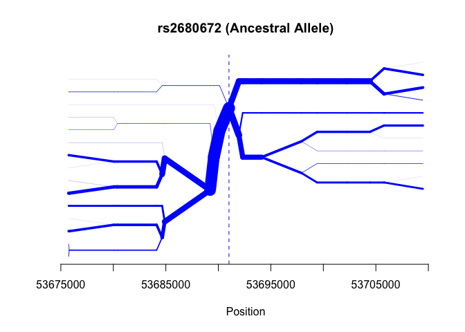
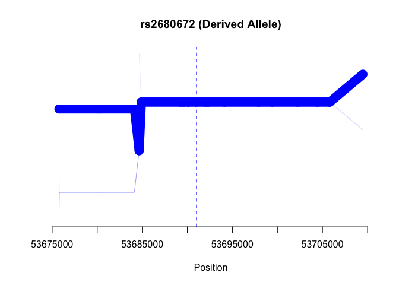
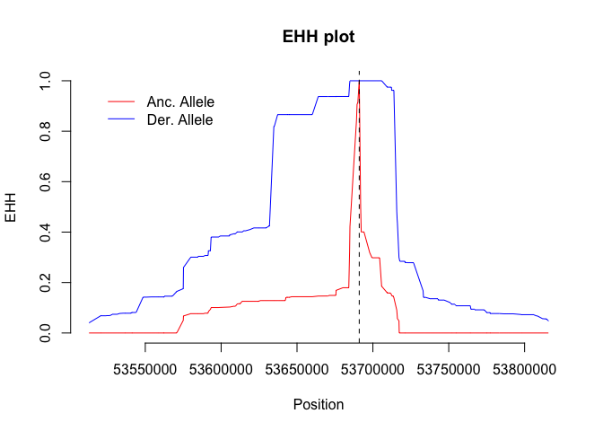
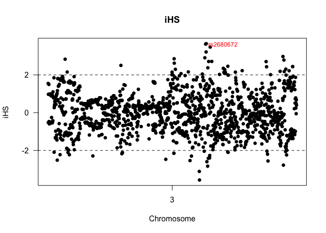
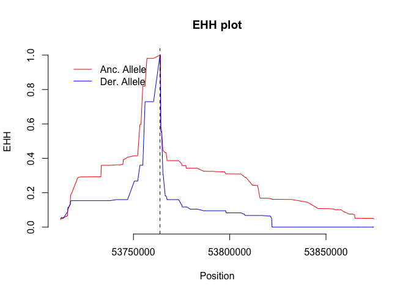

# <center>Extended Haplotype Homozygosity Analysis</center>
<center>`r format(Sys.time(), '%d %B, %Y')`</center></br>  


```
## Loading required package: MASS
```
### Background

Hopefully by now, the concept of a selective sweep has become rather intuitive.  Remember the scenario - a new, selectively favored mutation occurs on a particular chromosome with a particular haplotype of linked neutral variation (we will be talking primarily about SNP variation).  As a result of selection, that mutation increases in frequency; so too does the associated haplotype.  The results (at least until recombination works its inevitable effect) are

1.  Overall SNP diversity in the region of the favorable mutation will be reduced.
2.  Most importantly *there will be nonrandom associations between the new aadvantageous mutation and linked neutral polymorphic sites.*

But we can take this a step or two further.  For one, in this scenario, we would expect the favored mutation to be derived, as opposed to ancestral.   Thus, if we can determine which is which (best done by comparing the sequence of our species to that of a closely related outgroup species), we can then ask whether the second result pertains.  For another, if we can devise a test statistic, then we might be able to scan genomic data and ask where there are regions for which this pattern is observed.

### Finding Appropriate Statistics

Let's consider the issue of a suitable statistic first.  In a now classic paper, [Pardis Sabeti and her colleagues](https://dl.dropboxusercontent.com/u/9752688/ZOO%20422P/Readings/Sabeti/Original%20EHH%20Paper.pdf) introduced the concept of "extended haplotype anlaysis".  This paper is well worth reading, in that walks through the theoretical basis for the analysis and then provides nice examples from human genes to demponstrate its application.

The measure she developed can be described as follows:

1.  Given a SNP data set, identify a short region (a "core region") in which linkage disequilibrium among the SNPs is complete, meaning that |D'| equals 1.  That core region will thus contain a finite set of "corea haplotypes"
2.  Now consider an additional snp that is some distance x from the core region and ask what is the probability of two randomly selected gametes that share a core haplotype are also homozygous for the entire region, extending from the core region to x.
3.  Repeat this process for additional SNPs and determine the rate at which they decay.

If our selective sweep scenario is correct, then we should see significant EHH scores for derived core haplotypes extending for a further distance than we would for ancestral.  So how can we do such an analysis?  As always, the good news is that there is an r package for it:

```r
library(rehh)
```

```
## Loading required package: gplots
## 
## Attaching package: 'gplots'
## 
## The following object is masked from 'package:stats':
## 
##     lowess
```
And there  is an [excellent tutorial](http://bioinformatics.oxfordjournals.org/content/suppl/2012/03/11/bts115.DC1/rehh_tutorial.pdf) that walks the user through the various steps of the program, using some sample SNP data from the bovine genome.

The bad news, however, is that it requires considerable data manipulation to, for example, analyze human diversity data from HapMap with this package.  The input required is two files - a data file listing haplotypes and an information file, providing both the map positions of SNP's and the identity of ancestral and derived alleles.  The haplotype data can be obtained from HapMap, of course.   For most human SNPs, ancestral alleles have been determined by comparison with other primate genomes, however those data have to be obtained separately from the human SNP data base.  Those data are available in R via the biomaRt package, however merging and formatting data from the two sources is not a trivial exercise. 

What we are going to do is to work with some previously prepared data from five million base pairs of human chromosome 3 (positions 50M to 55M in HapMap).
``

```r
hap.rehh<-data2haplohh(hap_file="./Data/hyal2.hap",map_file="./Data/hyal2.map",chr.name=3) # read in the data and put it into a usable object
```

```
## Map file seems OK: 2469  SNPs declared for chromosome 3 
## Standard rehh input file assumed
## Data consists of 340 haplotypes and 2469 SNPs
```
Now, instead of a core haplotype, we're going to start with a single snp - rs2680672.  Why we chose this one will become apparent shortly.  We need to specify it as the "mark" and go from there.

```r
mark <-which(hap.rehh@snp.name=="rs2680672") # Identify the number of the core SNP in the data set
mark
```

```
## [1] 1598
```
We can look at this two ways.  First, we can make a bifurcation diagram:

```r
par(mfrow=c(1,1))
bifurcation.diagram(hap.rehh,mark,all_foc=1)
```

 

```r
bifurcation.diagram(hap.rehh,mark,all_foc=2)
```

 
Alternatively, we can examine each allele's EHH score as a function of distance from the core SNP

```r
par(mfrow=c(1,1))
dat.ehh <-calc_ehh(hap.rehh,mark)
```

 

And what we see is exactly what we would predict if indeed this was target of a selective sweep.


### But where to look??

In the above example, we used a seemingly arbitrarily chosen SNP for illustrative purposes.  Howwever, suppose we wished to survey a dataset and look for candidates that show this kind of pattern (reduced haploytpe diversity associated with a derived allele).  How would we go about doing so?

[Voight et al(2006)](http://www.plosbiology.org/article/info%3Adoi%2F10.1371%2Fjournal.pbio.0040072#pbio-0040072-g007) developed a method for doing so, one that is conceptually quite simple.  Look again at the curves we generated above, and think about that the result of integrating those curves would be.  Doing so might be computationally difficult, however, at least qualitatively, the result is pretty clear - the area under the ancestral curve is much larger than that under the derived.  So, what we could do would be to do a "sweep" of SNPs in a region of interest, and for each one calculate the ratio of those two intergals, and determine when they differ significantly from 1.  For details of the mathematics involved, see wither [Voight et al (2006)](http://www.plosbiology.org/article/info%3Adoi%2F10.1371%2Fjournal.pbio.0040072#pbio-0040072-g007) or the [rehh vignette](http://bioinformatics.oxfordjournals.org/content/suppl/2012/03/11/bts115.DC1/rehh_tutorial.pdf); for our purposes, suffice it to say that if we define those integrals as iHHS-A and iHHS-D (ancestral and derived), then we can define

iHs =ln(iHHS-A/iHHS-D)

Note that this statistic will be negative if the score for the ancestral allele is lower and positive if it is greater than one.  This raw statistic is then normalized to correct for variance in allele frequencies (again, see Voight et al or the rehh vignette for details) to give our final statistic, which can then be visualized graphically.  rehh provides a routine to perform such a scan; it's syntax is

res.scan<-scan_hh(hap.rehh)

Where hap.rehh is our haplohh object we created earlier.  However, running this is a fairly lengthy process, so while you may wish to do it yourself as an excercise, we will load the results of a previous run with the same chromosome 3 dataset.


```r
load("./Data/hyal2.res-scan")
```
That creates the object "res.scan"; we can look at a bit of it:

```r
head(res.scan)
```

```
##            CHR POSITION    FREQ_a     IHHa     IHHd      IES
## rs13060128   3 50000032 0.8294118 180505.1 132061.1 178526.6
## rs4688758    3 50003389 0.1705882 132061.1 180505.1 178526.6
## rs17657664   3 50007012 0.8558824 168344.4 199531.4 168892.7
## rs17657688   3 50008232 0.8558824 168344.4 199531.4 168892.7
## rs1986599    3 50009641 1.0000000 121231.3      0.0 121231.3
## rs4688689    3 50010546 0.1705882 133080.6 180505.1 178567.4
```
And we see that it contains the raw information we need - IHHa, IHHd, and IES.  Now we want to normalize the data based on allele frequency and plot the results.


```r
hya.ihs <-ihh2ihs(res.scan,freqbin=.05) # normalize the raw data.  Expectations are calculated based on binned frequencies
```
The object that is returned, a list with two elements is worth exploring further.  

```r
head(hya.ihs[[1]]) # look at the first five entries of the first list element
```

```
##            CHR POSITION        iHS    Pvalue
## rs13060128   3 50000032  1.5446085 0.9120732
## rs4688758    3 50003389 -0.5239512 0.2216226
## rs17657664   3 50007012  0.9712538 0.4796188
## rs17657688   3 50008232  0.9712538 0.4796188
## rs4688689    3 50010546 -0.5124325 0.2158476
## rs7628058    3 50014478  1.4943099 0.8693619
```
We see that this gives us the actual iHS scores, along with the probability that they would be observed due to chance.  We can do a rough plot of the data as follows

```r
ihsplot(hya.ihs$res,plot.pval="FALSE")
rs.data <-hya.ihs[[1]][which(rownames(hya.ihs[[1]])=="rs2680672"),]
textxy(which(rownames(hya.ihs[[1]])=="rs2680672"),rs.data[4],"rs2680672",cex=.8,col="red")
```

 
Note that we've marked our snp of interest

Note that scores can be either positive or negative.  What we have been focusing on previously are the negative ones - where iHHSd>iHHsa.  However we could certainly imagine cases in which the reverse situation could be true; these would be worth exploring as well.  For example:


```r
dat <-data.frame(hya.ihs[[1]])
mk2 <-rownames(dat[which(dat[,3]==max(dat[,3])),])
mk <-which(hap.rehh@snp.name==mk2)
res <-calc_ehh(hap.rehh,mk)
```

 


Finally, regardless of sign, which of these are significant?

```r
ihsplot(hya.ihs$res.ihs) # plot the ihs scores
```

  
Here the probabilities are plotted on a log-likelihood scale, so using a threshold value of 2 (that the observed ihs score is likely to occur by chance less than 1% of the time), we see perhaps five regions that warrant further exploration

Finally, in the above calculations,  SNPs are "binned" based on their allele frequency.  The default size of the bin is .025, however in some cases (as in this one) that creates bins with two few entries to allow for accurate calculation of expectations.  We have thus increased it to .05.  This is something that needs to be determined for each dataset analyzed.  We can see those bins as follows

```r
printx(hya.ihs[[2]])
```

<!-- html table generated in R 3.1.2 by xtable 1.7-4 package -->
<!-- Thu Feb 19 12:18:31 2015 -->
<table border=1>
<tr> <th>  </th> <th> Freq Class </th> <th> Size </th> <th> Mean iHH </th> <th> SD iHH </th>  </tr>
  <tr> <td align="right"> 1 </td> <td> 0.05 - 0.1 </td> <td> 85 </td> <td> 1.04586932276568 </td> <td> 0.696172579586913 </td> </tr>
  <tr> <td align="right"> 2 </td> <td> 0.1 - 0.15 </td> <td> 22 </td> <td> 0.302013656018027 </td> <td> 0.541510064013783 </td> </tr>
  <tr> <td align="right"> 3 </td> <td> 0.15 - 0.2 </td> <td> 62 </td> <td> 0.037302582414733 </td> <td> 0.667613871250491 </td> </tr>
  <tr> <td align="right"> 4 </td> <td> 0.2 - 0.25 </td> <td> 42 </td> <td> -0.191566244663709 </td> <td> 0.741715528621978 </td> </tr>
  <tr> <td align="right"> 5 </td> <td> 0.25 - 0.3 </td> <td> 20 </td> <td> -0.319987135515535 </td> <td> 0.501643688202917 </td> </tr>
  <tr> <td align="right"> 6 </td> <td> 0.3 - 0.35 </td> <td> 43 </td> <td> 0.155176744215642 </td> <td> 0.804586191235659 </td> </tr>
  <tr> <td align="right"> 7 </td> <td> 0.35 - 0.4 </td> <td> 102 </td> <td> 0.0938853943095335 </td> <td> 0.58567025460449 </td> </tr>
  <tr> <td align="right"> 8 </td> <td> 0.4 - 0.45 </td> <td> 92 </td> <td> -0.516666876689336 </td> <td> 0.803749931229 </td> </tr>
  <tr> <td align="right"> 9 </td> <td> 0.45 - 0.5 </td> <td> 127 </td> <td> -0.17257024061076 </td> <td> 0.632197313270491 </td> </tr>
  <tr> <td align="right"> 10 </td> <td> 0.5 - 0.55 </td> <td> 109 </td> <td> -0.141138385005703 </td> <td> 0.448091440552698 </td> </tr>
  <tr> <td align="right"> 11 </td> <td> 0.55 - 0.6 </td> <td> 103 </td> <td> -0.105495106844254 </td> <td> 0.96216398109224 </td> </tr>
  <tr> <td align="right"> 12 </td> <td> 0.6 - 0.65 </td> <td> 83 </td> <td> -0.213002097338202 </td> <td> 0.52539505799057 </td> </tr>
  <tr> <td align="right"> 13 </td> <td> 0.65 - 0.7 </td> <td> 103 </td> <td> -0.910108508756553 </td> <td> 0.516850901454138 </td> </tr>
  <tr> <td align="right"> 14 </td> <td> 0.7 - 0.75 </td> <td> 61 </td> <td> -0.441236440224062 </td> <td> 0.685253120284935 </td> </tr>
  <tr> <td align="right"> 15 </td> <td> 0.75 - 0.8 </td> <td> 69 </td> <td> -0.81601154731 </td> <td> 0.700165417340788 </td> </tr>
  <tr> <td align="right"> 16 </td> <td> 0.8 - 0.85 </td> <td> 123 </td> <td> -0.723838291647398 </td> <td> 0.670935563919494 </td> </tr>
  <tr> <td align="right"> 17 </td> <td> 0.85 - 0.9 </td> <td> 115 </td> <td> -0.749655597255549 </td> <td> 0.59685318343828 </td> </tr>
  <tr> <td align="right"> 18 </td> <td> 0.9 - 0.95 </td> <td> 217 </td> <td> -1.02972493522218 </td> <td> 0.539910491526874 </td> </tr>
   </table>
###  Conclusions

So where are we?  We've been able to identify a number of SNPs whose patterns of haplotype diversity, comparing ancestral and derived alleles, departs from that expected by chance. As such, the results suggest that w could use this approach to identify targets of recent selection.  But so far, all we have is a bunch of points on graphs.  What we want to do next is address the following:

1.  Do we see evidence of selection in cases where we might have had *a priori* expectations of its existence?
1.  What can we learn about the genes with which these SNPs are associated?

These will be the subject of the next unit.


