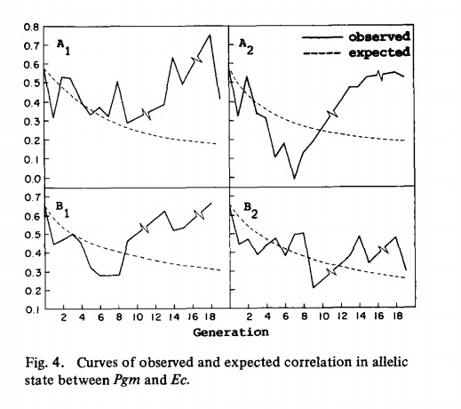
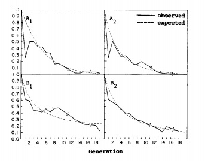

## The Fate of Linkage Diequilibrium

Having seen how we measure linkage disequilibrium, we need to address what the fate of disequilibrium would be in an equilibrium population.  We will do so in the context of a very simple model, that of two genes on the same chromosome, between which recombination occurs with some frequency r.


### The scenario

Suppose we have two genes that are linked but undergo recombination some percent of the time (call it r).  Some fraction of those gametes are of the type \(A_1B_1\).    We let the population mate at random (and assume recombination occurs in both sexes).  What happens to \(f(A_1B_1)\) after 1 generation? 

We would get these gametes from two possible sources

1. Nonrecombinant -  these would be all of the A1B1 gametes that do **not** undergo recombination.  Since a fraction r do recombine, the nonrecombinant fraction would be 1-r, and  \(f'(A_1B_1)=(1-r)f(AB)\)
2. Recombinant - Assuming that mating is random, then for that fraction of gametes that undergo recombination ,r, the probability of it being \(A_1B_1\) is simply r multiplied by the allele frequencies, or \(r(f(A_1)f(B_1))\).

Taken together, the expected frequency in the next generation (f'(A1B1)) is simply the sum of these, or 

\(f'(A_1B_1) = (1-r)(fA_1B_1)+rf(A_1)f(B_1)\)

Remmber also that 

\(D = f(A_1B_1) - f(A)f(B)\)

we can  subtract \(f(A_1)f(B_1)\) from both sides, do a little algebra (see @FelsensteinBook, pg 18 for more details),  and get  


\(D'=(1-r)D_0\)

If we then repeat this process for a second generation

\(D'' =(1-r)^2 Do\)
 
  And at time t

\(Dt = (1-r)^t Do \)

4.  So let's look at this graphically for various values of r

```{r}
Do <-.25
r <-c(.001,.01,.05,.1,.5)
r <-rev(r) # simple way to reverse order of elements; not needed if they had been input from largest to smallest
t <-c(0:50)
D <- sapply(r, function(x) Do*(1-x)^t )
matplot(D, type="l",main="Decay of Linkage Disequilibrium", xlab ="Generation", ylab="D",lty=1)
legend(40,.12,r,fill = 1:5,title="Recomb. Rate")
```

From these results, two results are worth noting:

1.  LD can exist briefly, even for unlinked loci
2.  Ultimately, however, it will decay assymptotically to zero, even with very tight linkage

Thus, if LD is observed, suggests that this is a  nonequilibrium population, the cause of which would need to be explored.  One important application, however, is in population-based association mapping, that is, looking for markers that cosegregate with genes contributing to a phenotype of interest.  In fact, this is nothing more than finding markers that are in LD with condition of interest **even if the marker itself is not in a causal gene**.  We will explore further as we go along.

<!--Note also that throughout, we've been assuming we can count gametes; in real life that is not straightforward.  The problem is that, in the case of double heterozygotes (A1/A2; B1/B2) we cannot directly determine the **phase** of the markers - is the genotype, in gametic terms, (A1B1)/(A2B2) or (A1B2)/A2B1)?  There are numerous methods to address this problem and obtain robust estimates of D; one of these is described in [Supplemental Chapter 2]. This problem can also be addressed by genotyping parents and offspring - indeed much of the HapMap data we have been using are obtained from such samples, thus allowing more powerful estimation of D and more definitive association mapping from these data. -->

Finally - if we are doing this in a finite population, as always we will see scatter.  For example, we can ask what we would expect to see for the same recombination fractions in populations of 1000 and 100:

```{r,echo=FALSE}
Dfin <- function(n){

n2 <-2*n

d <-matrix(0,50,5)
for (nr in 1:5){

a <-cbind(rep(0,n),rep(0,n))
b <-cbind(rep(1,n),rep(1,n))
gametes <-rbind(a,b)
newpop <-matrix(0,n2,2)
diploid <-matrix(0,2,2)
for (j in 1:50){
##n <-as.integer(rnorm(1,n,n/10))
##n2 <-2*n
k <-1
for (i in 1:n2){ 
  diploid <-gametes[sample(nrow(gametes),size=2,replace=TRUE),]
  rprob <-sample(runif(100,0,100),size=1)/100
  if (rprob>r[nr]){
		newpop[k,] <-diploid[sample(nrow(diploid),size=1),]
		k <-k+1} else{
		temp <- diploid[1,2]
		diploid[1,2] <- diploid[2,2]
		diploid[2,2] <- temp 
		newpop[k,] <- diploid[sample(nrow(diploid),size=1),]
k <-k+1}
	#print(diploid)
}
gamnum <-as.data.frame(table(newpop[,1], newpop[,2]))
gamfreq <-gamnum$Freq/n2
d[j,nr]<-gamfreq[1]*gamfreq[4]-gamfreq[2]*gamfreq[3]
gametes <-newpop
}
}
matplot(D, type="l",main=paste("Decay of Linkage Disequilibrium ","\n", "n=",n,sep=""), xlab ="Generation", ylab="D",lty=1)
for(j in 1:5){
	points(t,d[,j],col=j)
}
}
```


```{r,results='hide',fig.height=10}
par(mfrow=c(2,1)) #create two panels in the plot window
sapply(c(1000,100),Dfin) # Do  two simulations, one with N=1000 and one with N=100
par(mfrow=c(1,1)) #restore single graphic panel
```

As will become a common theme throughout, we see that in finite populations (which, indeed, all populations are), random factors can lead to departures from expectations, especially in small populations. 

### A Real Example

And, just to bring some actual data below, @Clegg1978 did an interesting experiment in which they monitored changes in allele and gamete frequencies of two allozyme loci initially in linkage disequilibrium with a dominant lethal allele in *Drosopshila melanogaster*. In four replicate populations, they observed the following:



In three of the four replicate populations, we see that from generation 8-10 onward, LD increases.  So what is happening?  Some insight can be gained from looking at the decline in heterozygosity at the locus with the lethal allele (Sb):



Their conclusion was that, as a result of recombination, particular haploytpes were generated that were free of the negative selection acting at the Sb locus and conferred a selective advantage, so they increased in frequency.


### Conclusions

So is linkage equilibrium, like the Hardy-Weinberg equilibrium, an expected property of ideal populations?  The answer is yes, but with a major caveat.  That is, in the case of Hardy-Weinberg equilibrium, it is easy to show that if a population falls out of equilibrium, then a generation of random mating (at least for autosomal loci) will restore it.  Not so in the case of linkage equilibrium, however - as we have seen, if LD exists, the population does return to equilibrium (D=0), but only exponentially, with the rate dependent on the frequency of recombination between the loci in question.

