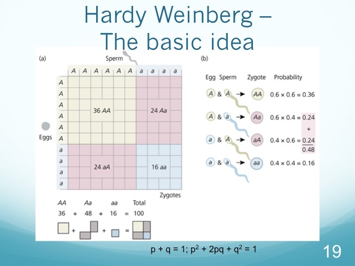
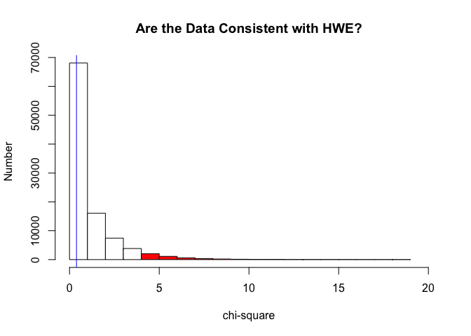
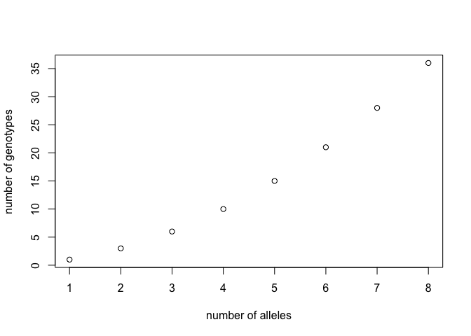
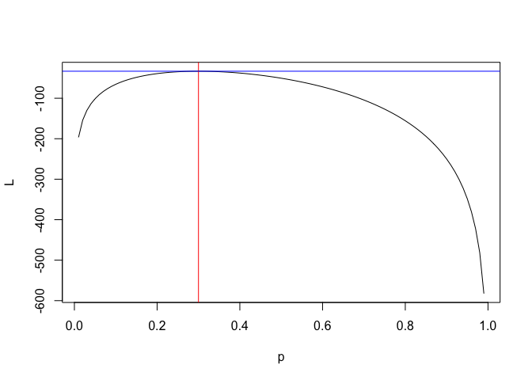
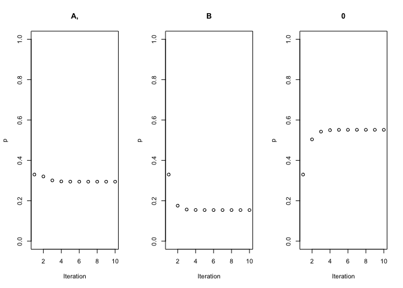

# <center>The Hardy Weinberg Equilibrium</center>
`r Sys.Date()`  


```
## Loading required package: ape
```

```
## Loading required package: pegas
```

```
## Loading required package: adegenet
```

```
## Loading required package: ade4
```

```
## 
##    /// adegenet 2.0.1 is loaded ////////////
## 
##    > overview: '?adegenet'
##    > tutorials/doc/questions: 'adegenetWeb()' 
##    > bug reports/feature requests: adegenetIssues()
```

```
## 
## Attaching package: 'pegas'
```

```
## The following object is masked from 'package:ade4':
## 
##     amova
```

```
## The following object is masked from 'package:ape':
## 
##     mst
```

```
## Loading required package: stringr
```

```
## Loading required package: phyclust
```

```
## Loading required package: XML
```

```
## Loading required package: RCurl
```

```
## Loading required package: bitops
```

```
## 
## Attaching package: 'RCurl'
```

```
## The following object is masked from 'package:adegenet':
## 
##     pop
```


## What is it?

The starting point for in population genetics is the  Hardy Weinberg equilibrium.  It is the basis on which everything is built, so a thorough understanding of what it says and what it assumes is critical.  In this unit, we will briefly go through the basics of it ( the familiar p and q approach).  We will then examine it in more detail.


### A Sample Problem

So let's approach this as a problem in data analysis.  Imagine a single nucleotide polymorphism (SNP) that occurs in a population such that 6 individuals have genotype G/G, 28 individuals have genotype G/T (heterozygotes) and 66 individuals have genotype T/T.

Genotype | Number
---|---  
G G | 6
G T | 28
T T | 66

We want to ask two questions:

1.  What are the allele frequencies (i. e. how many G's and how many T's are there)?
2.  Most importantly, if these individuals were to mate at random, what would be the allele frequencies in the F1 generation?

#### Determining Allele Frequencies

So for let's proceed as follows.  First of all, we will create a vector with of the observed data.

```r
obs <- c(6,28,66)
```
Recall that c() is a function that concatenates a number of values, in this case integers, in order to create a vector.

Now, let's ask how many G's there are.  Recognizing that every GG homozygote has two and every GT heterozygote has one, we can calculate that by

```r
nA <-2*obs[1]+obs[2]
nA
```

```
## [1] 40
```
And to make that a frequency, we need to divide it by the total number of *alleles*, which, since these are diploid individuals, is simply two times the number of individuals genotyped (N).

```r
N <-sum(obs)
p <-nA/(2*N)
p
```

```
## [1] 0.2
```
Now, we could repeat that process to determine the frequency of T, but here one of the simplest but most important relationships comes in to play.  Note that this is a biallelic locus, so if a particular allele is not G, it has to be T.  Thus, if we set the frequency of T to be q, then p+q must equal 1, or

```r
q <-1-p
q
```

```
## [1] 0.8
```
#### Random Mating

Now, suppose we turn the question around.  Given p and q, as calculated above, and assuming that random mating then occurs, what genotype numbers frequencies would we expect to see?  There are two ways we can approach this, one mathematical and one graphical.  First, the mathematical one.  Think of the population as orginating from a pool of alleles with frequencies p and q.  If that is the case, then we can calculate the expected probabilities of the three genotypes (GG, GT, and TT) as

p{GG} = p{G}*p{G} = p^2^  
p{TT} = p{T}*p{T} = q^2^  
p{GT} =p{GT} or p{TG}   
= P{G} * P{T} + P{T} *P{G}  
= pq + qp   
= 2pq

We can can make a vector of those frequencies as follows

```r
fexp <-c(p^2,2*p*q,q^2)
fexp
```

```
## [1] 0.04 0.32 0.64
```
And finally, given those frequencies, what numbers of genotypes would we expect to see in a sample size of N?  Here, R makes it very easy to multiply the frequency vector by N


```r
Nexp <-fexp*N # multiplies each element of fexp by N
as.integer(Nexp) # get rid of decimal positions
```

```
## [1]  4 32 64
```
Contrast that with our observed numbers

```r
obs
```

```
## [1]  6 28 66
```
And they look pretty close.  Of course we need to test that statistically (which we will in a bit), but before we do so, let's see what's happened to p and q as a result of random mating:

```r
p1 <-(2*Nexp[1]+Nexp[2])/(2*N)
q1 <- 1-p1
p1;q1
```

```
## [1] 0.2
```

```
## [1] 0.8
```
And again, contrast those values with what we determined from the original data:


```r
p;q
```

```
## [1] 0.2
```

```
## [1] 0.8
```
And note.  **p and q have not changed**.


#### A Sample problem:

Below are some (completely made-up) data.  Use them to 

1.  Calculate p and q.
2.  calculate expected genotype frequencies
3.  Calculate expected genotype numbers

Genotype | Number
---|---
AA|69
Aa|101
aa|30


```
## [1] 0.5975
```


```
## [1] 0.3570063 0.4809875 0.1620062
```

### And Why is This Important?

So what have we shown?  We can summarize as follows:

1.  Given a random mating population, with allele frequencies p and q, the expected genotype frequencies are p^2^, 2pq, and q^2^.
2.  In an ideal population, allele frequencies do not change.
3.  One generation of random mating is sufficient to restore HWE to autosomal loci (X linked are a bit different)
3.  And what is an "ideal" population?  It is one with the following properties  

>* Infinite size  
>* Random mating  
>* No Mutation  
>* No Migration  
>* No selection

In other words, *A population that is in Hardy Weinberg Equilibrium is not evolving*.  Thus, it becomes the null hypothesis from which we work; hence a deep understanding of its properties is essential if we are to thoroughly understand the genetics of the evolutionary process.

##### A graphical derivation





 

### Calculations Based on Genotype Frequencies

Note that, at times problems are formulated in terms of genotype *frequencies* rather than numbers.  In those cases, the typical formula given is

p = f(AA) + 1/2(f(Aa))

But let's look at this a little more closely - Suppose we multiply it by 2N/2N.  Then we get

P =(2N*f(AA))+2N*(1/2(f(Aa)))/2N

But what is this?  N * f(AA) is simply the number of AA genotypes counted, and N *F(Aa) is the number of Aa, so this whole equation can be rewritten as

p=(2 * #(AA) + # (Aa))/2N

Which is exactly the same formula as above.  

So to wrap it up, when you start a Hardy-Weinberg problem, the first question to ask is whether you are given genotype *Numbers* or *frequencies* and go from there.  What you do **not** want to do is to treat the numbers as frequencies or vice versa.


### Exploring in More Depth

So at this point, we've seen how we can calculate allele frequencies, and we've also seen that in an ideal population, those frequencies do not change - the population does not evolve.  And it is worth it at this point to briefly summarize the properties of an ideal population:

1.  It is infinitely large
2.  Mating is random
3.  There is no mutation
4.  There is no migration
5.  There is no selection

Much of the rest of our time will be focused on understanding the consequences departures from one or more of these conditions - how do we detect them and what are their consequences?  Before that, however, we need to delve into the Hardy Weinberg Equilibrium a bit more deeply.

### Testing for departures from Hardy Weinberg

This is a subject we will be exploring in more depth in a later unit, but for starters, let's keep it simple.  Assume we can observe some genotypes:

Genotype| N
---|---
AA | 56
Aa | 78
aa | 22

We can calculate the frequencies of the two alleles as we did before:


```r
obs <-c(56,78,22)
N <-sum(obs)
p <-(2*obs[1]+obs[2])/(2*N)
q <- 1-p
p; q
```

```
## [1] 0.6089744
```

```
## [1] 0.3910256
```
And from those, we can calculate our expected genotype *numbers*

```r
exp <-N*c(p^2,2*p*q,q^2)
exp
```

```
## [1] 57.85256 74.29487 23.85256
```
So now we have observed and expected numbers; it would seem a logical step to apply the chi-square test to see if the difference between the two is significant. For more details, see [the unit on the chi-squared distribution](https://dl.dropboxusercontent.com/u/9752688/PopGenWithR/html/chisq.html); at this point, remember that what we are doing is quantitating the departure from the expectations of an hypothesis for categorical data.  In our case, the categories are genotypes; the hypothesis is that the population is in Hardy-Weinberg equilibrium, and the data are the observed genotype *numbers*, which are compared to those expected based on HWE.

We've done the calculations above, so &chi;^2^ can be calculated easily by


```r
chi <-sum((obs-exp)^2/exp)
chi
```

```
## [1] 0.3879836
```

But how many degrees of freedom?  Our rule of thumb previously was that degrees of freedom are one less than the number of classes, suggesting that it might be two in this case.  However there is another wrinkle.  In this case we used the actual data to estimate a parameter used in determining our expected values - p.  That costs us another degree of freedom.  So in the case of testing Hardy Weinberg with data from a biallelic locus, we only have one degree of freedom.  

So what is the probability that we would observe this much deviation based on chance alone (in which case we would accept our hypothesis)?  One way to do that is what we did with coin flips - generate a bunch of &chi;^2^ distributed random variables and see where the 5% cutoff falls.  In this case, we will do a *one tail test*, since the range of our statistic is from zero to infinity (with zero the value obtained if the observed data exactly match the expectation)


```r
set.seed(123)
ch <- rchisq(100000,1)
colhist(ch,tail=1, xr=c(0,20),xlab="chi-square",ylab="Number",main="Are the Data Consistent with HWE?")
abline(v=chi,col="blue")
```

<!-- -->

```r
quantile(ch,.95)
```

```
##      95% 
## 3.851331
```

And we see that the data in fact fall within the range expected be observed as a result of chance.

We can also calculate the probability of this particular &chi;^2^ value as follows:


```r
pr <-qchisq(chi,.95)
pr
```

```
## [1] 0.2277098
```

And we see that the probability of observing this much or more deviation from Hardy-Weinberg expectations is 22%, far higher than our normal standard of 5% for rejecting the null hypothesis.  So we can conclude in this case that the hypothesis cannot be rejected.

#### The more conventional approach

When you've done &chi;^2^ testing in the past, you've probably used a table that lists degrees of freedom and cutoff values that have been determined analytically.  For example, for one degree of freedom, that value is 3.84; we see that it is very similar to the number we obtained from our simulation above.  A small version of the table is in [the unit on the &chi;^2^ distribution](https://dl.dropboxusercontent.com/u/9752688/PopGenWithR/html/chisq.html); it is also shown below:


```r
df <-c(1:10)
chicrit.05 <-sapply(df, function(x) qchisq(.95,x))
chicrit.01 <-sapply(df,function (x) qchisq(.99,x))
kable(data.frame(df,p.05 = chicrit.05,p.01=chicrit.01))
```


 df        p.05        p.01
---  ----------  ----------
  1    3.841459    6.634897
  2    5.991465    9.210340
  3    7.814728   11.344867
  4    9.487729   13.276704
  5   11.070498   15.086272
  6   12.591587   16.811894
  7   14.067140   18.475307
  8   15.507313   20.090235
  9   16.918978   21.665994
 10   18.307038   23.209251

#### A coding note

the hw() function in TeachingPopGen will accomplish much of what we have done so far.  Given some set of single locus, biallelic genotypes, it will return all the basic information.  For example


```r
dat.obs <-c(55,75,12) #observed numbers of AA, Aa, and aa
dat.hw <-hw(dat.obs)
```

```
## [1] p= 0.651408450704225 q= 0.348591549295775
##      obs exp
## [1,]  55  60
## [2,]  75  64
## [3,]  12  17
## [1] chi squared = 3.772 p =  0.052 with 1 d. f.
## [1] F =  -0.163
```
Note that it will print the results to the console; it also returns a list, in this case to the variable dat.hw:


```r
str(dat.hw)
```

```
## List of 6
##  $ Observed    : num [1:3] 55 75 12
##  $ Expected    : num [1:3] 60.3 64.5 17.3
##  $ Allele_freqs: num [1:2] 0.651 0.349
##  $ Chisq       : num 3.77
##  $ prob        : num 0.0521
##  $ F           : num -0.163
```


### Homozyogsity, Heterozygosity, and F


So by now we've looked at the chi-squared approach to testing whether observed genotype **numbers** are consistent with the prediction of Hardy-Weinberg.  There is, however, another way we can make this comparison - one that is less statistical, but which (as we shall see) is very relevant biologically.

#### A couple of definitions

We will use the following terms extensively in what follows:

* *Homozygosity* - the frequency of homozygotes (of any sort, e. g. AA and aa in the biallelic case) in a sample or population
* *Heterozygosity*  the total frequency of heterozygotes in the population

#### Expected Values

As is the case with any such measure, we need to have expectations.  These are pretty straightforward, especially:

1.  Expected homozygosity is simply ∑p<sub>i</sub>^2^, where the p's are the frequencies of the k alleles in the population
2.  Expected heterozygosity is easy for the biallelic case - it is simply 2p(1-p).  That could be extended to the case of multiple alleles, but remembering that every individual is either a homozygote or a heterozygote, a simpler calculation is

E(heterozygosity)=1-E(homozygosity) = 1- ∑p<sub>i</sub>^2^

#### Comparing some observations.

Now that we have our expectations, we can turn to some data.  These come from real data and are a staple of chapter-end problems in Genetics and Evolution texts.  The organisms are brown bears, the phenotypes are brown (dominant) vs. white(recessive) and the genotypes of a single base in the melanocortin receptor gene which is responsible for the difference are as follows:

Genotype | Phenotype | N
---|---|---
AA|Brown|42
AG|Brown|24
GG|White|21

So we can do some basic calculations


```r
genos <-c(AA=42,AG=24,GG=21)
genos
```

```
## AA AG GG 
## 42 24 21
```
And we can do our basic Hardy-Weinberg calculations as we have before

```r
hw.genos <-hw(genos)
```

```
## [1] p= 0.620689655172414 q= 0.379310344827586
##    obs exp
## AA  42  34
## AG  24  41
## GG  21  13
## [1] chi squared = 14.922 p =  0 with 1 d. f.
## [1] F =  0.4141
```
And we see that this is not an ideal population.  In fact, by inspection, we see that the observed number of heterozygotes, 24, is less than the expected one, 40.9655172.  But we want to make this more quantitative, comparing the observed and expected homozygosity and heterozygosity.  But since these must add up to one, and for reasons that will become clear down the road, we'll focus on heterozygosity.  Furthermore, from here on out, we'll work with frequencies rather than numbers (although  the latter would work equally well).

So first, what are the observed frequencies?

```r
genos.f.obs <-genos/sum(genos)
genos.f.obs
```

```
##        AA        AG        GG 
## 0.4827586 0.2758621 0.2413793
```
The observed heterozygosity is thus 0.276; to make the notation easier, we'll assign that a name

```r
Hobs <-genos.f.obs[2]
```
Now, what about the expected?  Remembering that that is 2pq, we calculate it as

```r
allele.freqs <-hw.genos$Allele_freqs
Hexp <-2*allele.freqs[1]*allele.freqs[2]
unname(Hexp)
```

```
## [1] 0.470868
```
Note that an alternate way of calculating this would simply be

```r
homo.exp <-(allele.freqs)^2
homo.exp <-sum(homo.exp)
unname(1-homo.exp)
```

```
## [1] 0.470868
```
Which gives us the same value.

### The F statistic

So what we want to do now is to come up with a numerical value to compare observed and expected heterozygosity.  Obviously, if they are equal (that is, we have a Hardy-Weinberg population), then the ratio will be 1.  Similarly, if there are no heterozygotes observed, then the ratio would be zero.  Thus, by subtracting the ratio from 1, we get a statistic that increases from zero to one, proportionate with increasing departure from HW.  Thus for our bear case here, we find that

```r
f.bears <-1-Hobs/Hexp
unname(f.bears)
```

```
## [1] 0.4141414
```
This statistic has a variety of names - Wright's F Statistic and the Fixation Index are two common ones.  We won't say more about it at this point, however we will be using it extensively in the future.  But the key points to realize are

1.  If a population is in HWE, then Hobs=Hexp so F= 1-1 = 0
2.  If there are *fewer* heterozygotes observed than expected, then F will be positive (as in the bear case)
3.  If there are *more* heterozygotes observed than expected, then F is negative

So what is a significant value of F?  At this point, we will leave that question open, but we will come back to it.

Finally, as an aside, the explanation for the bear data is that bears preferentially mate with ones of their own color.  Thus, brown X white matings occur less frequently than they would in a random mating population, thus reducing the frequency of heterozygotes.

### A Few Wrinkles

#### Dominance

Until now, we'eve assumed we can identify all genoytpes and then count alleles, divide by the total and have estimate of p.  However, what if we can't? For example, consider a typical general genetics problem - the frequency of cystic fibrosis in Caucasians is 1/3000; what is frequency of allele?  One approach (the only one in this case) - **if we assume HW, then**  


```r
freq <-1/3000
q <-sqrt(freq)
q
```

```
## [1] 0.01825742
```
But note that we have *assumed* that the genotypes are in Hardy-Weinberg proportion by estimating q as the square root of the frequency of recessive homozygotes.  Hence, no statistical test for departure from HW is possible.

#### Multiple Alleles

Much of what we will work with this semester will involve biallelic data (for example, most SNPs are polymorphisms of two bases - sites with three are quite rare).  However, there will be some cases in which there are multiple alleles - in fact this is the norm for microsatellite loci.  In those cases, calculating allele frequencies is a fairly straightforward extension of the biallelic one; probably the easiest way is to work from genotype frequencies, in which case, for the frequency of allele i

p<sub>i</sub> = f(homozygotes)+ 1/2∑ f(heterozygotes)

And also, by extension, from an observed set of genotypes, we can estimate n allele frequencies and then estimate expected genotype frequencies and numbers, noting that if

f(A1) = p  
f(A2) = q  
f(A3) = r  

then 

f(A1A1)<sub>exp</sub> = p^2^  
f(A1A2)<sub>exp</sub> = 2pq  
f(A1A3)<sub>exp</sub> = 2pr  
etc. for six total genotypes  

And of course, we can again do a chi square test, with degrees of freedom; since we estimate both p and q from the data, we lose a total of three degrees of freedom (one for each parameter estimated and one for the number of categories) giving us a total of 6-3=3.

But be forewarned, however - as i increases, the number of possible genotypes increases, and thus the expected numbers of particular genotypes can become very small (approaching zero in the case of homozygotes for low frequency alleles,) so &chi;^2^ testing becomes problematic. In fact the number of genotypes can be calculated as follows.

Given k alleles, there are obviously k possible homozygotes.  The number of possible heterozygotes is (k(k-1))/2.  So we can plot this as


```r
k <-1:8
ngenos <-k+(k*(k-1))/2
plot(k,ngenos, xlab="number of alleles", ylab="number of genotypes")
```

<!-- -->


#### Do we have the best estimator of p?

This may seem a bit nitpicky, but it is a nice illustration of the principle of likelihood maximization.  Consider the following biallelic data


```r
genos <-c(11,41,53)
```
Using a TPG function, we can calculate all of the above

```r
 hw.out <-hw(genos)
```

```
## [1] p= 0.3 q= 0.7
##      obs exp
## [1,]  11   9
## [2,]  41  44
## [3,]  53  51
## [1] chi squared = 0.519 p =  0.471 with 1 d. f.
## [1] F =  0.0703
```
And we see that, *based on our estimate of p*, we cannot reject Hardy-Weinberg.  But is this the best estmator?  We could consider a couple of other possibilities

1.  use the square root of the frequency of AA 

```r
sqrt(genos[1]/sum(genos))
```

```
## [1] 0.3236694
```
Or one minus the square root of the number of aa

```r
1-sqrt(genos[3]/sum(genos))
```

```
## [1] 0.289534
```
So we have three estimates - .3, .32, and ,29.  Which is the best? Intuitively, since  we used the most information to get .3, so it seems best, but is it?

R. A. Fisher investigated this problem; [Felsenstein](http://evolution.gs.washington.edu/pgbook/pgbook.pdf) provides the necessary mathematical information.  In essence, what we can do is the following:

1.  For a range of parameters (p in this case) estimate P(X|p), the likelihood of X given p,  where X is the data.  Note that heretofore we have been estimating P(p|X), the probability of a particular value of p given observed data X.
2.  Intuitively, this likelihood is going to cover a wide range.  In the example above, it we know that p cannot equal zero or 1; furthermore it is highly unlikely that it would be, say .05 or .9.
3.  So what we can then do, for the range p=.01 to .99, calculate the exact probability (just like we did when we introduced the binomial distribution) that we would get the data if p were in fact truly that value, and take the logarithm of it to scale it appropriately
4.  Finally, we can plot the log likelihood against p, and look for the point at which it is maximized.  The function maxp will do that for us.


```r
maxp(genos)
```

<!-- -->

```
## [1] 0.3 0.3
```
And we see that, in fact, the value of P that has the maximum likelihood associated with it is .3, the same as what we calculated initially.

Again, this may seem like a somewhat meaningless exercise, but it does introduce the concept of maximum likelihood estimation, something that can be extremely useful in more complex situations.  And, as we did in Bayesian analysis, we are using the data to actually estimate p, not ask (as the frequentist does) whether the deviation from a previously determined paramter is likely to be due to chance

#### ABO Blood Types - When Multiple alleles and Dominance Collide.

We are all familiar with the ABO blood type system.  There are typically three alleles, A, B and i.  A and B are codominant, so that an AB heterozygote has the AB blood type.  However, i is recessive to both A and B so, for example, an Ai individual has type A blood, as does an AA one.  These relationships are summarized as follows:

Genotypes|Blood Type|Number|Phenotype Frequency
---|---|---|---|---
AA, AO|A|\(n_{A}\)|\(p^2_{A}+2p_{A}p_{O}\)
BB, BO|B|\(n_{B}\)|\(p^2_{B}+2p_{B}p_{O}\)
AB|AB|\(n_{AB}\)|\(2p_{A}p_{B}\)
OO|O|\(n_{0}\)|\(p^2_{O}\)

And using our multiple allele logic, we should be able to calculate the frequency of the A allele as 

\(P_{A} = \frac{2n_{AA}+n_{AO}+n_{AB}}{2n}\)

But there's a problem - we can't distinguish between AA and AO individuals, so how do we plug in the numbers?

Again, @FelsensteinBook suggests an approach (see also @weir1996genetic) known as "expectation maximization" to get at this problem. Look again at the  equation above.  Our problem is that, while we can get n and n<sub>AB</sub> directly from the data, AA and AO individuals both have type A blood.  The similar problem would exist for the frequency of B as well.  

Felsenstein(page 31 and 32) shows the three values we wish to estimate, p <sub>A </sub>, p <sub>B </sub> and p <sub>i </sub>, can be expressed as follows:

\(P_{A}=\frac{2(\frac{p_{A}+p_{O}}{p_{A}+2p_{O}})n_{A}+n_{AB}}{2n}\)

\(P_{B}=\frac{2(\frac{p_{B}+p_{O}}{p_{B}+2p_{O}})n_{A}+n_{AB}}{2n}\)

\(P_{O}=\frac{\frac{p_{O}}{p_{A}+2p_{O}}n_{A}+\frac{p_{O}}{p_{B}+2p_{O}}n_{B}+n_{O}}{n}\)

We also know that the three frequencies must sum to one.

But wait a minute!  In each case, calculation of the frequency is dependent on knowing that frequency, that is, the quantity we are trying to estimate is necessary in order to make the estimate.  So how to proceed?

Look again at these equations.  If we plug some set of frequencies into the right sides, we will get some values on the left - no problem. And if we happened to have guessed the right ones, we would be done.  But of course that is almost never going to occur, rather we'll get a new set of p's.  We could then use those as our new values on the right and repeat the process.  Eventually (we hope) we would reach some equilibrium value, in which the numbers we calculate on the left are the same as the ones we plug in on the right.

So we can work through an example.  Suppose we have the following data from and actual sample

```r
ABO <-c(212,103,39,148) # vector of counts of A, B, AB and O
```
We've written a simple function to carry out the expectation maximization process, starting with an initial estimate that all three frequencies are .3  We can apply that function to these data:


```r
p <-p.em(ABO)
```

<!-- -->

```r
p
```

```
## [1] 0.2944973 0.1540032 0.5514996
```
These plots show the first 10 iterations of the estimation maximization process, and we see that the estimates of the three allele frequencies quickly stabilize at the equilibrium values of .29,.12, and .55.  We can now calculate expected genotype numbers, assuming Hardy Weinberg holds

```r
OExp <- p[3]^2

ABExp <-2*(p[1]*p[2])

Aexp <-p[1]^2+2*p[1]*p[3]

Bexp <-p[2]^2+2*p[2]*p[3]

exp <-c(Aexp,Bexp,ABExp,OExp)*sum(ABO)

exp
```

```
## [1] 206.60255  97.17833  45.53493 152.68419
```
And we can then use our function for a quick chi square with 1 df (remembering that 2 parameters are estimated and one df lost for the data)


```r
chixw(ABO,exp)
```

```
##   chi.sq prob d.f.
## 1   1.57 0.21    1
```
And we see that in fact we have done a pretty good job of explaining the data.

So what have we done?  As Felsenstein points out, at first glance, it may seem to be an "exercise in ad-hockery".  However, he then goes on to point out that what we have done  is to find the maximum likelihood estimates of the allele frequencies, and we have done so in a way that is relatively quick and insensitive to the starting values used.


### References
