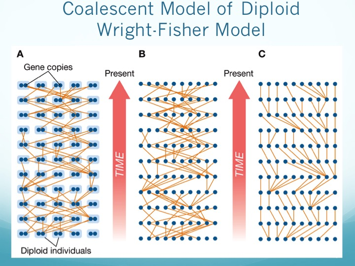

```{r, message=F,warning=F}

library(phangorn)
library(TeachingPopGen)
```

## Exploring Gene Genealogies

One of the two key tenets of Darwinian evolution is common descent - the idea that any two organisms share a common ancestor.  The same principle holds for alleles - two homologous sequences, regardless of their current differences, at some point in the past shared a common ancestor.  The problem is that, unlike reproductively isolated species, the relationships are reticulated, so that different pairs of alleles have different ancestries.  The objective of coalescence analysis is to develop the necessary theory to generate expectations regarding the process, and then analyze actual data within that framework.  We are asking  *Given an observed set of allelic DNA sequences, what can we infer about the evolutionary processes that gave rise to them?* The theory can be daunting, however it is worth the effort, since it offers the promise of providing robust insights into population and species histories.

### A Visual introduction

Before delving into the theory, we can consider the problem qualitatively. When we depart from a Hardy-Weinberg ideal population, and model a finite population of a given size (thus genetic drift is in action),  we call the resulting model a Wright-Fisher population (after Sewell Wright and R.A. Fisher). A Wright-Fisher model assumes a haploid population in which each individual reproduces without mating. Many population genetic models assume haploidy because it is so much simpler to model, and it turns out to make little difference to the result. 

Imagine you have two bags. One contains 2N marbles of different colors, representing different alleles in a population at generation *t*. You draw a marble from the bag, note its color, and place a marble of this color into the second bag (generation *t+1*). You keep doing this until the second bag has 2N marbles. You have just modeled a Wright Fisher population. The change in color frequencies from the first to the second bag is genetic drift.


Now let's consider a set of sequences taken from this Wright-Fisher population.  A phylogeneticist interested in that history would use one or more available algorithm to construct a phylogenetic tree, under the assumption that the most similar sequences share the most recent common ancestry.  We can do that with our acp29 data, reading it as follows:


```{r}
data(acp29) #read the data from a local file
names(acp29)<-c(1:17) # rename the sequences to clean up the output
```

#### Plotting a tree

Let's start with a possible tree that purports to trace our sequences to a common ancestor.  The easiest way to do that is with a function in the package `phangorn` (which may need to be installed in the usual way)

```{r}
#install.packages("phangorn") # uncomment if you need to install
library (phangorn) #note that this make take a while to load
```
```{r}

tree.rat <-pratchet(as.phyDat(acp29),trace=0) # Do parsimony; requires conversion of data to different type of object
tree.rat <-root(tree.rat,16,resolve.root=TRUE)
plot(tree.rat,root.edge=TRUE) # Plot the data, ignoring inferred branch lengths
```

Don't take this tree too seriously; it is simply a possible gene genealogy, and there are no doubt many more.  Remember - we are dealing with alleles in a population, not genes in different species. The bootstrap values are likely to be fairly low.  So we need to dig further.

What is nice about this tree is it gives us a hypothesis for how the samples are related to one another. Given a forward-time simulator of a Wright-Fisher population, we could simulate over and over until we got a set of relationships that look like this tree. That would be quite difficult! Remember that most lineages go extinct, and thus most population histories did not lead to these particular lineages being extant in the population. We would have to simulate trillions or probably more scenarios to recreate them. Far better would be to start with the sample we have (because we know that, whatever history it was, it led to these samples existing), and simulate **backwards**. This is the coalescent approach.




In a coalescent version of the Wright-Fisher model, each individual gene copy in generation *t+1* chooses its parent with equal probability among all parents in the previous generation. If two DNA sequences in generation *t+1* have the same parent in the previous generation, we say that the ancestral lineages representing these two individuals have *coalesced*. Given enough time, all lineages eventually coalesce! 

  The individual at which all lineages in a given sample coalesce is called the Most Recent Common Ancestor (MRCA) of the sample. The woman at which all human mtDNA sequences coalesce is called Mitochondrial Eve. Apart from the implications of the name, she wasn't the first woman, just one woman among many in Africa, whose lineage happened to go to fixation (in a time forward perspective). Y-chromosome Adam is the MRCA of all Y-chromosomes.

### Generating random trees

We return to program `ms`.  It is the most widely-used coalescent simulator. Remember that what it does is to simulate sequence evolution under the neutral model - that is, given either a value of &theta; or S (as well as, when appropriate, some other population parameters), it will generate simulated data sets; in addition it can, if the appropriate options are set, generate the data necessary for illustrating each set as a tree.

#### Running the simulations

So what we will do is to generate 6 random data sets, each with 17 sequences, 702 base pairs and 15 segregating sites, just like our actual dataset. The numbers following the -r parameter indicate that there is 0 recombination and 702 total positions, and the -T option indicates that we wish to have descriptions of the trees generated.
```{r}
tr <-ms(nsam=17,nreps=6,opts ="-s 15 -r 0 702 -T" )
```

#### Plotting the trees

We will talkmore about using ms output, but for now, we can use the read.tree function in `ape` to extract the data and then plot the trees:

```{r, results='hide', fig.height=15}
#par(mfrow=c(3,2))
trees <-read.tree(text=tr)
sapply(trees,plot)
par(mfrow=c(1,1))
```

These could be thought of as the gene genealogies of six different genes, **all sampled from the same individuals**.  What we see is a veritable forest (and if we increased nreps, we could get even more - `ms` is VERY fast, so that generation of 1000 simulations is a simple matter).  The question now becomes how to summarize the simulations in a way that is amenable to our usual form of analysis.  That is where we will go next.

### Summary

Everything we have covered assumes that a given set of alleles has a common ancestor (usually referred to as MRCA).  We have also assumed that the processes that gave rise to the set of alleles we've sequenced are the stochastic processes of mutation and drift, which are the components that go into &theta;, the neutral parameter.  What we see, however, is that there are, even for a small sample of alleles, a nearly infinite number of geneologies that can give rise to the observed data.  What we will now do is to divert into theory for a bit and ask how we might use some of the work we have done in analyzing DNA polymorphisms to see how we can better quantify the coalescent process.


