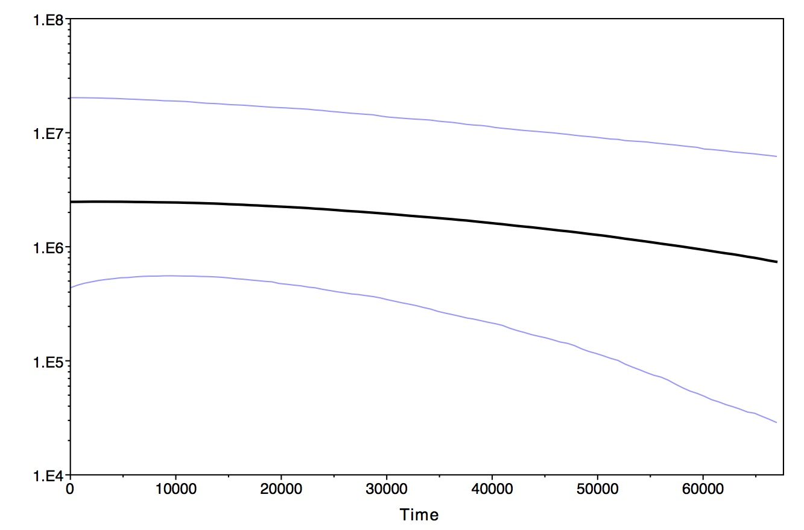

## BEAST - An Introduction

So up to this point, we've seen that we've used coalescent theory, starting from a set of nucleotide sequences, to make inferences about past population history, and in fact we managed to achieve some at least semi-plausible results.  However, none of the work we have done would even begin to appropach publishable standards.  Think again what our work has been based on:

1.  We assumed the phylogeny, based as it was on progressively grouping similar sequences, was the true gene geneaolgy.
2.  We assumed that "a mutation is a mutation is a mutation" (more on this in a minute).
3.  We assumed that the substitution rate was constant with time.

With those assumptions, we found that we could take a Bayesian approach, starting with the coalescent intervals derived from the tree, and find a distribution of values for N0 . . . N(TMRCA) that best fit the data.  But in fact, as we shall see, there is uncertainty in all three of our assumptions, so what we really want to do is something like the following:

1.  Select a model of mutation that is appropriate for our data
2.  Select a "molecular clock" model that best relates our mutation model to units of time.
3.  Based on those, generate a *distribution* of gene geneaologies that best explain our data
4.  Use that posterior distribution to estimate the gene genealogy, and from that do our Skyline (or other analyses).

BEAST stands for Bayesian Evolutionary Analysis by Sampling Trees - as its name implies, it does all of the following.  It is an incredibly complex program, but if managed correctly, it can be very powerful.  Thus, before delving into the actual workings of the program, we need to get at at least a few of the underpinnings. 

### Dealing with Forests of Trees

As we shall see, the output of BEAST consists of two files - one contains trees that were accepted as part of the posterior distribution of trees, drawn from the prior distribution that we specified.  As an illustration, we will demonstrate this very simplistically at part of the output of a simple BEAST run, performed on some simulated data generated by ms and ms2dna.  We've done this before - we are simulating 10 sequences of length 703 with 15 segregating sites

```{r,eval=FALSE}
#system("ms 10 1 -s 15 -r 0 703 -seed 1 2 3 | ms2dna >./BEAST/demo1.fasta")
```

We can visualize them in the usual way:

```{r}
seqs <-read.FASTA("../../BeastDemo/demo1.fasta")
image.DNAbin(as.matrix(seqs))
```

However, rather than staying in R, we will detour (in class) to the BEAST pipeline, doing the following:

1.  Load the data into BEAUTi, the program that prepares the model for BEAST analysis.  In so doing, we will, with two exceptions, stick to defaults.  First, we will specify that we want to use a constant size coalescent model as our prior distribution of trees.  Second,   we will reduce the number of MCMC cycles to 1,000,000 and specify a burn-in (early trees we discard) of 100,000.  Note also that we will only save every 1000th tree.
2.  Run BEAST
3.  Return to R to see some of what we got.


We now return to look at the output.  All of it was stored (at our choosing) in the folder BEAST.  Its contents are now

```{r}
list.files("../BeastDemo")
```

The key files are demo1.log and demo1.trees.  Our focus for now will be on the trees.  They are stored in what is called a "nexus" format, and they can be easily read by R.

```{r}
trees <-read.nexus("../BeastDemo/demo1.trees")
length(trees)
```

So we see we have `r length(trees)` of them.  What we can now do is to sample a few of them and look at their topology:

```{r}
par(mfrow=c(1,1))
s <-sample(length(trees),4)
x <-sapply(s, function(x) plot(trees[[x]]))

```

Since both BEAST and our sampling in R are stochastic in nature, the output will vary from run to run.  However, notice a few things:

1.  The overall topology of the trees are quite similar.  This is to be expected - remember that they were all generated from the same data set, and that furthermore, BEAST has generated (mysteriously at this point) a posterior distribution consisting of trees with the highest likelihood of being the actual one.
2.  The big problem is that, while the nodes mostly connect the same samples, the branch lengths (and the relative timing of the nodes) vary.  This is a problem - after all, those are what we are using in our coalescent analysis.  This can be visualized by plotting the same four trees, only telling R to ignore branch lengths:

```{r}
x <-sapply(s, function(x) plot(trees[[x]],use.edge.length=FALSE))
par(mfrow=c(1,1))
```

Now we see they are much more similar (although still not identical).

So obviously, at this point we need to think more about where the distribution of branch lengths came from.  To do so, we need to diverge into mutation theory.

### The log file - what is in it

As noted above, BEAST produces two output files, one containing the distribution of trees and the other calculations derived from each of those trees.  The log file is almost never used directly - rather it is used as input for analysis in TRACER.  However, for completeness sake, we can briefly look at its contents:

```{r}
dat.log <-read.table("../BeastDemo/demo1.log",header=TRUE)
head(dat.log)
```

About the only one of these headings that makes any sense at this point is popSize; in fact, by visualizing it, we can see the posterior distribution of population size estimate from our data:

```{r}
colhist(dat.log$popSize,xlab="Scaled Population Size",ylab="Frequency",main="Population Size Posterior Distribution")
abline(v=median(dat.log$popSize),col="darkred")
```

We can also get a preview of one of the kinds of output we will be looking at:

```{r}
plot(dat.log$popSize,xlab="Sample X 10^3",ylab="N", main="Population Size Scaled by Substitution Rate",type="l")
```

What we see is evidence for good "mixing" - that is, there are no evident correlations among sequentially accepted values in the distribution.

As we will see however, we can learn much more from this output.

### A Note on Rates


With BEAST, one can either use a predetermined substitution rate (preferably derived from independent data) or ask the program to estimate it.  In either case, the rate that BEAST works from is substitutions/site/unit time.  And if you can estimate the rate as part of the model (i. e. you have one or more calibration points), you do need to specify a prior distribution.  Here, the authors recommend selecting a log-normal distribution, for which you specify a mean and standard deviation.  In one of the worked examples (RSV), for example, the recommendation is for a log-normal distribution with mean of -2 and standard deviation of 1.25.  This distribution looks like the following

```{r}
x <-seq(.001,2,.001)
y <-dlnorm(x,-2,1.25)
plot(x,y,type="l")
mean(y)
quantile(y,c(0.025,.975))
```

So in this case, you would be restricting your prior to a range of something like .015 to 4.2 substitutions/site/year, a range that is reasonable for viral evolution.

### Summary

So at this point, we need to review the basic approach we are using


1.  We want to create a posterior distribution of gene genealogies that best explain the data.
2.  To do so, we have to specify a tree model (constant, skyline, etc.)
3.  We need to select a mutation model and set appropriate prior distributions for its parameters.
4.  With all that (plus more we haven't gotten to yet), we put BEAST to work to find the posteriors.

And then comes the analysis of the results.  We will be moving to that next, but first, we'll work through a couple of real data examples.

### Skyline Plots for our data

Let's do this analysis for our friend *Pomacentrus coelestis*. 

1. Create a FASTA file using just your Dongsha samples. Make sure to exclude any "weird" samples that are highly divergent or otherwise suspect. Talk to me if in doubt. 
2. Download the [BEAST](http://beast.community/installing) package to your computer. Also, download [Tracer](http://tree.bio.ed.ac.uk/software/tracer/)
3. Open up BEAUTi. If you are on a Mac you may need to open it by right clicking, selecting "open" and then granting it the right to open.
4. Drag your Dongsha.fasta file into the partitions tab
5. Click over to the sites tab and use the HKY model with empirical base frequencies and gamma site heterogeneity.
6. Click the tree tab and choose Coalescent: Bayesian Skyline. Use no more than 10 groups, but if you have fewer than n=20 samples, then use n/2 groups. Skyline model is piecewise-constant and use a random starting tree.
7. Click over to the priors tab and note that they are very weak, with bounds from zero to infinity. We will leave them as they are. Click on clock.rate and enter 3.5e-8, which is equivalent to 3.5% per million years.
8. Check out the operators tab - these are the little algorithms that will make minor updates in the search to create the posterior distribution.
9. Click to the MCMC tab, and keep all the defaults.
10. Click "Generate Beast File" and save the .xml file to your desktop or data folder.
11. From your Unix terminal, upload your XML file to the computational server "Treebeard" thusly (or you can do the computation on your own computer):

```{unix, eval=F}
cran5048$ ssh OTTERID@treebeard
cran5048@treebeard's password: 

#on treebeard
$ mkdir arena
$ logout

cran5048$ scp /Users/cran5048/github/BIO444/lessons/Data/pcoelestis_dongsha.xml OTTERID@treebeard:./arena

Warning - unauthorized access, attempted access, or use of any State computing system is a violation of Section 502 of the California Penal Code and/or applicable Federal Laws.

cran5048@treebeard's password: 
pcoelestis_dongsha.xml                                                                    100%   17KB 432.5KB/s   00:00    
```

12. Run beast thusly:

```{unix, eval=F}
cran5048$ ssh OTTERID@treebeard
cran5048@treebeard's password: 

$ scp OTTERID@treebeard
$ beast -beagle_off YOURFILE.xml
```
 And it should be off and running. It will likely take 15 minutes to an hour to complete.
 
13. Once it is finished:

```{unix, eval=F}
cran5048$ scp OTTERID@treebeard:./arena/your_prefix* ~/Desktop/A folder you have created
```

14. Now open Tracer and drag your .log file into it. We will discuss the meaning of each plot, but in generall you are looking for ESS (estimated sample size) values greater than 200.

15. From the `Analysis` menu select Bayesian Skyline Reconstruction, and select your .trees file. It will take awhile to process.

The skyline for *P. coelestis* in Dongsha is kinda boring:



 