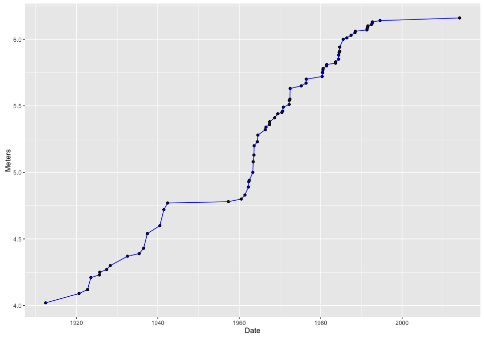
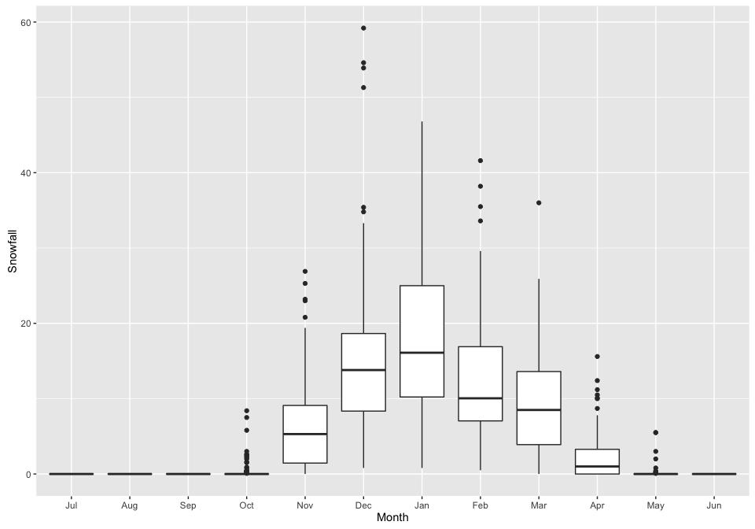
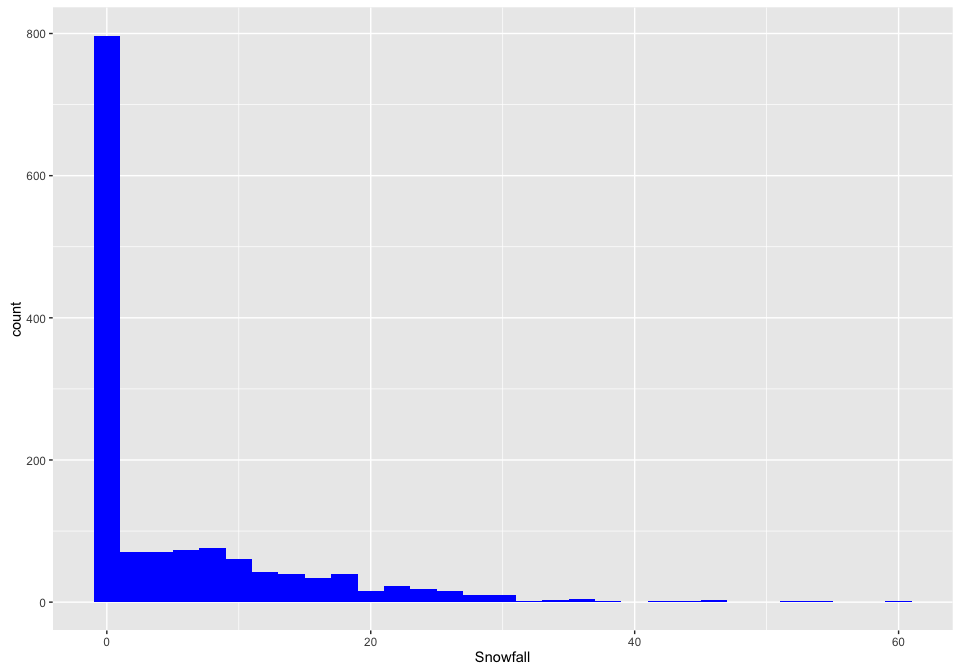
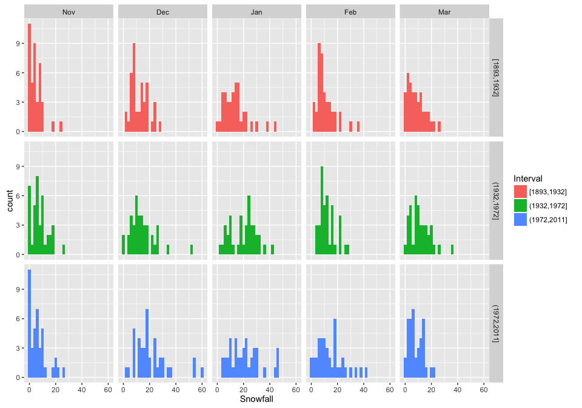
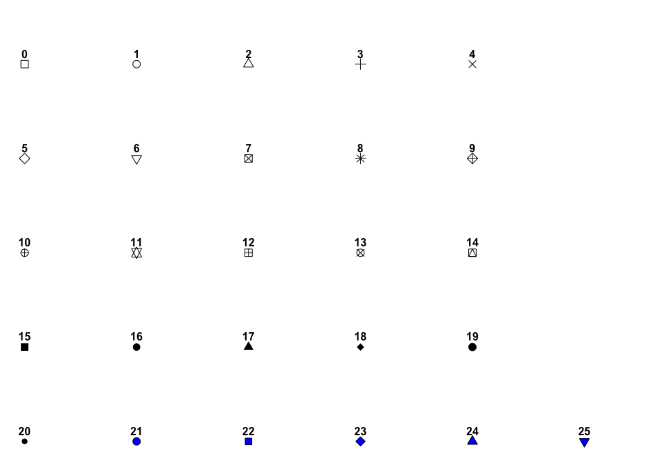
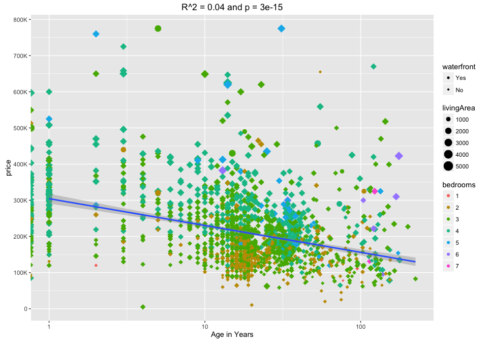

# Graphics in ggplot2
Eric Crandall  
`r Sys.Date()`  


# Intro to ggplot2 {#ggplot2-intro-lecture} 
Thanks to Eric Anderson for lesson ideas and code!


### Prerequisites {#ggplot-prereq}
* To work through the examples you will need a few different packages.
* Please download/install these before coming to class:
    1. install necessary packages:
        
        ```r
        install.packages(c("ggplot2","lubridate", "plyr", "mosaic", "mosaicData", "reshape2","png"))
        ```
    2. Pull the most recent version of the rep-res-course repo just before coming to class.

### Goals for this session:

1. Describe (briefly) `ggplot2`s underlying philosophy and how 
to work with it.
2. Quickly overview the _geom_s available in `ggplot2`
3. Develop an example plot together
4. Discuss _wide_ vs. _long_ format data, and how ggplot operates on the latter
5. Introduce the `reshape2` package for converting between _wide_ and _long_ formats
6. Demonstrate _faceting_ (creating many smaller plots whilst breaking data up over different categories)
7. Brief discussion of ggplot's _stats_ (statistical transformations)
8. Turn you all loose with the `mosaic` package to experiment with different plots


## About ggplot2

### Basics

* A package created by Hadley Wickham in 2005
* Implements Leland Wilkinson's ["grammar of graphics"][ggraphics]
* Unified way of thinking about 2-D statistical graphics
* Not entirely easy to learn
    + if you already know R's base graphics system, it is a little painful to re-learn a different way of doing things
    + if you don't already know how to do graphics in R, be glad,
    because this systems is more comprehensive and creates better
    looking plots that are publishable quality.
    
* Amazing for quick data exploration and also produces publication quality graphics
* Support for legends etc., considerably better/easier than R base graphics

[ggraphics]: https://www.amazon.com/Grammar-Graphics-Statistics-Computing/dp/0387245448

### What is this grammar of graphics?

* Traditionally, people have referred to plots by _name_
    + i.e., scatterplot, histogram, bar chart, bubble plot, etc.
* Disadvantages:
    + Lots of possible graphics = way too many names 
    + Fails to acknowledge the common elements / similarities / dissimilarities between different plots
* Wilkinson's [_Grammar of Graphics_][ggraphics] (a book) describes a few building blocks which when assembled together
in particular ways can generate all these named graphics (and more)
    + Provides a nice way of thinking about and describing graphics


### ggplot2

* Hadley Wickham's R implementation of a modified (_layered_) grammar of graphics
* `ggplot` and `ggplot2` are similar. ``ggplot2` is just more recent (and recommended)
* `ggplot` operates on _data frames_
    + in R base graphics typically you pass in vectors
    + in `ggplot` everything you want to use in a graphic must be contained within a data frame
    + needs to be in _long format_ rather than _wide format_. We will
    learn what these mean.
    + Takes getting used to, but ultimately is a good way of thinking about it.

### Components of the grammar of graphics

1. _data_ and _aesthetic mappings_
2. _geoms_ (geometric objects)
3. _stats_ (statistical transformations)
4. _scales_ 
5. _coords_ (coordinate systems)
6. _facets_ (a specification of how to break things into smaller subplots)

We will try to touch on everything but _coords_ today.

### In a nutshell

Without getting into the complications of scales and coordinate systems
here, in a nutshell, is what ggplot does:

* Layers in plots are made by:
    1. mapping _values_ in the columns of a data frame to _aesthetics_, which are properties that can visually express differences, for example:
        a. $x$-position
        b. $y$-position
        c. shape (of a plot character, for example)
        d. color
        e. size (of a point, for example)
    2. Portraying those values by drawing a _geometric object_ whose appearance and placement in space is dictated by the mapping of values to aesthetics.


## An example, please {#pv-example}

Phew! That is a crazy mouthful. Is this really going to help us make pretty plots?

All I can say is you owe it to yourself to persevere --- `ggplot2` is really worth the effort!

### A pole vaulting example

* Here is a concrete example: we will investigate the history of pole-vaulting world records
* I grabbed the data by copying them from http://en.wikipedia.org/wiki/Men's_pole_vault_world_record_progression and pasting them into a text file
* Here we read them in:
    
    ```r
    library(ggplot2)
    library(lubridate)
    library(plyr)
    ```
    
    ```
    ## 
    ## Attaching package: 'plyr'
    ```
    
    ```
    ## The following object is masked from 'package:lubridate':
    ## 
    ##     here
    ```
    
    ```r
    # first off read the data into a data frame
    pv <- read.table("https://ericcrandall.github.io/BIO444/lessons/ggplot/data/mens_pole_vault_clean.txt", 
                sep = "\t", 
                header = TRUE, 
                stringsAsFactors = FALSE
                )
    #change date to true date format
    pv$Date<-ymd(pv$Date)
    #View(pv)
    ```

* Here are the first few rows of our data fram:
    
    ```r
    head(pv)
    ```
    
    ```
    ##   Meters      Athlete         Nation               Venue       Date X
    ## 1   4.02  Marc Wright  United States     Cambridge, U.S. 1912-06-08 1
    ## 2   4.09   Frank Foss  United States    Antwerp, Belgium 1920-08-20 1
    ## 3   4.12 Charles Hoff         Norway Copenhagen, Denmark 1922-09-22 1
    ## 4   4.21 Charles Hoff         Norway Copenhagen, Denmark 1923-07-22 2
    ## 5   4.23 Charles Hoff         Norway        Oslo, Norway 1925-08-13 3
    ## 6   4.25 Charles Hoff         Norway      Turku, Finland 1925-09-27 4
    ```

### A first ggplot

* FYI There is a simplified ggplot function called `qplot` that behaves more like R's base graphics
function `plot()`.
    + I don't recommend `qplot`.  It will just lengthen the time it takes to understand the grammar of graphics.
    + Instead, we will use the full `ggplot()` standard syntax.
    
1. First we have to essentially establish a plotting area upon which to add layers. We will do this like so:
    
    ```r
    g <- ggplot()
    ```
    At this point, `g` is a ggplot plot object.  We can try printing it:
    
    ```r
    g
    ```
    
    
    That doesn't work, because there is nothing to plot.  We have to add a layer to it.
2. Adding a layer is done by adding a collection of geometric objects to it using one of the `geom_xxxx` functions. Each such function 
requires a _data set_ and a _mapping_ of columns in the data set to _aesthetics_.  Let's make some scatter-points: Meters as a function of Date:
    
    ```r
    g2 <- g + geom_point(data = pv, mapping = aes(x = Date, y = Meters))
    g2
    ```
    
    
    
Here are some interesting points about:
    
    ```r
    g2 <- g + geom_point(data = pv, mapping = aes(x = Date, y = Meters))
    g2
    ```
    a. You add layers by catenating them with `+`.
    b. the names of the columns don't need to be quoted.
    c. when you map aesthestics you wrap them inside the `aes()` function
    b. the full object with all the layers is returned into `g2` and then we printed it (by typing `g2`).
    (we could have also just said `g + geom_point(data = pv, mapping = aes(x = Date, y = Meters))`)
    d. we didn't have to do anything fancy to the dates...ggplot knew how to plot them.
    
3.  I want to overlay a line on that...No problem!  Add another layer:
    
    ```r
    g3 <- g2 + geom_line(data = pv, mapping = aes(x = Date, y = Meters))
    g3
    ```
    
    
    
    That worked! We just added (literally, using a `+` sign!) another layer---one that had a line on it. BUT! what if I want
    to make that line blue?
4. Make the line blue.  Note that you are giving the line an aesthetic property (the color blue), but you are not mapping that
to any values in the data frame, __so__ you don't put that within the `aes()` function:
    
    ```r
    g4 <- g2 + geom_line(data = pv, mapping = aes(x = Date, y = Meters), color = "blue")
    g4
    ```
    
    
    
    That worked!  Notice that we were able to put that new layer atop `g2` which we had stored previously.
    

### ggplot's system of defaults

* I am really tired of typing `data = pv, mapping = aes(x = Date, y = Meters)` isn't there some way around that?
* Yes! You can pass a default data frame and/or default mappings to the original `ggplot()` function.  Then, if data
and mappings are not specified in later layers, the defaults are used. 
    
    ```r
    d <- ggplot(data = pv, aes(x = Date, y = Meters))  # this defines defaults
    d2 <- d + geom_point()  # add a layer with points
    d2  # print it
    ```
    
    
* Now we can add all sorts of fun layers as we see fit, each time, by invoking a `geom_xxx()` function.
* Let's go totally crazy!

1. Establish plot base with defaults:
    
    ```r
    d <- ggplot(data = pv, aes(x = Date, y = Meters))
    ```
2. Add a transparent turquoise area along the back:
    
    ```r
    d2 <- d + geom_ribbon(aes(ymax = Meters), ymin = min(pv$Meters), alpha = 0.4, fill = "turquoise")
    d2
    ```
    
    
    
    Wow! Transparency is not so easy in R base graphics!
    
3. Put a line along there too:
    
    ```r
    d3 <- d2 + geom_line(color = "blue")
    d3
    ```
    
    
4. Now add some small orange points:
    
    ```r
    d4 <- d3 + geom_point(color = "orange")
    d4
    ```
    
    
5. Now, add "rugs" along the $x$ and $y$ axes that show the position of points, and
in them, map _color_ to _Nation_:
    
    ```r
    d5 <- d4 + geom_rug(sides = "bl", mapping = aes(color = Nation))
    d5
    ```
    
    
    * Note that we are using the `aes()` function to add the mapping of _color_ to _Nation_ within the `geom_rug()` function.
        + Note also that the legend was created automatically.
    * Wow! A legend is produced automatically, by default, and it looks pretty good.  This doesn't happen without an all-out
    wrestling match in R's base graphics system.
    
* So, that was some fun playing around with the truly awesome ease with which you can build up complex and lovely graphics with ggplot.


          
### How many geoms are there?

* Quite a few.  There is a good summary with little icons for each [here](http://docs.ggplot2.org/current/)
* Note that most geoms respond to the aesthetics of `x`, `y`, and `color` (or `fill`).  And some have more (or other) aesthetics you can
map values to.

## Wide vs Long format {#wide-v-long}

In the past you have probably encountered data in two different formats, _wide_ and _long_, without ever really thinking about it. _Wide_ data are sometimes easier for humans to grok. _Long_ data are easier to use with statistical packages, and also make more sense at a basic level: each row is an observation.
### Grand Rapids, MI snow data 1893-2011
* We will explore this using the snowfall data from Grand Rapids, Michigan that is in the `mosaicData` package.
* Here we will print out a small part of it:
    
    ```r
    library(mosaicData)
    dim(SnowGR)  # how many rows and columns?
    ```
    
    ```
    ## [1] 119  15
    ```
    
    ```r
    head(SnowGR)  # have a look at the first few rows
    ```
    
    ```
    ##   SeasonStart SeasonEnd Jul Aug Sep Oct  Nov  Dec  Jan  Feb  Mar Apr May
    ## 1        1893      1894   0   0   0 0.0  8.0 24.9 12.5  6.8  4.8   2   0
    ## 2        1894      1895   0   0   0 0.0  7.5  5.3 21.5  8.0 22.5   0   0
    ## 3        1895      1896   0   0   0 0.4 23.2 15.0   NA  8.5  2.0   0   0
    ## 4        1896      1897   0   0   0 0.2  8.0  8.0  4.9 11.2 12.0   0   0
    ## 5        1897      1898   0   0   0 0.0  1.4  8.0 15.5 29.5  0.0   0   0
    ## 6        1898      1899   0   0   0 0.0 18.5 18.0 20.0  3.4 16.0   0   0
    ##   Jun Total
    ## 1   0  59.0
    ## 2   0  64.8
    ## 3   0  49.1
    ## 4   0  44.3
    ## 5   0  54.4
    ## 6   0  75.9
    ```
* We could think of a few plots we might want to make from this:
    + Average snowfall for each month
    + Distribution since 1893 of snowfall in each month, 
    + etc.
* Would be great to explore this with ggplot, but there is one small problem:
    + ggplot accepts _long_ format data, and `SnowGR` is in _wide_ format.
    
### Wide vs. Long, colloquially

* Wide format data is called "wide" because it typically has a lot of columns
which stretch widely across the page or your computer screen
* Long format data is called "long" because it typically has fewer columns
but preserves all the same information.  In order to that, it has to
be longer...
* Most of us are familiar with looking at wide format data
    + It is convenient if you are doing data entry
    + It often lets you see more of the data, at one time, on your screen 
* Long format data is typically less familiar to most humans
    + It seems awfully hard to get a good look at all (or most) of it
    + It seems like it would require more storage on your hard disk
    + It seems like it would be harder to enter data in a long format
    + if we have been using Microsoft Excel for too long our conceptual
    model for how to analyze data may never have developed beyond thinking
    about operating on columns as if each one were a separate entity.
* Which is better?
    + Well, there _are_ some contexts where putting things in wide format is computationally
    efficient because you can treat data in a matrix format and do efficient
    matrix calculations on it.
    + However, 
        1. adding data to wide format data sets is very hard
        1. it is very difficult to conceive of analytical schemes
        that apply generally across all wide-format data sets. 
        1. many tools in R want data in long format
        1. the long format for data corresponds to the _relational model_ for
        storing data, which is the model used in most modern data bases like
        the SQL family of data base systems.
        
### ID variables, Measured variables, Values

* A more technical treatment of wide versus long data requires some terminology:
    + <span style="color:blue">Identifier variables</span> are often categorical things that cross-classify observations into
      categories.
    + <span style="color:red">Measured variables</span> are the names given to properties or characteristics that you can go out
    and measure.
    + <span style="color:orange">Values</span> are the values that you measure and record for any particular measured variable.
* In any particular data set, what you might want to call an <span style="color:blue">Identifier variables</span> versus a
<span style="color:red">Measured variables</span> can not always be entirely clear. 
    + Other people might choose to define things differently.
* However, to my mind, it is _less important_ to be able to precisely recognize these three entities in every possible situation (where there might be some fuzziness about which is which)
* And it is _more important_ to understand how <span style="color:blue">Identifier variables</span>,
<span style="color:red">Measured variables</span>, and <span style="color:orange">Values</span> interact and
behave when we are transforming data between wide and long formats.


### Variables and values in SnowGR

* To give this some concreteness, let's go back to the SnowGR data set.
* However, let us drop the "Total"  column from it first because that is 
just computed from the other columns and is not "directly measured".
    
    ```r
    Snow <- SnowGR[, -ncol(SnowGR)]
    ```
* Now, color it up:  
    
* We can think of SeasonStart and SeasonEnd as being <span style="color:blue">Identifier variables</span>.
They identify which season we are in.
* The months are the <span style="color:red">Measured variables</span>, because you go out and measure snow in each month
* And the <span style="color:orange">Values</span> occupy most of the table.


### Long Format Snow

* When something is in long format, there are columns for values of the <span style="color:blue">Identifier variables</span>
and there is _one column_ for the values of the values of the <span style="color:red">Measured variables</span> and 
one column for the <span style="color:orange">Values</span> 
* This is called a [Tidy Data](http://vita.had.co.nz/papers/tidy-data.pdf) format.
* It looks like this:  
    
* This is the type of data frame that ggplot can deal with.

### Reshaping data

* Hadley Wickham's package `reshape2` is perhaps the nicest utility for converting
between long and wide format (of course).
* Today we will look at the `melt` function which converts from wide to long format.
* When you "melt" a big, wide, block of data, you can stretch it easily into long format.
* `melt` takes a few arguments. The most important are these:
    +  __data__: the data frame in wide format
    + <span style="color:blue">id.vars</span>: character vector of the names of the columns
    that are the <span style="color:blue">Identifier variables</span>
        * __NOTE__: if this is omitted, but <span style="color:red">measure.vars</span> is given, then all the columns that __are not__
    in <span style="color:red">measure.vars</span> are assumed to be <span style="color:blue">id.vars</span>
    + <span style="color:red">measure.vars</span>: The names of the columns that hold the <span style="color:red">Measured variables
    </span>.  
        * __NOTE__: if this is ommitted, but <span style="color:blue">id.vars</span> is given, then all the columns that __are not__
    in <span style="color:blue">id.vars</span> are assumed to be <span style="color:red">measure.vars</span>
    + __variable.name__: What do you want to call the column of <span style="color:red">Measured variables</span> in the
    long (or molten) data frame that you are making?
    + __value.name__: What do you want to call the column of <span style="color:orange">Values</span> in the long format data
    frame you are making?
* Let's see it in action:
    
    ```r
    library(reshape2)
    longSnow <- melt(data = Snow, 
                     id.vars = c("SeasonStart", "SeasonEnd"), 
                     variable.name = "Month", 
                     value.name = "Snowfall"
                    )
    head(longSnow)  # see what it looks like
    ```
    
    ```
    ##   SeasonStart SeasonEnd Month Snowfall
    ## 1        1893      1894   Jul        0
    ## 2        1894      1895   Jul        0
    ## 3        1895      1896   Jul        0
    ## 4        1896      1897   Jul        0
    ## 5        1897      1898   Jul        0
    ## 6        1898      1899   Jul        0
    ```
* Note that you have to __quote__ the column names (unlike in ggplot!)
## Plotting some snowfall

We are going to make some plots to underscore some particular points about ggplot

### Order of items done via factors

* Let's make simple boxplots summarizing snowfall for each month over all the years.  We want 
Month on the $x$-axis and we will map Snowfall to the $y$-axis.
    
    ```r
    g <- ggplot(data = longSnow, mapping = aes(x = Month, y = Snowfall))
    g + geom_boxplot()
    ```
    
    ```
    ## Warning: Removed 7 rows containing non-finite values (stat_boxplot).
    ```
    
    
* Hey!  The months came out in the right order.  That is cool.  Why?
    + Because, by default, `melt` made a factor of the Month column and
    ordered the values as they appeared in the data frame:
        
        ```r
        class(longSnow$Month)
        ```
        
        ```
        ## [1] "factor"
        ```
        
        ```r
        levels(longSnow$Month)
        ```
        
        ```
        ##  [1] "Jul" "Aug" "Sep" "Oct" "Nov" "Dec" "Jan" "Feb" "Mar" "Apr" "May"
        ## [12] "Jun"
        ```

### Colors: discrete or continuous gradient?

* When `ggplot` applies colors to things, it uses discrete values if the values are discrete (aka factors or characters) and 
continuous gradients if they are numeric.
* We can plot points, coloring them by SeasonStart (which is numeric...) instead of making boxplots
    
    ```r
    g + geom_point(aes(color = SeasonStart))
    ```
    
    ```
    ## Warning: Removed 7 rows containing missing values (geom_point).
    ```
    
    
* If we made a factor out of SeasonStart, then each SeasonStart gets it own color (far more than would be reasonable to visualize)
    
    ```r
    g + geom_point(aes(color = factor(SeasonStart)))
    ```
    
    ```
    ## Warning: Removed 7 rows containing missing values (geom_point).
    ```
    
    
* So that is a little silly.

### Dealing with overplotting of points 

* Notice that many points are drawn over one another.  You can reveal many more points by "jittering" each one.
* This is easily achieved with `geom_jitter()` instead of `geom_point()`
    
    ```r
    g + geom_jitter(aes(color = SeasonStart))
    ```
    
    ```
    ## Warning: Removed 7 rows containing missing values (geom_point).
    ```
    
    


## Faceting {#ggplot-facets}

* Sometimes it is helpful to break your data into separate subsets (usually on the value of a factor) and make a plot that
is a series of smaller plots.

### Facet Wrap
* Let's consider looking at a histogram of Snowfall:
    
    ```r
    d <- ggplot(data = longSnow, aes(x = Snowfall)) + geom_histogram(binwidth = 2, fill = "blue")
    d
    ```
    
    ```
    ## Warning: Removed 7 rows containing non-finite values (stat_bin).
    ```
    
    
* That is nice, but it might be more interesting to see that month-by-month
* We can add a `facet_wrap` specification.  We are "faceting"" in one long strip by `month` but then "wrapping" it to fit on the page in 4 columns:
    
    ```r
    d + facet_wrap(~ Month, ncol = 4)
    ```
    
    ```
    ## Warning: Removed 7 rows containing non-finite values (stat_bin).
    ```
    
    

### Facet Grid
* You can also make a rows x column `facet_grid`.  In fact that is where the `~` sort of specification comes from.  
* Let's imagine that we want to look at Nov through Mar snowfall, in the three different, equal-length, periods of years.

```r
    # make intervals
    longSnow$Interval <- cut_interval(longSnow$SeasonStart, n = 3, dig.lab = 4)

    # here is what they are:
    levels(longSnow$Interval)
```

```
## [1] "[1893,1932]" "(1932,1972]" "(1972,2011]"
```
Now, we are really just interested in the winterish months: November, December, January, February and March. How do we subset the data to just include these months? There is a construct in r called `%in%`. It is syntactically the same as `match()`, but sometimes more intuitive to use. It is used in the same way that `which` is used, but for a vector of possible matches, rather than a single T/F test.


```r
    # get just the months we are interesed in
winterMonths<-c("Nov", "Dec", "Jan", "Feb", "Mar")
winterSnow <- longSnow[longSnow$Month %in% winterMonths,]
levels(winterSnow$Month)
```

```
##  [1] "Jul" "Aug" "Sep" "Oct" "Nov" "Dec" "Jan" "Feb" "Mar" "Apr" "May"
## [12] "Jun"
```

Notice that the `levels` of the summer months are still part of the factor!

```r
winterSnow<-droplevels(winterSnow)
levels(winterSnow$Month)
```

```
## [1] "Nov" "Dec" "Jan" "Feb" "Mar"
```
* Now we can plot that with a facet_grid:
    
    ```r
    w <- ggplot(winterSnow, aes(x = Snowfall, fill = Interval)) + 
      geom_histogram(binwidth = 2) +
      facet_grid(Interval ~ Month)
    w
    ```
    
    ```
    ## Warning: Removed 4 rows containing non-finite values (stat_bin).
    ```
    
    
* How about a different kind of plot that is like a continuous boxplot? Just for fun.
    
    ```r
    y <- ggplot(winterSnow, aes(x = Month, y = Snowfall, fill = Interval))
    y + geom_violin() + facet_wrap(~ Interval, ncol = 1)
    ```
    
    ```
    ## Warning: Removed 4 rows containing non-finite values (stat_ydensity).
    ```
    
    

## ggplot's statistical transformations

* In order to create boxplots and histograms, ggplot is clearly doing some sort of statistical
operations on the data.  
    + For the histograms it is _binning_ the data
    + For the box plots it is computing _boxplot_ statistics (notches, and medians, etc)
    + For the violine plots it is computing _density_ statistics.
* Each `geom_xxx()` function is associated with a default `stat_xxxx` function and vice-versa.

### Accessing the outputted values of stat_xxxx() functions

* This is not entirely trivial, but can be done by looking at the output of `ggplot_build()`
    
    ```r
    boing <- ggplot_build(d) #let's look at our simple histogram
    ```
    
    ```
    ## Warning: Removed 7 rows containing non-finite values (stat_bin).
    ```
    
    ```r
    head(boing$data[[1]])
    ```
    
    ```
    ##     y count  x xmin xmax    density     ncount  ndensity PANEL group ymin
    ## 1 797   797  0   -1    1 0.28043631 1.00000000 2842.0000     1    -1    0
    ## 2  71    71  2    1    3 0.02498241 0.08908407  253.1769     1    -1    0
    ## 3  71    71  4    3    5 0.02498241 0.08908407  253.1769     1    -1    0
    ## 4  73    73  6    5    7 0.02568614 0.09159348  260.3087     1    -1    0
    ## 5  76    76  8    7    9 0.02674173 0.09535759  271.0063     1    -1    0
    ## 6  60    60 10    9   11 0.02111189 0.07528231  213.9523     1    -1    0
    ##   ymax colour fill size linetype alpha
    ## 1  797     NA blue  0.5        1    NA
    ## 2   71     NA blue  0.5        1    NA
    ## 3   71     NA blue  0.5        1    NA
    ## 4   73     NA blue  0.5        1    NA
    ## 5   76     NA blue  0.5        1    NA
    ## 6   60     NA blue  0.5        1    NA
    ```
* This can be a fun exercise to get your head around what sort of data are produced by each of the stats (and there
are quite a few of them!  http://docs.ggplot2.org/current/ )

### Using a stat by itself

We can add stats to our plots directly as well. Let's have a look at houses in Saratoga, New York.


```r
m <- ggplot(data=SaratogaHouses, aes(x = age, y = price))
m1 <- m + geom_point()
m1 + stat_smooth(method = lm)
```


Now let's play a little with this data


```r
#lets fade the points a little
m2 <- m + geom_point(color="grey60") + stat_smooth(method=lm)
m2
```


```r
# size the points by living area
m2 <- m + geom_point(color="grey60", mapping=aes(size=livingArea))+
  stat_smooth(method=lm)
m2
```


```r
# more fun, lets apply aesthetics for size and shape
m2 <- m + geom_point(mapping=aes(size=livingArea, color=bedrooms, shape=waterfront))+
  stat_smooth(method=lm)
m2
```


Now lets start playing with scales. First, here are the possible shapes in R.




```r
# lets make bedrooms into a factor so that ggplot will treat it as discrete values.
SaratogaHouses$bedrooms<-as.factor(SaratogaHouses$bedrooms)
# starting over
m <- ggplot(data=SaratogaHouses, aes(x = age, y = price))
# change the color scale
m2 <- m + geom_point(mapping=aes(size=livingArea, color=bedrooms, shape=waterfront))+ stat_smooth(method=lm) + scale_fill_discrete() 

#lets choose our shapes too 
m2 <- m + geom_point(mapping=aes(size=livingArea, color=bedrooms, shape=waterfront))+
  stat_smooth(method=lm)  + 
  scale_shape_manual(values=c(16,18)) +  scale_color_discrete()
m2
```


## Working with Annotations and Axes

We can annotate our plots thusly:

```r
m3 <- m2 + annotate("text",x=25,y=4e+05,label="New Houses")
m3 <- m3 + annotate("text",x=150,y=1e+05,label="Old Houses")
m3 <- m3 + geom_abline(slope=0,intercept=2.5e+5)
m3 <- m3 + annotate("text",x=25,y=3e+05,label="Our budget")
m3
```


The first parameter of `annotate()` can take any geom, so we could add boxes, line segments etc.

We can limit the x and y axes in a very similar way to the base package


```r
m4 <- m3 + xlim(0,100) 
m4
```

```
## Warning: Removed 83 rows containing non-finite values (stat_smooth).
```

```
## Warning: Removed 83 rows containing missing values (geom_point).
```

```
## Warning: Removed 1 rows containing missing values (geom_text).
```


And we can change the names of the tick labels and axes, and add a title

```r
#first lets do the actual regression to get some useful info to put in our title
ageprice<-lm(SaratogaHouses$price ~ SaratogaHouses$age)
adj.r.squared<-signif(summary(ageprice)$adj.r.squared,1)
pvalue<-signif(summary(ageprice)$coefficients[2,4],1)
m4 <- m2 + scale_y_continuous(breaks=seq(0,800000,by=100000), 
                              labels = c("0","100K","200K","300K","400K","500K","600K","700K","800K")) + 
  xlab("Age in Years") +
  ggtitle(paste("R^2 =",adj.r.squared,"and p =",pvalue,sep=" ")) 
m4
```


And finally we can use a logarithmic scale

```r
m5 <- m4 + scale_x_log10()
m5
```

```
## Warning: Removed 83 rows containing non-finite values (stat_smooth).
```



## Playing on your own {#ggplot-play-on-own}

It can be downright daunting learning `ggplot`, and difficult to show you everything in one class.  That is why I recommend you
get a feel for it by playing with a sort of ggplot GUI developed by the guys who
make the `mosaic` package.

Do this:

```r
library(mosaic)

mPlot(SAT, system = "ggplot")
```
This will load the SAT dataset into moscaic's ggplot "interactor".  

* Click the "gear" symbol in the upper left of the plot window and start fiddling!
    + Note that you only access a fraction of ggplot's functionality this way, but it can still be informative.
* Hit the Show Expression button to see what commands create the resulting plot.
* Look for other data sets.  Type `data()` to see a list of them.  Or try 

```r
data(package = "mosaicData")
```
Then consider:

```r
mPlot(Galton, system = "ggplot")
mPlot(Births78, system = "ggplot")
mPlot(mtcars,system = "ggplot")
```
Or plug your own data frame in there.

* After seeing the expression, can you modify it to add more stuff, like:

```r
Births78$day_of_week <- wday(ymd(Births78$date), label = TRUE)
ggplot(data=Births78, aes(x=dayofyear, y=births, color = day_of_week)) + geom_point()  + theme(legend.position="right") + labs(title="") + geom_smooth(method = "loess", alpha = .1)
```


