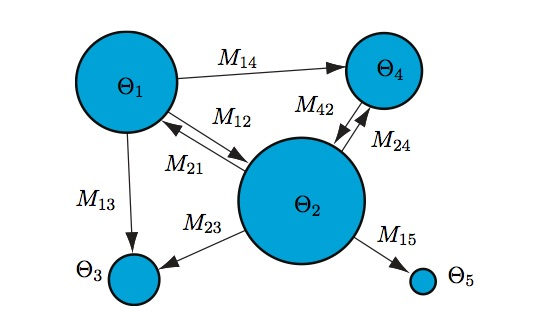
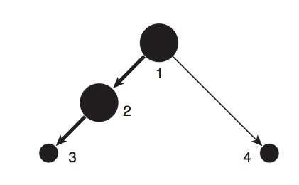

## Migrate Introduction

[Migrate-n](http://popgen.sc.fsu.edu/Migrate/Info.html) is a program for inferring effective population sizes and gene flow rates and direction within a metapopulation using a Markov Chain Monte Carlo search of parameter space with coalescent simulations. It was written by Dr. Peter Beerli at Florida State University. The program is famously difficult to use, and the [documentation](http://popgen.sc.fsu.edu/migratedoc.pdf) is lengthy and abstruse. The program estimates two parameters for each population that you give it: $\theta = 4N_e\mu$ and $M = \frac{m}{\mu}$. One main assumption of the program is that all populations have been "infinitely" separated - it does not handle models of divergence...yet (there is a beta version that includes divergence, and possibly also population size change).



Migrate is controlled by a "parameter file" that controls all of the myriad settings that one can use for one's data. We will walk through the example below:

```{bash, eval=F}
################################################################################
# Parmfile for Migrate 3.6.4 [do not remove these first TWO lines]
menu=NO
nmlength=10
datatype=SequenceData
ttratio= 4.18
freqs-from-data=YES
seqerror-rate=0.0
categories=1
rates=4:1.611612e-06 1.884553e-03 1.181330e-01 3.879981e+00
prob-rates=4:0.598 0.362 0.04 0.001
autocorrelation=NO
weights=NO
interleaved=NO
fast-likelihood=NO
inheritance-scalars={1}
population-relabel={1 2 3 4}
usertree=RANDOMTREE
infile=../abuabd_CB_coleman_newH.mig
random-seed=AUTO
title=abuabd_CB_coleman_newH
progress=VERBOSE
logfile=NO
print-data=NO
outfile=outfile.txt
pdf-outfile=abuabd_CB_coleman_newH_outfile.pdf
use-M=YES
plot=NO
mathfile=mathfile
profile=ALL:QUICK
print-tree=NONE
write-summary=NO
aic-modeltest=NO
mig-histogram=NO
skyline=NO
theta=own:{0.01}
migration=own:{100000}
mutation=CONSTANT
fst-type=THETA
custom-migration={
*000
**00
0**0
*00*
}
geo=NO
bayes-update=YES
bayes-updatefreq=0.500000
bayes-posteriorbins=500 500
bayes-posteriormaxtype=ALL
bayes-file=YES:bayesfile
bayes-allfile=YES:1:bayesallfile
bayes-proposals= THETA METROPOLIS Sampler
bayes-proposals= MIG SLICE Sampler
bayes-priors= THETA WEXPPRIOR: 0.000010 0.010000 10.000000 1.00000 
bayes-priors= MIG WEXPPRIOR: 0.000100 100000.000000 1000000.000000 100000.000000 
long-chains=1
long-inc=500
long-sample=100000
burn-in=10000
heating=YES:1:{1,1.5,3,100000}
heated-swap=YES
moving-steps=NO
long-chain-epsilon=INFINITY
gelman-convergence=No
replicate=YES:3
resistance=0.000100
end
```

At the top are parameters having to do with the model of molecular evolution that we are using. Migrate can use microsatellites, Sanger DNA, and SNP data. The inheritance scalar is set to 1, rather than 4 (as in 4Nem) because we are using mitochondrial DNA. mtDNA has 1/4 of as many copies as nuclear DNA because it is 1) haploid and 2) passed only through females (so male copies don't really count).

Towards the end are parameters that have to do with the MCMC search, including the number of samples of the posterior to take and the increment at which to take each sample. If you multiply these two items together, you get the total length of the MCMC "chain" that you will be running. There is the burnin which is the number of samples to discard because they are before the chain reaches an equilibrium. Also, importantly, there are the priors for $\theta = N_e\mu$ and $M = \frac{m}/{\mu}$.

Of particular interest is the matrix of 0 and \*: this is what lets us specify a hypothesis about gene flow in our metapopulation. We can use migrate-n to calculate the likelihood of several alternative hypotheses, thus allowing us to use strong inference to understand migration in our species. The columns denote the departure population and the rows denote the arrival population. The diagonals contain the theta parameter for each population.  \* means we are inserting this parameter into the model to be estimated. 0 means no estimated parameter. We could also conceivably use S for symmetric migration, or m for mean migration (all m's have the same mean)

|   | 1 | 2 | 3 | 4 |
|---|---|---|---|---|
| 1 | \* | 0 | 0 | 0 |
| 2 | \* | \* | 0 | 0 |
| 3 | 0 | \* | \* | 0 |
| 4 | \* | 0 | 0 | \* |

This matrix denotes the following metapopulation model, where population 1 is a source and 3 and 4 are sinks.



## Setting up Migrate-n
So now we will go about setting up for a migrate run.

1. First, find the closest 3-4 populations to Dongsha and create a new FASTA file containing only these sequences. For *P. coelestis* I have chosen populations in Okinawa, Hainan and Taiwan.
2. Stop and think about some hypotheses that you'd like to test with these populations.
3. Make a copy of the parmfile that I posted above. Open it in a text editor.

4. Determine the optimal model of molecular evolution for your dataset. We will use `modeltest` in the phangorn package. We need to determine the gamma shape parameter that governs the rates at which bases change in the model.

```{r}
library(TeachingPopGen)
library(phyclust)
library(phangorn)
library(strataG)
library(knitr)

pcoel<-read.FASTA(file="../data/pcoelestis_migrate.fasta")

pcoel<-as.matrix(pcoel)
pcoel_phy<-phyDat(pcoel)
pcoel_modeltest<-modelTest(pcoel_phy,G=T, I=F)

pcoel_modeltest<-pcoel_modeltest[order(pcoel_modeltest$BIC),]

head(pcoel_modeltest)
```

For P. coelestis, HKY+G is the best model of molecular evolution

```{r}
# some funky code to get the gamma shape parameter
env<-attr(pcoel_modeltest, "env")
HKY<-get("HKY+G", env)
eval(HKY, env=env)

# 


```
the shape parameter for P.coelestis  is 0.10879

So our gamma distribution looks like this:
```{r}
plot(density(rgamma(1000,shape=0.10879)), xlim=c(0,1))
```

And now to discretize it into 4 rate categories.
```{r}
phangorn:::discrete.gamma(0.10879,4)
```

Enter these values in the rates line of your parmfile, after the "4:".

Now to figure out the Transition to Transversion ratio
```{r}
TiTvRatio(pcoel)
```

Enter this value (for your data) in the ttratio line of the parmfile. 

5. Change all the filenames in the parmfile to reflect the species and gene that you sequenced. Save the parmfile in a directory that will be devoted to migrate-n analysis.

6. Now write your data into nexus format, so that you can easily create a datafile that is formatted appropriately for migrate-n.

```{r, eval=F}
write.nexus.data(pcoel,"./lessons/data/pcoelestis_migrate.nex", interleaved=F,missing="N")
```

7. In a text editor, edit your files so that they look like this (except that the lines shouldn't wrap):

```{bash, eval=F}
4 1 Control Region Data from Pomacentrus coelestis
337
10 Hainan
Luhuito   ccacattaaacttatattaaccaaatcaggggctattaagactatatatggttattcaacattacttgtatttacactattttgtttaattactaatttcagtttaattacattaagcataataagaccttt-gtacaaaaattgaaatgggactggcgaaacttaagttct-agaagattatccattgtcaaagatataccaagtacccaacatctctgaattccc-aaatatttaatgtagtaagaaccgaccatcagttgatttcttaatgcacacggttattgatggtgagggacaagtattagtgggggtcgcacaactgaattattcctgg
Luhuito_10ccacattaaacttatattaaccaaatcaggggctattaagactatatatggttattcaacattacttgtatttacactattttgtttaattactaacttcagtttaattacattaagcataataagaccttt-gtacaaaaattgaaataggactggcgaaatttaagttct-agaagattatccattgtcaaagatataccaagtacccaacatctctgaattctc-aaatatttaatgtagtaagaaccgaccatcagttgatttcttaatgcacacggttattgatggtgagggacaagtattagtgggggtcgcacaactgaattattcctgg
Luhuito_11ccacattaaatttatattaaccaaatcaggggctattaagactatatatggttattcaacattacttgtatttacactattttgtttaattattaatttcagtttaattacattaagcataataagaccttt-gtacaaaaattgaaatgggactggcgaaacttaagttct-agaagattatccattgtcaaagatataccaagtacccaacatctctgaactctc-aaatatttaatgtagtaagaaccgaccatcagttgatttcttaatgcatacggttattgatggtgagggacaagtattagtgggggtcgcacaactgaattattcctgg
Luhuito_12ccacattaaacttatattaaccaaatcaggggctattaagactatatatggttattcaacattacttgtatttacactattttgtttaattattaatttcagtttaattacattaagcatgataagaccttt-gtac-aaaattgaaatggggctggcgaaacttaagttct-agaagattatccattgtcaaagatataccaagtacccaacatctctgaactctc-aaatatttaatgtagtaagaaccgaccatcagttgatttcttaatgcacacggttattgatggtcagggacaagtattagtgggggtcgcacaactgaattattcctgg
Luhuito_13ccacattaaacttatattaaccaaatcaggggctattaagactatatatggttattcaacattacttgtatttacactattttgtttaattactaatttcagtttaattacattaagcataataagaccttt-gtacaaaaattgaaatgggactggcgaaacttaagttct-agaagattatccattgtcaaagatataccaagtacccaacatctctgaattctc-aaatatttaatgtagtaagaaccgaccatcagttgatttcttaatgcacacggttattgatggtgagggacaagtattagtgggggtcgcacaactgaattattcctgg
Luhuito_2 ccacattaaacttatattaaccaaatcaggggctattaagactatgtatggttattcaacattacttgtatttacactattttgtttaattacttatttcagtttaattacattaagcataataagagcttt-gtacaaaaattgaaatgggactggcgaaatttaagttct-agaagattatccattgtcaaagatataccaagtacccaacatctctgaattctc-aaatatttaatgtagtaagaaccgaccatcagttgatttcttaatgcacacggttattgatggtgagggacaagtattagtgggggtcgcacaactgaattattcctgg
Luhuito_3 ccacattaaacttatattaaccaaatcaggggctattaagactatatatggtcattcaacattacttgtatttacactattttgtttaattattaatttcagtttaattacattaagcataacaagaccttt-gtacaaaaattgaaatgggactggcgaaacttaagttct-agaagattatccattgtcaaagatataccaagcacccaacatctctgaactctc-aaatatttaatgtagtaagaaccgaccatcagttgatttcttaatgcatacggttattgatggtcagggacaagtattagtgggggtcgcacaactgaattattcctgg
Luhuito_4 ccacattaaacttatattaaccaaatcaggggctattaagactatatatggttattcaacattacttgtatttacactattttgtttaattactaatttcagtttaattacattaagcataataagaccttt-gtacaaaaattgaaatgggactggcgaaacttaagttct-agaagattatccattgtcaaagatataccaagtacccaacacctctgaactctc-aaatatttaatgtagtaagaaccgaccatcagttgatttcttaatgcacacggttattgatggtgagggacaagtattagtgggggtcgcacaactgaattattcctgg
Luhuito_5 ccacattaaatttatattaaccaaatcaagggctattaagactatatatggttattcaacattacttgtatttacactattttgtttaattattaatttcagtttaattacattaagcataacaagaccttt-gtacaaaaattgaaatgggactggcgaaacttaagttct-agaagattatccattgtcaaagatataccaagcacccaacatctctgaactctc-aaatatttaatgtagtaagaaccgaccatcagttgatttcttaatgcatacggttattgatggtgagggacaagtattagtgggggtcgcacaactgaattattcctgg
Luhuito_6 ccacattaaacttatattaaccaaatcaggggctattaagactatatatggttattcaacattacttgtatttacactattttgtttaattattaatttcagtttaattacattaagcataataagaccttt-gtacaaaaattgaaatgggactggcgaaacttaagttct-agaagattatccattgtcaaagatataccaagtacccaacatctctgaactctc-aaatatttaatgtagtaagaaccgaccatcagttgatttcttaatgcacacggttattgatggtcagggacaagtattagtgggggtcgcacaactgaattattcctgg
Luhuito_7 ccacattaaacttatattaaccaaatcaggggctattaagactatatatggttattcaacattacttgtatttacactattttgtttaattattaatttcagtttaattacattaagcataataagaccttt-gtacaagaattgaaatgggactggcgaaacttaagttct-agaagattatccattgtcaaagatataccaagtacccaacatctctgaactctc-aaatatttaatgtagtaagaaccgaccatcagttgatttcttaatgcacacggttattgatggtcagggacaagtattagtgggggtcgcacaactgaattattcctgg
Luhuito_8 ccacattaaacttatattaaccaaatcaggggctattaagactatatatggttattcaacattacttgtatttacactattttgtttaattactaatttcagtttaattacattaagcataataagacctct-gtacaaaaattgaaatgggactggcgaaacttaagttct-agaagattatccattgtcaaagatataccaagtacccaacatctctgaattctc-aaatatttaatgtagtaagaaccgaccatcagttgatttcttaatgcacacggttattgatggtgagggacaagtattagtgggggtcgcacaactgaattattcctgg
Luhuito_9 ccacattaaacttatattaaccaaatcaggggctattaagactatatatggttattcaacattacttgtatttacactattttgtttaattactaatttcagtttaattacattaagcataataagaccttt-gtacaaaaattgaaatgggactggcgaaacttaagttct-agaagattatccattgtcaaagatataccaagtacccaacacctctgaattctc-aaatatttaatgtagtaagaaccgaccatcagttgatttcttaatgcacacggttattgatggtgagggacaagtattagtgggggtcacacaactgaattattcctgg
21 Dongsha
Dongsha   ccacattaaacttatattaaccaaatcaggggctattaagactatatatggttattcaacattacttgtatttacactattttgtttaattactaatttcaatttaattacattaagcataataagaccttt-gtacaaaaattgaaataggactggcgaaacttaagttct-agaagattatccattgtcaaagatataccaagtacccaacatctctgaattctc-aaatatttaatgtagtaagaaccgaccatcagttgatttcttaatgcacacggttattgatggtgagggacaagtattagtgggggtcgcacaactgaattattcctgg
Dongsha_10ccacattaaacttatattaaccaaatcaggggctattaagactatatatggttattcaacattacttgtatttacactattttgtttaattactaatttcagtttaattacattaagcataataagaccttt-gtacaaaaattgaaatgggactggcgaaacttaagttct-agaagattatccattgtcaaagatataccaagtacccaacatctctgaactctc-aaatatttaatgtagtaagaaccgaccatcagttgatttcttaatgcacacggttattgatggtgagggacaagtattagtgggggtcgcacaactgaattattcctgg
Dongsha_11ccacattaaacttatattaaccaaatcaggggctattaagactatatatggttattcaacattacttgtatttacactattttgtttaattactaatttcagtttaattacattaagcataataagaccttt-gtacaaaaattgaaatgggactggcgaaacttaagttct-agaagattatccattgtcaaagatataccaagtacccaacacctctgaactctc-aaatatttaatgtagtaagaaccgaccatcagttgatttcttaatgcacacggttattgatggtgagggacaagtattagtgggggtcgcacaactgaattattcctgg
Dongsha_12ccacattaaacttatattaaccaaatcaggggctattaagactatatatggttattcaacattacttgtatttacactattttgtttaattactaatttcagtttaattacattaagcataataagaccttt-gtacaaaaattgaaatgggactggcgaaacttaagttct-agaagattatccattgtcaaagatataccaagtacccaacatctctgaattctc-aaatatttaatgtagtaagaaccgaccatcagttgatttcttaatgcacacggttattgatggtgagggacaagtattagtgggggtcgcacaactgaattattcctgg

```

You'll likely need to remove spaces before and after the sample names. 

The first number on the first line is the number of populations. The second number is the number of loci (1). Then you can add any sort of descriptor for the data on that line.

The second line has the number of basepairs in the dataset.

The third line describes the first population, giving the number of sequences from that population and a population name.

The fourth line is the first data line. The first ten characters are reserved for the name of the sequence. All following characters are the sequence.

8. Now make several directories with names (no spaces!) that reflect your hypotheses. You'll probably have at least "panmixia", "n-island", "dongsha_source","dongsha_sink". Copy the parmfile into each of these directories. Then edit these duplicated parmfiles to reflect the hypothesis. You may want to use Excel to sketch out your migration models.

9. Place your formatted data file into the directory above these hypotheses, making sure that each parmfile is pointing to the directory above it (infile=../abuabd_CB_coleman_newH.mig).

10. Copy the whole folder (containing all of the model folders and the data folder) up to Treebeard (from your location on your computer)
```{bash, eval=F}
$ scp -r ./migrate_directory OTTERID@Treebeard:./migrate_directory
```

11. SSH to Treebeard
```{bash, eval=F}
$ ssh ./migrate_directory OTTERID@Treebeard
password:
```

12. Set up a virtual terminal window (so that closing the terminal won't kill migrate) and start migrate.

```{bash, eval=F}
$ cd migrate_directory/yourmodel

$ screen -S yourname_yourmodel
$ migrate-n

Reading parmfile "parmfile"....
  =============================================
  MIGRATION RATE AND POPULATION SIZE ESTIMATION
  using Markov Chain Monte Carlo simulation
  =============================================
  PDF output enabled [Letter-size]
  Version 3.6.11   [June-18-15]
  Program started at   Fri Nov  3 09:33:48 2017

.
.
.


$ Type Control-a and then Control-d to detach yourself from this screen
```

13. Repeat this process for all of your models. Keep track of what you named each terminal window (the entry after -S). You can re-attach to any screen by typing `screen -r yourname_yourmodel` to check on progress.

14. After 1 week, download the entire folder (probably to your Desktop, or to the folder where you are storing all of your BIO444 analyses) thusly:

```{bash, eval=F}

$ scp -r cran5048@treebeard:./pcoelestis_migrate ./

cran5048@treebeard's password: 
pcoelestis_CR_migrate.mig                     100%   36KB  20.1MB/s   00:00    
bayesallfile                                  100%   31MB  75.5MB/s   00:00    
pcoelestis_CR_migrate.txt                     100% 7566     7.9MB/s   00:00    
pcoelestis_CR_migrate.pdf                     100%  772KB 100.5MB/s   00:00    
.
.
.

```


15. Now we will rank the models based on their marginal likelihood scores. First, remove the .mig datafile and any parmfiles from the top directory of your migrate output (so there are only directories remaining), then set it as your working directory

```{r}
setwd("~/Desktop/pcoelestis_migrate")
```

16. This script will rip through all of the output files, and harvest the marginal likelihood scores
```{r}
setwd("~/Desktop/pcoelestis_migrate")
marglike<-data.frame(model=character(0),thermodynamic=numeric(0),bezier.corrected=numeric(0),harmonic=numeric(0),stringsAsFactors=F) #initialize a data frame to take the values
    l=1 #initialize l
    for(i in list.files()){ #i<-"stepping_stone"
      wd3<-file.path("~/Desktop/pcoelestis_migrate",i)
      print(wd3)
      if(!file.exists(wd3)){next}
      setwd(wd3)
      outfile<-scan(file="outfile.txt",what="character",sep="\n") #scan in the outfile, separating at each newline
      
      #get the result from thermodynamic integration
      thermoline<-grep("(1a)",outfile,value=T) #find the line with the thermodynamic likelihood on it
      if(length(thermoline)==0){next}
      thermoline<-strsplit(thermoline,split="=",fixed=T) #split it up
      thermo<-as.numeric(substr(thermoline[[1]][2],start=1,stop=12)) #grab the thermodynamic likelihood
      bezistart<-grep("\\(",strsplit(thermoline[[1]][2],split="")[[1]])+1
      bezier<-as.numeric(substr(thermoline[[1]][2],start=bezistart,stop=bezistart+11)) #and the bezier-corrected value
      #get the harmonic mean
      harmoline<-grep("\\(2\\) H",outfile,value=T) #find the line with harmonic mean likelihood on it
      harmoline<-strsplit(harmoline,split="=",fixed=T) #grab the harmonic mean
      harmo<-as.numeric(substr(harmoline[[1]][2],start=1,stop=12))
      marglike[l,]<-c(i,thermo,bezier,harmo) #add this as a row to the data frame
      l=l+1
    }

# Here is a function for calculating log bayes factors 
bfcalcs<-function(df,ml="bezier.corrected"){
  df$thermodynamic<-as.numeric(df$thermodynamic)
  df$bezier.corrected<-as.numeric(df$bezier.corrected)
  df$harmonic<-as.numeric(df$harmonic)
    mlcol<-df[,ml] 
	bmvalue<-mlcol[which.max(mlcol)]
	lbf<-2*(mlcol-bmvalue)
	choice<-rank(-mlcol)
	modelprob<-exp(lbf/2)/sum(exp(lbf/2))
	dfall<-cbind(df,lbf,choice,modelprob)
	return(dfall)
}	

# and this function should give us our "answer" as to which model is best supported by the data
bftable<-bfcalcs(marglike)
kable(bftable)
write.csv(bftable,"model_selection_table.csv")
```

17. Supposing that the best model is not "panmixia", you can figure out the highest posterior densities for the parameters in your model.

```{r, warning=F,message=F}
library(coda)
library(ggplot2)
library(ggmcmc)
library(gridExtra)
library(reshape2)

setwd("~/Desktop/pcoelestis_migrate/dongsha_source")


#a function for creating Nm vectors out of m and Theta vectors.
migrants.per.gen<-function(x){
  #x<-x[[1]]
  m<-names(x)[which(grepl("M_",names(x)))] #names of m columns
  #theta<-names(x)[which(grepl("Theta_",names(x)))] #names of theta columns
  for(n in m){
    t<-paste("Theta",strsplit(n,split="_")[[1]][3],sep="_")
    x[,paste("Nm",strsplit(n,split="_")[[1]][2],strsplit(n,split="_")[[1]][3],sep="_")]<-  	x[,which(names(x)==n)]*x[,which(names(x)==t)] #this hairy little statement makes a new column named "Nm_X_Y" and then fills it by multiplying the M_X_Y column by the Theta_Y column	
  }
  return(x)
}

    data<-read.table("bayesallfile", header=T) #this may take a minute or two
  
    # Split the whole list into the individual replicates, so that you will
    # have a list of data frames
    data.list.1<-split(data,data$Replicate)
    
    # Subset the parameters of interest, either by rows or by columns to remove burnin and uninteresting columns
    burnin<-0
    data.list.1<-lapply(data.list.1,subset,subset=Steps>(burnin*max(data.list.1[[1]]$Steps)))# by rows. Removing burnin if it wasn't removed in the run. e.g. First 40% First 20,000 samples out of 50,000 or 10 million steps out of 25 million
    #data.list.1<-lapply(data.list.1,subset,select=c(4:(length(data.list.1[[1]])-6))) #by columns.
    
    # calculate Nm for each row
    data.list.2<-lapply(data.list.1,migrants.per.gen)
    
    #convert each dataframe to an mcmc object and then convert the whole thing to an mcmc list
  data.list.mcmc<-mcmc.list(lapply(data.list.2,mcmc))
    #collapse all replicates to one for purposes of highest posterior density
  data.list.allinone<-mcmc(data=do.call("rbind",data.list.2)) 
    
     print("calculating statistics")
  summ<-summary(data.list.mcmc)
  ess<-effectiveSize(data.list.mcmc)
  gelman<-gelman.diag(data.list.mcmc,multivariate=F)
  HPD<-HPDinterval(data.list.allinone)
    
    #concatenate the stats
    allstats<-cbind(summ$statistics[,1:2],HPD,ess,gelman$psrf)
  write.csv(allstats,file="codastats.csv")
  
  allstats
  
```

And create some plots
```{r, eval=F}
data.list.plot<-lapply(data.list.2,subset,select=c(which(grepl("Theta_",names(data.list.2[[1]])) | grepl("M_",names(data.list.2[[1]])) | grepl("Nm_",names(data.list.2[[1]])) |grepl("lnPost",names(data.list.2[[1]])))))
  #log transform them, since they come from an exponential prior
  #data.list.plot<-lapply(data.list.plot,log)
  data.list.plot<-mcmc.list(lapply(data.list.plot,mcmc))

  data.list.gg<-ggs(data.list.plot,burnin=F,description="P. coelestis Dongsha Sink Model")
  ggmcmc(data.list.gg,plot=c("ggs_traceplot","ggs_density","ggs_Rhat"),simplify_traceplot=0.25,file="~/Desktop/pcoelestis_migrate/pcoelestis_ggmcmc.pdf")
```

Here's what those plots look like:

