# <h1>Mutation</h1>
`r Sys.Date()`  
Lesson based on materials from [Bruce Cochrane](http://www.teachingpopgen.org)


```r
library(ggplot2)
```


#### What is a mutation?

Look in any introductory biology, genetics, or evolution text, and you will likely find the following statements made in some form,

1.   Mutation is a random process
2.  Most mutations are detrimental and are quickly eliminated from the population
3.  Those rare beneficial mutations that occur quickly spread and go to fixation


#### Mutations can come in many forms

1. Point mutations
AGCTAGCTGACTA
AGCTA*G*CTGACTA

2. Insertions/Deletions
AGCTAGCTGACTA
AGCT*CC*AGCTGACTA

AGCT--AGCTGACTA
AGCTCCAGCTGACTA

3. Gene Duplications

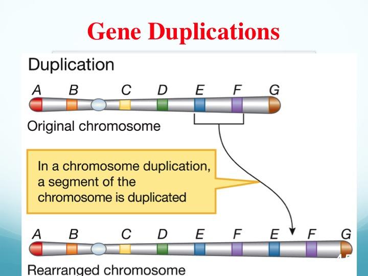

4. Chromosomal Inversions


5. Whole genome duplication (auto or allo polyploidy)
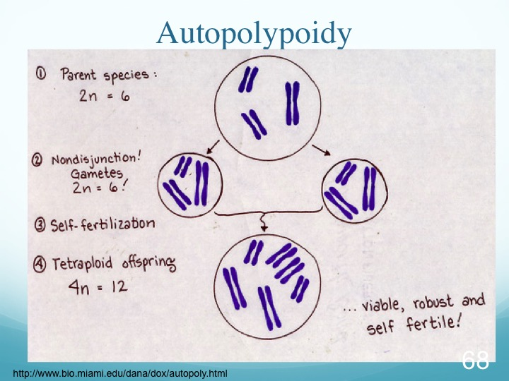

And there are many other ways to categorize and label mutations. For this class we will be focused on mutations from the first two categories, and really mostly only the point mutations. Point mutations yield what is called a Single Nucleotide Polymorphism (SNP). 

My intent here is not to come up with an absolute definition, but rather to emphasize that when one reads about mutation or investigates mutational data, it is important to be certain of the context in which the term is being used. Of course, a very simple molecular definition of the word might be "a change in DNA sequence". In the discussion that follows, I will attempt to focus on some general factors that can potentitally affect any mutational change, broadly defined.  Where necessary, I will specify particular features of the process in question that contribute to the analysis.

### Is Mutation Random or Directed?

The idea that mutation is a random process is so engrained in modern biology that the phrase "random mutation" seems repetitive.  But consider this.  If one grows up a large number of bacterial cells (let's say something like 10^10^) from a single cell that is sensitve to infection by bacteriophage T4, and then plates those bacteria on media containing the virus, a small number of colonies will grow, suggesting that, in those cases, a mutation has occurred that confers resistance to bacteriophage infection.  But how did they arise?  There are two possibilities

2.  The mutations arose as an adaptive response to the presence of T4 *after being exposed to the bacteriophage*.
1.  The mutations occurred at random, while the bacteria were being grown *in the absence of T4*.

Salvador Luria and Max Delbruck did exactly  this experiment, but in a way that allowed them to elegantly distinguish between the two hypotheses.  The basic experiment was simple - grow several cultures of sensitive cells as described above, and then plate samples of those  cultures on T4-containing agar plates.  Count the resistant colonies on the replicate plates and then compute the mean and variance.  

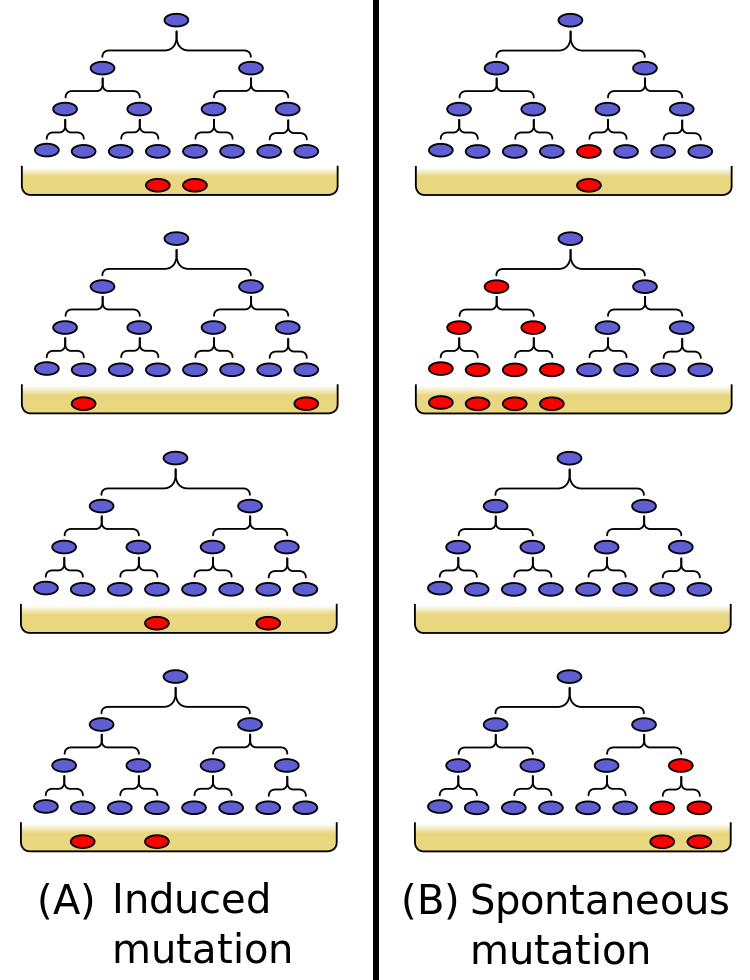

So what does that give us?  Consider the two possibilities; in both cases recognizing that the number of mutations that occurs relative to the total number of bacterial cells is quite small

#### Hypothesis I - Mutations are adaptive.

If the mutations occur in response to T4, then the probability of mutations occurring on the different plates would be the same, since they are all being exposed to the same mutation-inducing agent (the bacteriophage).  For such a rare event (sort of akin to the probability of an auto accident occurring at a particular intersection on a given day), the most likely event on a given plate would be the occurrence of a small number of resistant colonies (perhaps even zero), and the probabilities of larger numbers occurring would be smaller - a classic Poisson process.

As an aside, a Poisson process is one in which a particular event occurs with some probability per unit time.  Examples might be

1.  The number of cars passing a particular point in a given period of time.
2.  The number of persons killed by lightning per year.
3.  In our case, the number of mutations that occur in response to T4 per plate.

Let's simulate 20 Petri plates, and we find that the mean number of resistant colonies is 4.

```r
set.seed(123) #set random number seed
colonies <-rpois(20,4) # Generate 20 Poisson distributed points with mean of 4
colonies
```

```
##  [1] 3 6 3 6 7 1 4 7 4 4 8 4 5 4 2 7 3 1 3 8
```

```r
hist(colonies,xlab="Number of Colonies",ylab="Number of Plates", main="Simulation of Adaptive Mutation") 
```

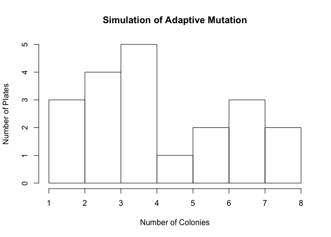<!-- -->

But the interesting feature about the Poisson distribution, which we could show mathematically (but won't) is that the expectation is that the mean equals the variance.  Let's see if that's the case

```r
mean(colonies)
```

```
## [1] 4.5
```

```r
var(colonies)
```

```
## [1] 4.684211
```

And we see that they are very close.  So getting back to the experiment, this leads to the following prediction:

**If mutation is an adaptive response to the selective agent, then we would expect the mean number of colonies per plate to be equal to the variance among them**

#### Hypothesis 2 - Mutation is random

Now let us see what we would expect if mutation did not occur n response to selection, but rather occurred at random while the cells were growing *in the absence of the selective agent*.  Remember that Luria and Delbruck grew multiple independent cultures, which were the source of bacteria for plating.  If mutation is random, then in  some cultures, it might occur early in the growth period, and through subsequent rounds of cell division produce a large number of progeny.  In others, it might occur late, shortly before plating, so that only a small number of resistant cells would be present at the time of plating.  The result would be an extremely large variance in the number of resistant colonies on the "replicate" plates.  Predicting the exact distribution under this hypothesis is not trivial; for our purposes at the moment, we can make the following prediction:

**If mutation is random, then we would expect the variance in number of colonies on the plate to greatly exceed the mean**

#### The results

So what did Luria and Delbruck actually find?  Here, We will use some functions developed by EsHamon2012; included in their material are some data from one of the original experiments, in which 42 plates were scored:


```r
source("http://ljk.imag.fr/membres/Bernard.Ycart/LD/LD.R")
length(LD43a)
```

```
## [1] 42
```

```r
LD43a
```

```
##  [1]  10  18 125  10  14  27   3  17  17  29  41  17  20  31  30   7  17
## [18]  30  10  40  45 183  12 173  23  57  51   6   5  10   8  24  13 165
## [35]  15   6  10  38  28  35 107  13
```
And doing our test is as simple as computing the mean and variance

```r
m2 <-mean(LD43a)
m2
```

```
## [1] 36.66667
```

```r
var(LD43a)
```

```
## [1] 2068.228
```

And we see that the variance exceeds the meen by two orders of magnitude, clearly supporting hypothesis 2 above.

We can also examine this graphically, comparing the observed distribution of resistant colonies compared with those expected from a Poisson distribution, given the mean value obtained:


```r
hist(LD43a,freq=FALSE,ylim=c(0,.07))
lines(dpois(0:200,m2),col="red")
```

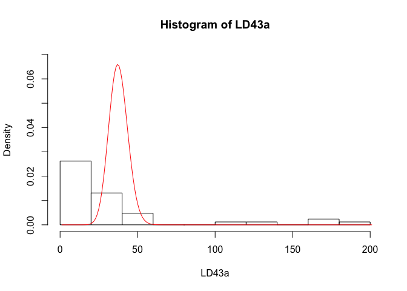<!-- -->

Clearly, the fit of the data to a Poisson expectation is poor.

Finally, as a control, Luria and Delbruck made replicate plates from a single culture, predicting that, since all of the platings were the result of the same mutational history, indeed we would expect to see a Poisson distribution of resistant colony numbers.  These were their results:


```r
con <-c(14,15,13,21,15,14,26,16,20,13)
m3 <-mean(con)
m3
```

```
## [1] 16.7
```

```r
var(con)
```

```
## [1] 18.23333
```


And these are entirely consistent with expectations based on the Poisson distribution.


```r
hist(con,freq=FALSE,xlim=c(0,30))
lines(dpois(1:30,m3),col="red")
```

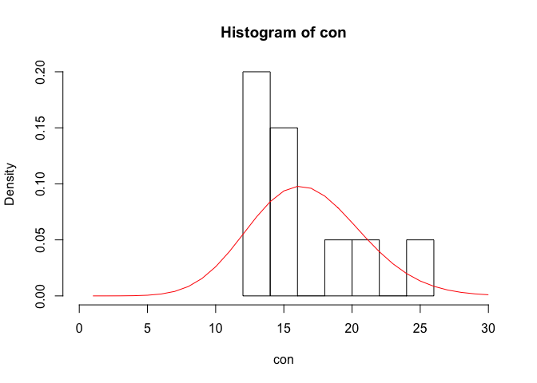<!-- -->


The fit is still not gorgeous, but in fact the difference between observed and expected is not significant.

This then leads to our next question - what happens to mutant alleles once they arise?


## The Fate of a Mutation

So we see that mutation is random with respect to adaptation, and that the occurrence of mutation is rare.  But it does happen, so we need to look at the expected fate of a mutation.  In so doing we will think about three stages:

1.  What is the immediate fate of a new mutation?
2.  We know that with genetic drift, the ultimate fate of all alleles are fixation aor loss.  How does mutation enter into that process?
3.  When we compare taxa at the molecular level, what we usually look for are fixed differences, or substitutions, at homologous positions.  That means that some mutations occur in a lineage and go to fixation.  What are the dynamics of that process?  How long does it take?

In his chapter on stochastic processes in evolution, John Gillespie begins with "Pity the fate of the  mutation".  Why?  It is worth exploring this question in some detail.

#### Setting the stage - the first generation

For simplicity's sake, we're going to use a haploid model for this exercise.  Let N be the population size, which is constant, and suppose that in generation zero, a single mutation occurs.  All of the members then reproduce, with the number of progeny of each individual being a Poisson variable with mean 1 (i. e. the average progeny per individual is one.).  We can simulate that as follows:

```r
N <-100000
u <-rpois(N,1)
hist(u,xlab="N",main="Simulated Poisson Distribution, N=10000, µ=1") 
```

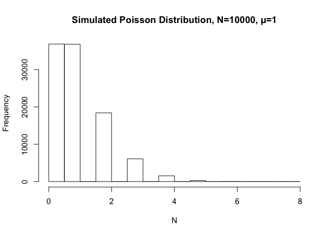<!-- -->

Note that the most frequent number of progeny is either zero or 1.  If our new mutant happened to be one of those that had zero progeny, that means that it would go extinct.  What is the probability of that occurring?  It is simply the ratio of the zero class to the total number of reproducing individuals (10000); that can be calculated by

```r
z <-length(u[u==0])/length(u)
z
```

```
## [1] 0.36839
```

So approximately 36% of the time, *by chance alone*  that mutation will be lost.


#### What would happen in subsequent generations?

For this, we turn away from our simulation approach.  It turns out that R.A. Fisher has a pretty straight forward analytical one.  

We start by noting that, while we did it via simulation, we could also have calculated the probability associated with the zero class in a Poisson distribution with mean 1 by the formula e^c(x-1)^, where x is the probability of leaving zero ancestors in the previous generation and c is the mean number of progeny (in our case 1)


```r
x1 <-exp(1*(0-1))
x1
```

```
## [1] 0.3678794
```

There is a 36% chance that a new mutation will be lost due to chance in population of constant size.


Now what about future generations?  We can set up recursion, in which we start with x=0, and with each generation set x[i+1] to e^c(x[i]-1)^.  So to get x[2, for example], we could do the following for a neutral mutation (with no effect on fitness):


```r
x2 <-exp(x1-1)
x2
```

```
## [1] 0.5314636
```

So now we see that in two generations, the probability of loss is over 50%.  We could continue to do this manually, but instead, we can do this as an r function and see what happens in 100 generations


```r
fate <-function(c){
x <-rep(0,100) # create a vector of zeros, which will hold the results of the recursion calculation
for(i in 1:99){
  x[i+1] <-exp((c)*(x[i]-1))
}

return(x)
}
```

With that function in hand, we can now see what will happen in the case of a neutral mutation, one which confers no advantage or disadvantage (c=1)


```r
x0 <-fate(1) 
```
We can then plot the results

```r
ggplot(data=as.data.frame(x0), mapping=aes(y=x0, x=0:99)) + geom_line() + xlab("Generation") + ylab("Probability") + ggtitle("Probability of Loss of New Mutation")
```

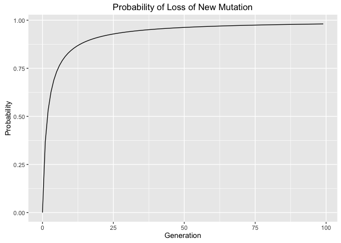<!-- -->

And what we see is that very quickly, the probability of loss of such a mutation *in a constant size population* approaches 1.

But what if the mutation confers an advantage?  Suppose that in the Luria-Delbruck experiment, new mutations that gave resistance to the phage confer, on average, an 8% advantage (or c=1.08)  We can plug that into our function and add the results to the plot:

```r
x1 <-fate(1.08)

ggplot(data=as.data.frame(cbind(x0,x1))) + geom_line(aes(x=0:99, y=x0)) +geom_line(aes(x=0:99, y=x1), color="blue") + xlab("Generation") + ylab("Probability") + ggtitle("Probability of Loss of New Mutation")
```

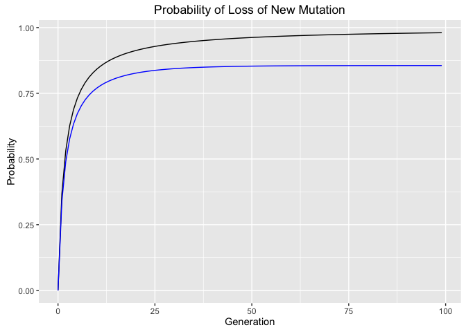<!-- -->

This suggests that, during the first few generations following the occurrence of the mutation, *the probability of loss of an advantageous mutation, by chance, is not much different from that of a neutral one*.  Furthermore, while we do see that in later generations, that mutation is more likely to survive than the neutral one, the probability of loss is still around 80%.  To illustrate this point, we can calculate the probability of the advantageous mutation surviving 100 generations as 


```r
 s1 <-1-x1[100]
s1
```

```
## [1] 0.1444437
```

which can be contrasted with the similar probability for a neutral allele


```r
s0 <-1-x0[100]
s0
```

```
## [1] 0.01954261
```
or a ratio of 

```r
s1/s0
```

```
## [1] 7.391217
```
A seven-fold advantage is significant, but to quote Fisher:

"*The fact  is, that a selective advantage of the order of 1 per cent., though amply powerful enough to bring about its evolutionary consequences 
with the utmost regularity and precision when numbers of individuals of the order if 1,000,000 are affected, is almost inoperative in comparison to random or chance survival, when only a few individuals are in question*"

As an exercise, you might want to try to repeat the calculations we did above for the case of a mutation conferring a 1% advantage.

### Mutation vs. substitution

This is a good point to make an important point regarding terminology.  In everything we have talked about so far, we are talking about *mutations*, as noted at the outset, as a change in DNA sequence.  Thus, when one occurs, there is a single copy of the mutation present in 2N alleles, an obviously very low frequency.  But obviously some mutations subsequently increase in frequency, and resulting from either chance (genetic drift) or deterministic (selection) processes, increase to a frequency of 1, or go to fixation.  At that point, we say that a *substitution* has occurred.  The distinction between mutation and substitution is one to keep in mind as we move forward.

*Mutation*  
AAGCTAGCTTA  
AAGCTAGCTTA  
AAGC**G**AGCTTA <- mutation  
AAGCTAGCTTA  
AAGCTAGCTTA  
AAGCTAGCTTA  

*Substitution*  
AAGC**G**AGCTTA  
AAGC**G**AGCTTA  
AAGC**G**AGCTTA  
AAGC**G**AGCTTA  
AAGC**G**AGCTTA  
AAGC**G**AGCTTA  

### Conclusions

So we are left with three observations:

1.  Mutations occur without respect to the presence or absence of a selective agent - this is what we mean when we use the shorthand "random mutation". While rates and processes of mutational change are in fact distributed nonrandomly in the genome, this basic tenet, first demonstrated by Luria and Delbruck, holds in all cases in which it has been examined.
2.  The rate at which individual genes mutate are typically very low
3.  The typical fate of a particular new mutation in a finite population of constant size, *even if it confers a selective advantage* is that it will be lost.

Point three, on the face of it, may seem paradoxical.  All populations are finite; many have relatively constant population sizes, If variation is the raw material of evolution, and it is those mutations that confer an advantage that benefit from natural selection, how can the process occur if most of them are lost?

There are a few general responses we can make at this point.  First, although mutations in a given gene and a given generation may be rare, there are lots of genes in the genome undergoing the process, the total number of mutations occurring can be quite large.  Second, of course, while the probability of loss of a particular advantageous mutation is high, it is not 1, so that some will obviously survive.  And at this point, natural selection can take over, right?

Not so fast.  Before we get to that, we need to consider the issue of population size (and genetic drift) more closely, in a future lecture.


```
## Loading required package: ape
```

```
## Warning: package 'ape' was built under R version 3.3.2
```

## Mutation Models

We now need to think a little bit more about mutation as an evolutionary process.  In particular, and for the first time, we need to really think about genes as DNA sequences.  The data we have available to us are (usually) two or more contemporary sequences, and we can determine the number of *differences* between them.  However, what we are interested in as a process is the number *substitutions* that have occurred giving rise to those differences.  To get at that question, we need to think in more detail about what a sequence is.  In brief

1.  It's a set of k **sites**
2.  Each site of a particular sequence can be occupied by one of the four bases - A, G, C, or T.
3.  Mutation can result in a particular site of a sequence changing (for example from A ->G or C -> T.
4.  Two of the bases are *purines* (A and G) and the other are *pyrimidines* (C and T), so mutations can be either *transitions* (purines <-> purines or pyrimidines <-> pyrimidines) or *transversions* (purines <--> pyrimidines).  
5.  If we are dealing with protein coding sequences, we need to consider the effect of the mutation on the encoded protein (does it result in an amino acid change or not)?

### The basic model

For our purposes, we're going to assume that at a given time, the probability of a given mutation is constant and is the same for each position being considered.  Thus, we can think of there being a stable *Transition matrix* conisting of the probabilities of all possible state changes (no change, transition, transversion).  And if our model is "time-reversible" then p(A - > G) is the same as p(G ->A) and the matrix is symmetric.

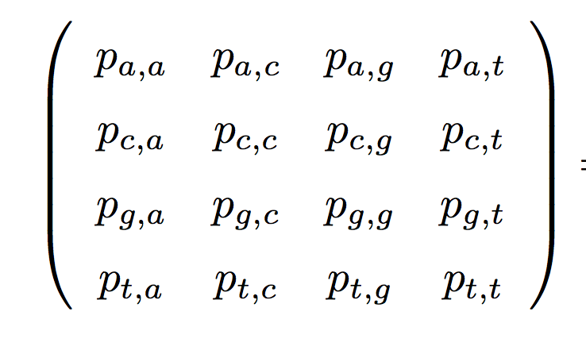

### The Jukes Cantor Model

We will start with the simplest model.  In it we assume that there are four possible states at each position (A, G, C, and T), and that there is some rate &alpha; at which one base mutates to one of the other three.  Thus, for example, if we start with an A at time t, at time t+1, the probability of no mutation coccuring would be 

\(p_{a,a}= -3\alpha\) (remembering that mutation occurs to each of three bases with rate &alpha;)

and \(p_{a,c}\), for example, would be &alpha;

For simplicity's sake for the moment, let's set alpha equal to one, so that we are using substitution rate as our time unit.  We can also think that there are three ways we can lose a particular base (as represented on the diagonal) and one way we can gain it (the other elements of the matrix.  We can thus start with a matrix Q, which shows the *relative rates* of all possible transitions:


```r
Q1 <-matrix(c(-3,1,1,1,1,-3,1,1,1,1,-3,1,1,1,1,-3), nrow=4)
Q1
```

```
##      [,1] [,2] [,3] [,4]
## [1,]   -3    1    1    1
## [2,]    1   -3    1    1
## [3,]    1    1   -3    1
## [4,]    1    1    1   -3
```

Where the rows and columns are A, G, C, and T.  This is usually then normalized in such a way that all of the possible transitions made by a base add to zero.  This will then allow us to express our transition probability in terms of substitutions per site (or genetic distance).


```r
Q2 <-Q1/3
Q2
```

```
##            [,1]       [,2]       [,3]       [,4]
## [1,] -1.0000000  0.3333333  0.3333333  0.3333333
## [2,]  0.3333333 -1.0000000  0.3333333  0.3333333
## [3,]  0.3333333  0.3333333 -1.0000000  0.3333333
## [4,]  0.3333333  0.3333333  0.3333333 -1.0000000
```

This is what is known as the "instantaneous transition rate matrix".  But what we need is a "transition probability matrix".  It turns out that this is pretty easy to get (at least with a computer) - we simply exponentiate our rate matrix:


```r
Qt <-expm(Q2)
Qt
```

```
## 4 x 4 Matrix of class "dsyMatrix"
##           [,1]      [,2]      [,3]      [,4]
## [1,] 0.4476979 0.1841007 0.1841007 0.1841007
## [2,] 0.1841007 0.4476979 0.1841007 0.1841007
## [3,] 0.1841007 0.1841007 0.4476979 0.1841007
## [4,] 0.1841007 0.1841007 0.1841007 0.4476979
```

Note that the rows and columns of this matrix sum to one.  This is as it should be - if we refer back to our original matrix above (Figure 1), we realize that the first each row can be thought of as the fate of a particular base, and so the probability that it will be A, G, C, or T after one generation must be one.

Down the road, we will return to the elements of this matrix and look at what they mean with respect to relating number of substitutions to observed sequence differences, but for now, let's ask the following question:  Given that there is a position that is fixed for A, what would the base frequencies be after one time unit?  To do that, we simply use matrix multiplication to calculate the new base frequencies


```r
b <-c(1,0,0,0) #initial frequencies of A, G, C, and T.
```
Now, by implementing the following code repeatedly, we can see what happens with each time unit:

```r
b <-b%*%Qt # multiply by transition matrix
b
```

```
## 1 x 4 Matrix of class "dgeMatrix"
##           [,1]      [,2]      [,3]      [,4]
## [1,] 0.4476979 0.1841007 0.1841007 0.1841007
```

And we see that the frequencies of the four bases rapidly converge on 0.25.  

Another way we can look at this is  looking at both the transition probability A->A (i. e. no mutation) at that position and that of a change (A ->C) as the number of substitutions increases


```r
t <-seq(0.1,2,.1)
Q.time <-lapply(t, function (x) expm(Q2*x))
pAA <-sapply(Q.time,function(x) x[1,1])
pAC <-sapply(Q.time,function(x) x[1,2])
p.mat <-cbind(pAA,pAC)
matplot(t,p.mat,type="l",lty=1,xlab="Genetic Distance (ut)",ylab="Transition Probability",main="Jukes-Cantor Model")
abline(h=.25,lty=2)
text(1.5,.5,"A ->A")
text(1.5,.1,"A->C",col="red")
```

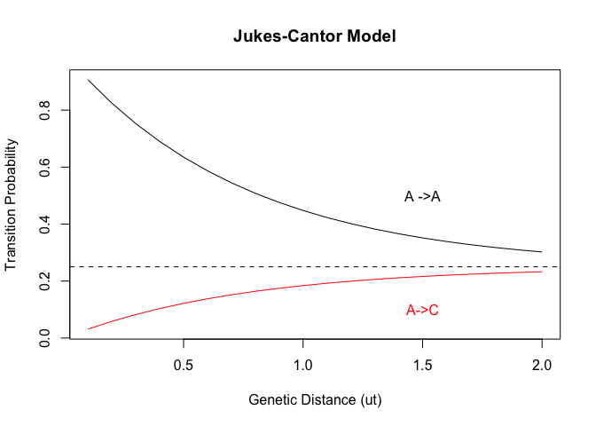<!-- -->

What we see is that both lines assymptotically approach .25, reflective of the fact that, under our model, are equally probable to occupy a position, regardless of what the starting state was.

### Differentiating between transitions and transversions - the K80 Model

What we have done so far is obviously simplistic - as noted at the outset, other factors are involved as well.  One of those is that it is well established that transition mutations occur more frequently than transversions.  In the following, k is a rate associated with transitions and &beta; with transversions:

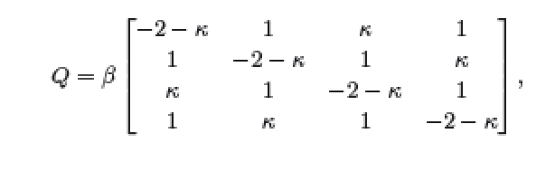

If we set k to 4 and &beta; to 1/(2+k), then we can get  our transition rate matrix:


```r
k=4
b=1/(2+k)
Qk <- b*matrix(c(-2-k,1,k,1,1,-2-k,1,k,k,1,-2-k,1,1,k,1,-2-k),ncol=4)
Qk
```

```
##            [,1]       [,2]       [,3]       [,4]
## [1,] -1.0000000  0.1666667  0.6666667  0.1666667
## [2,]  0.1666667 -1.0000000  0.1666667  0.6666667
## [3,]  0.6666667  0.1666667 -1.0000000  0.1666667
## [4,]  0.1666667  0.6666667  0.1666667 -1.0000000
```

And we note that the rate of transversions is lower than that of transitions.  And this can be converted to a probability matrix by exponentiating


```r
Qk.t <-expm(Qk)
Qk.t
```

```
## 4 x 4 Matrix of class "dsyMatrix"
##           [,1]      [,2]      [,3]      [,4]
## [1,] 0.4727921 0.1216457 0.2839165 0.1216457
## [2,] 0.1216457 0.4727921 0.1216457 0.2839165
## [3,] 0.2839165 0.1216457 0.4727921 0.1216457
## [4,] 0.1216457 0.2839165 0.1216457 0.4727921
```

And we can do similar manipulations (code not shown) as before, plotting three transition probabilities this time - no change (A->A) a transition (A->G) and a transversion (A_>C)

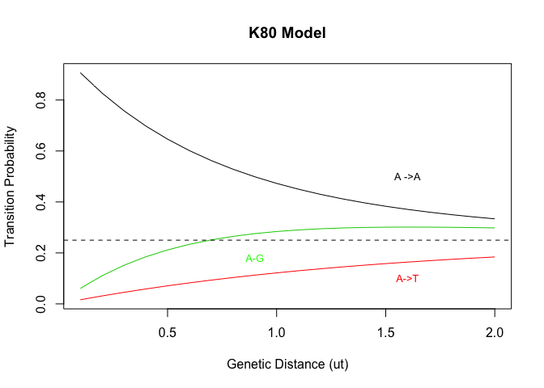<!-- -->

So we see that the transition probabilities are higher than the transversion, although given sufficient time, once again all frequencies converge on 0.25.

### Choosing models

There are three additional models that are commonly used in modeling the evolutionary process, and each one of them has even more twists that can be specified.  

2.  The Felsenstein model, which incorporates base composition. Jukes-Kantor and K80 assume bases occur at a frequency of 0.25
3.  The HKY model combines both base composition and transition-transversion differences, along with variable rates, into what is at present the most widely used model.
4.  The Generalized Time-Reversible model (GTR),which incorporates separate parameters for each different transition or transversion.

So which should we use?  There are two possible approaches

1.  Keep it simple.  As the models become more complex, there are more parameters that must be estimated from the data.  This is risky - there may simply not be enough data to come up with accurate assessments of each.
2.  Compare the different models.  Here, we won't go into great detail, but there is a procedure that does that, which is implemented in the phangorn package of R.  As an example, we will look at a small simulated DNA sequence data set:


```r
dat <-read.FASTA("../BeastDemo/demo1.fasta")
dat.phy <-phyDat(dat)

dat.mt <-modelTest(dat.phy,G=FALSE,I=FALSE)
```

```
## negative edges length changed to 0!
```

```r
dat.mt[with(dat.mt,order(dat.mt$BIC)),]
```

```
##   Model df    logLik      AIC       AICw     AICc      AICcw      BIC
## 1    JC 17 -1081.748 2197.496 0.04996922 2198.390 0.05894012 2274.937
## 3   K80 18 -1078.663 2193.325 0.40219000 2194.325 0.44977831 2275.321
## 2   F81 20 -1078.970 2197.940 0.04003228 2199.171 0.03987225 2289.047
## 4   HKY 21 -1075.862 2193.725 0.32930171 2195.082 0.30808955 2289.387
## 5   SYM 22 -1076.037 2196.074 0.10172311 2197.563 0.08911851 2296.292
## 6   GTR 25 -1073.318 2196.637 0.07678368 2198.557 0.05420126 2310.521
```

Here, the models are listed from the best fit to the worst, and we find out that, for these data, the Jukes and Cantor model works fine.  But in fact that's the model that was used to simulate the data, so that is no surprise.  What if we use some real data?  We can use some mitochondrial DNA sequences from fur seals as an example.


```r
load("../Data/furseals.R")
fur.phy <-phyDat(fur.dat)
fur.mt <-modelTest(fur.phy,G=FALSE,I=FALSE)
```

```
## negative edges length changed to 0!
```

```r
fur.mt[with(fur.mt,order(fur.mt$BIC)),]
```

```
##   Model  df    logLik      AIC         AICw AICc AICcw      BIC
## 4   HKY 493 -738.9796 2463.959 9.213118e-01  NaN   NaN 4225.031
## 3   K80 490 -753.7416 2487.483 7.181300e-06  NaN   NaN 4237.839
## 6   GTR 497 -737.4400 2468.880 7.868061e-02  NaN   NaN 4244.241
## 5   SYM 494 -752.6092 2493.218 4.081795e-07  NaN   NaN 4257.862
## 2   F81 492 -814.9765 2613.953 2.475383e-33  NaN   NaN 4371.453
## 1    JC 489 -827.2139 2632.428 2.409301e-37  NaN   NaN 4379.211
```

Now we see that it is the HKY model that best fits the data, while the JC model is the worst.  Again, this is as we expected, as the HKY model was explicitly developed to be applicable to mammalian mitochondrial DNA.

### Summary

From what we have covered in this chapter, there are a number of points that need to be re-emphasized.

1.  Mutation is random with respect to mutation
2.  The fate of most new mutations is that they are lost.
3.  Those that are not lost are what underly observed sequence differences
4.  The challenge for the evolutionary geneticist is to infer the number of substitutions that occur based on observed sequence differences.

But suppose we can estimate rates.  Could we then use sequence data to make inferences about evolutionary history?  The short answer is that we can, but before doing so we need to explore the dynamics of allele frequencies and gene genealogies in finite populations.

