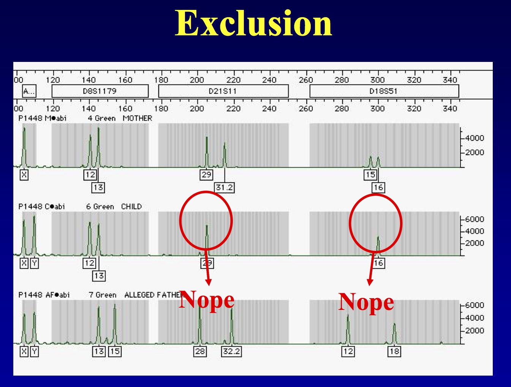

# Parentage Analysis

### The analysis of parental and offspring data

Parentage analysis is the determination of the mother (maternity) or father (paternity) of an individual. Parentage testing can help wildlife conservation by verifying that an individual originates from captive parents, as might be claimed by some in the pet trade industry. An enormous problem for wildlife conservation is the illegal capture of indiviuals from the wild, which occassionally involves killing the wild parents as well. 

Another place where parentage analysis has become useful is in determining larval dispersal distributions in the marine realm. If one is able to sample all (or most) of the putative parents in a particular region, then it is possible to assign larvae that recruit to that population or other populations back to those parents..as if the larvae had a tag on them that identified their place of origin. This technique is called parentage based tagging. From this method it is then possible to generate dispersal kernels...distributions that give the probability of a larvae dispersing a particular distance. 

Using this method, Pablo Saenz-Agudelo, Michael Berumen and others were able to derive a map of dispersal events:


And compute a dispersal kernel like so:


 

Beyond this, parentage analyses are used in a broad range of studies:

1. Identical vs fraternal twins
2. Agricultural crop line differentiation
3. Differentiate between livestock/dog/cat breeds
4. Pathogenic strain identification (e.g., Hep-C strains a-e)
5. Assigning parentage to individuals
6. Assigning individuals to populations
7. Identifying the source of unknown tissues (e.g., gettin’ perps)

### A statistical approach for identifying the parent(s) of a particular individual. 

This requires:

1. A set of genetic markers that are bi-parentally inherited
2. Variation in these markers
3. Some assumptions about the prior probability of the union of parents.

For  the simplest case of single parent parentage analysis, it is either paternity or maternity that is being established (usually paternity). Here we assume that the other parent is definitely the biological parent of the individual (e.g.,  P(prior)=1). This can be because:

The offspring was collected from the identified parent
There is other evidence that points to the identified parent being the biological one.
The goal then is to determine who the unidentified parent is with some level of statistical probability. 

### Exclusion

The goal is to exclude all of the fathers that couldn't be parents, based on a Mendelian cross betweeen the father and mother.




While exclusion is definite, inclusion is not. It simply means that the male cannot be excluded from being the father.

#### Single Locus Exclusion

It is useful to use this reasoning to evaluate a locus for its power in parentage analysis.


Probability of exclusion:

$$ P_{exclusion} = p_1^3p_2^2 + p_1^4p_2 + p_1^2p_2^3 + p_1^3p_2^2 + p_1p_2^4 + p_1^2p_2^3 $$
Which when simplified a bit becomes

$$ P_{exclusion} = p_1p_2(1-p_1p_2) $$

So we can do the math for a variety of allele frequencies at a particular locus:

```{r}
p <- seq(0,1,by=0.02)
q <- 1-p
Pexcl <- p*q*(1-p*q)
plot(Pexcl ~ p, xlab="Allele frequency, p", ylab="Paternity Exclusion Probability")
```


And we see that loci with intermediate allele frequencies are the best for excluding fathers.

#### Multilocus Exclusion

Exclusion probabilities are multiplicative across loci

$$ p_{exclusion} = 1 - \prod_i^l(1-P_{exclusion},i) $$

Let's look at a case where we have 5 loci at intermediate frequencies (p=0.5)
```{r}
p <- rep( 0.5*0.5*(1-0.5*0.5), 5 )
p

ptot <- 1
for( i in 1:length(p))
  ptot <- ptot * (1-p[i])
1-ptot
```

What about for 10 loci?

```{r}
p <- rep( 0.5*0.5*(1-0.5*0.5), 10 )


ptot <- 1
for( i in 1:length(p))
  ptot <- ptot * (1-p[i])
1-ptot
```

20 loci?

```{r}
p <- rep( 0.5*0.5*(1-0.5*0.5), 20 )

ptot <- 1
for( i in 1:length(p))
  ptot <- ptot * (1-p[i])
1-ptot
```

So with 20 biallelic SNP loci we get into the realm of acceptable power to exclude non-related fathers.

### Paternity Probability

Paternal probability can be computed as the posterior odds of paternity versus non-paternity. This is the likelihood ratio of hypothesis 1 (H1 = the male is the father) and hypothesis 2 (H2 = the male is not the father).

Nomenclature:
| Individual           | Identifier | Genotype |
|----------------------|------------|----------|
| Female Parent        | FP         | $\alpha$ |
| Putative Male Parent | MP         | $\beta$  |
| Offspring            | O          | $\gamma$ |

$$ L(H_1, H_2 | \alpha, \beta, \gamma) = \frac{P(D| \alpha, \beta, \gamma)}{P(D|\alpha,\gamma)} $$


Consider a maternal individual whose genotypes are 

FP = {AA, Bb, CC, Dd}

and her ith offspring with genotypes 

O = {AA,BB,Cc,dd}

The probability of the offspring genotype given just the mother then is  

$P(D|\alpha,\gamma)$ = 1 \* 0.5 \* 1 \* 0.5

Now consider two putative male parents

| Individual | Locus 1 | Locus 2 | Locus 3 | Locus 4 |
|------------|---------|---------|---------|---------|
| MP1        | Aa      | Bb      | CC      | Dd      |
| MP2        | AA      | BB      | Cc      | dd      |

Which one of the potential fathers is the most likely parent?

| Individual  | Locus 1 | Locus 2 | Locus 3 | Locus 4 |
|-------------|---------|---------|---------|---------|
| FP          | AA      | Bb      | CC      | Dd      |
| MP1         | Aa      | BB      | cc      | Dd      |
| O           | AA      | BB      | Cc      | dd      |
| P(O|FP,MP1) | 0.5     | 0.5     | 1       | 0.25    |

$P(O|\alpha,\beta) =$ 0.5*0.5*1*0.25 = 0.0625

| Individual  | Locus 1 | Locus 2 | Locus 3 | Locus 4 |
|-------------|---------|---------|---------|---------|
| FP          | AA      | Bb      | CC      | Dd      |
| MP2         | AA      | BB      | Cc      | dd      |
| O           | AA      | BB      | Cc      | dd      |
| P(O|FP,MP2) | 1     | 0.5     | 0.5      | 0.5    |

$P(O|\alpha,\beta) =$ 1*1*0.5*0.5 = 0.125


Father 1:

$$ \frac{P(D| \alpha, \beta, \gamma)}{P(D|\alpha,\gamma)} = \frac{0.0625}{0.25} = 0.25 $$

Father 2
$$ \frac{P(D| \alpha, \beta, \gamma)}{P(D|\alpha,\gamma)} = \frac{0.125}{0.25}  =  0.5$$

Male 1 is *more likely* to be the true father than male 2.

# Population Assignment

With population subdivision, individual population allele frequencies may diverge if there is not panmictic connectivity, leading to increases in $F_{ST}$ as we have seen. Along with this differentiation, it is possible to begin estimating the origin of individual samples. We can also use models of admixture to understand how both individuals and populations are connected

The easiest way to assign individuals to particular populations is to estimate the probability of each multi locus genotype coming from each population and then compare the relative likelihoods of each, assigning the individual to either the most likely population or at least assigning it, with probability equal to its likelihood, to two or more populations. The probability of a particular genotype coming from a specific population is dependent upon the allele frequencies at that population as well as any deviations that population may have from Hardy-Weinberg Equilibrium.

Across loci, the probability of a multi-locus genotype (X) is multiplicative across all L loci

$$ P(X|F) = \prod_{i=1}^L P_{x_i}$$
As a simple example, consider the following code, where we make three populations differing in allele frequencies at a single locus.
```{r}
library(gstudio)

freqs <- data.frame( Stratum=rep(c("Population A","Population B","Population C"),each=2), Locus="Locus1")
freqs$Allele <- rep( c("A","B"), times=3)
freqs$Frequency <- c( 0.1, 0.9, 0.4,0.6, 0.7, 0.3)
freqs
```

Next, the three possible genotypes are created on which we will estimate the assignment probabilities.

```{r}

loci <- c( locus(c("A","A")), locus(c("A","B")), locus(c("B","B")) )
individuals <- data.frame( ID=1:3, Locus1=loci)
individuals
```


Before we jump in, it should be noted that we are going to estimate the posterior log likelihood of assignment for each genotype. What this means is that we are going to estimate the probability the genotype came from each population. These probabilities may be large or small depending upon the allele frequency spectra of each population. Some can even be zero, for example, if the population does not have a copy of a particular allele. However, we are interested in understanding the relative likelihood of assignment for each genotype, not the raw probability itself. In forensic genetics, the multi locus probability of anyone genotype is exceedingly small (by design, that is how they ‘get the perp’), but it is the relative likelihood of each multi locus probability that is most important.
As an example, consider the case where we have 99 populations that have alleles  A and  B and 1 population with alleles A,  B, and  C. In this last population, the frequency of the C allele is  $p_c$=0.001. A CC
homozygote individual would have zero probability of occurring in the 99 populations (they just don’t have that allele) and probability of  (0.001)^2=1e−6 in the last population. Even though this is a small probability, it is infinitely more probable than 0! So our likelihood estimate is based upon the probability of assignment to a particular population,  Pi, scaled by the sum of all potential populations it could be assigned to. This is estimated as:

$$ \lambda_i = \frac{P_i}{\sum_{j=1}^K P_j} $$


Where $P_j$ is the multi-locus probability of assigning to each population. As such, our CC genotype would have $\lambda_i$ = 0 for populations 1-99 but $lambda_{100}$ = 1.0 for the last population. This is the best-case scenario—the assignment process has eliminated all populations except for one.In R, multi locus probabilities and posterior assignments are made using the `multilocus_assignment()` function from gstudio. It needs to have an individual that has at least one locus objects in it, typically as a row from a data.frame holding all your data, and a frequency matrix as outline above. Here are examples for the three potential genotypes and the three example populations.

```{r}

multilocus_assignment(individuals[1,], freqs)
```

