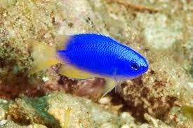
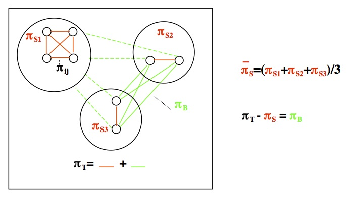
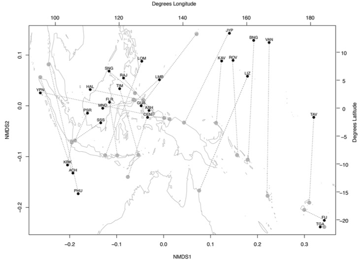
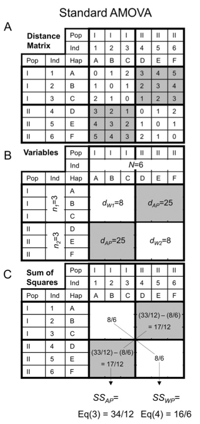

### Read in the data




```{r, message=F,warning=F}
library(strataG)
library(gdistance)
library(ggplot2)
library(vegan)
library(knitr)

pcoel<-read.FASTA(file="../data/pcoelestis_aligned.fasta")

#put them in alphabetical order
pcoel<-pcoel[order(names(pcoel))]

image.DNAbin(pcoel)

pop<-gsub(names(pcoel),pattern = "_\\d+",replacement="") #create a vector of population assignments by stripping off the individual identifiers
pcoel<-as.matrix(pcoel)
pcoel_g<-sequence2gtypes(pcoel,strata=pop)

pcoel_g2<-labelHaplotypes(pcoel_g)
pcoel_g2

```

### F-Statistics with DNA data

Thus far we have learned about calculating F<sub>st</sub> under the infinite sites model, i.e., we consider each allele to be different from each other allele, and always different by the same amount (whether that is one mutation or twenty mutations). What if we could measure the number of differences between each allele (or haplotype)? With DNA data we can! How can we incorporate this additional information into a similar measure of subpopulation differentiation?

Slightly different measures have been devised by different authors (as usual!), but the simplest of these to comprehend in light of our previous discussion is probably that of Nei (1982). What he did was to define a similar measure of population differentiation as F<sub>st</sub>, but this time using a measure of nucleotide diversity (π) within a population, in place of heterozygosity (H) or haplotype diversity (h). Recall, if we define $\pi_{ij}$ as the genetic distance between haplotype i and haplotype j (measured either by the simple proportion of nucleotide differences, or by some more complicated method, e.g., Jukes-Cantor, Kimura 2-parameter, etc.), then the nucleotide diversity within the total population is:

$$\pi =  \sum_{ij}x_ix_j\pi_{ij}$$
Where $x_i$ and $x_j$ are the respective frequencies of the ith and jth sequences in the sample and $\pi_{ij}$ is the number of nucleotide differences between these two sequences.

That is, the distances between haplotype pairs are simply weighted by how common they are, to arrive at an average. If we also define $\pi_s$ as the average nucleotide diversity within subpopulations, then we can derive a familiar expression for an F<sub>st</sub> –like nucleotide measure of subpopulation differentiation:
$$ \Phi_{ST} = \frac{\pi_T-\pi_S}{\pi_T} = \frac{\pi_B}{\pi_T}$$

This statistic could also be called $F_{ST}$ , but it was originally described by Nei (1982) as $\gamma_{ST}$ . A related statistic derived by Lynch & Crease (1990) was called $N_{ST}$ , one derived for mtDNA data by Takahata and Palumbi (1985), $G_{ST}$ , and one by Excoffier et al. (1992, see below), $\Phi_{ST}$ (phi-st). Although each of these statistics for nucleotide data is calculated slightly differently, in reality they are all trying to estimate the same parameter - the proportion of nucleotide diversity among subpopulations, relative to the total – and their values are usually quite similar, particularly with larger sample sizes. The same things can be said for all the different ways of calculating $F_{ST}$from allelic data. Given the multitude of different descriptor variables used by different authors, and the fact that within the two classes they are trying to estimate essentially the same parameters, my convention is to refer to the allelic form of the statistic as $F_{ST}$ , and the nucleotide diversity form as $\Phi_{ST}$ , and simply mention somewhere whose formulae or program you used to calculate them.

### Pairwise Statistics on Our Data


For our purposes now, we will first be calculating **pairwise** $\Phi_{ST}$. For pairwise F-statistics, we are taking every pair of populations, and calculating $\pi_B$ and $\pi_T$ and getting $\Phi_ST$ for each pair. In this way, we create a distance matrix of genetic distance between each pair of populations.

```{r}
pairwise_phi<-pairwiseTest(pcoel_g,stats="phist",nrep=1000,quietly=T,model="raw")

#pairwise_F<-pairwiseTest(pcoel_g,stats="Fst",nrep=1000,quietly=T)


head(pairwise_phi)

# PhiST in lower triangle, p-value in upper triangle
kable(head(pairwise_phi$pair.mat$PHIst))
```


### Isolation By Distance

Up to now, we have not let geographic distance into the picture. In general, organisms will disperse to nearby populations more frequently than they disperse to distant populations.  This would certainly seem to be the case for marine organisms that disperse via pelagic larvae. A more realistic model of $F_{ST}$, particularly for a series of populations, would involve migration rate as an inverse function of the distance between pairs of populations. In other words, $F_{ST}$ should be lower between nearby populations and higher between distant populations.

Rather than use the modeling approach we have previously, we will instead apply a model developed by [Rousset (1997)](http://www.genetics.org/content/145/4/1219.short) to some original data.  What he showed was that, if we consider distance to be one dimension, then in fact,  $\frac{F_{ST}}{1-F_{ST}}$ would be expected to be a linear function of geographic distance.


[Pinsky et al (2017)](http://www.sciencedirect.com/science/article/pii/S0960982216312878) reported a survey of microsatellite variation in clownfish in Kimbe Bay, Papua New Guinea. The locations are shown here:


When they plotted Roussett's relationship with distance they found the following relationship:


Based on the slope of this relationship and an estimate of the the effective population size of the whole population, they were able to estimate the dispersal kernel using the following relationship:

$$\sigma = \sqrt{\frac{1}{4D_em}}$$
Where $D_e$ is the effective density ($N_e$ per unit area) and m is the slope of the IBD relationship.

They found that the dispersal kernel was very close to dispersal kernels estimated from direct dispersal events that were estimated for the species using parentage-based tagging methods!!! (more on this later in the class)


#### Determining significance - Mantel's test

Think for a moment about what we have - two matrices, one of genetic differences and one of geographic ones.  If indeed isolation by distance exists, then we would expect the two matrices to be correlated, right?  But a simple correlation coefficient will not suffice, since the elements of the matrix are not independent of one another.  If for example, site one is moved, then its distance to all other n-1 sites is also changed.  Thus, we need another method.  

The Mantel Test is one of those, and involves a randomization process similar to what we have done in other cases.  The process is conceptually simple:

1.  Calculate the correlation between the two matrices
2.  Randomize the rows and columns of one of the two (usually the genetic distance matrix)
3.  Calculate the correlation between the fixed and randomized values
4.  Repeat, and look at the distributions


#### Using our data

First you need to load in your metadata and use it to calculate a great-circle distance between all sampled points. 
```{r}

pcoel_metadata<-read.csv("../data/pcoel_metadata_2.csv")
pcoel_unique<-unique(pcoel_metadata[,c("locality","decimalLatitude","decimalLongitude")]) #pull out just locality and lat/longs, and get unique values
pcoel_unique<-pcoel_unique[order(pcoel_unique$locality),] #put them in alphabetical order

pcoel_unique
```

Verify that you have a data frame containing the same number of populations in the same order as what is listed by your gtypes object. Then calculate great circle distances thusly:

```{r}
gdist<-pointDistance(p1=pcoel_unique[,c(3,2)], lonlat=T,allpairs=T) #measure great circle distance between points in meters
gdist<-gdist/1000 # convert to km
gdist<-as.dist(gdist) #convert to distance object
```

Then pull out the PhiST matrix, linearize it, and perform a Mantel test
```{r}
pair_phi<-as.dist(pairwise_phi$pair.mat$PHIst) #convert phi_st to distance object
pair_phi<-pair_phi/(1-pair_phi) #linearize PhiST

phi_mantel<-mantel.randtest(pair_phi,gdist)

phi_mantel

```

And plot it
```{r}
plot(gdist,pair_phi)
identify(gdist,pair_phi) # use this if you want to identify outliers

phi_plot<-ggplot(as.data.frame(cbind(gdist,pair_phi)),aes(x=gdist,y=pair_phi)) + geom_point() + geom_smooth(method=lm) + xlab("Great Circle Distance (km)") + ylab(expression(Phi["ST"]/1-Phi["ST"]))

phi_plot

# just the points relating to Dongsha

#pull out just the fifth column (corresponding to Dongsha) from the PhiST and Geographic distance matrices
dongsha<-as.data.frame(cbind(as.matrix(pair_phi)[,5],as.matrix(gdist)[,5]))

phi_plot_dongsha<-phi_plot+geom_point(data=dongsha,aes(x=V2,y=V1),color="red")

```

### Non-metric Dimensional Scaling (NMDS)

Because we only have data from a single locus, a principal component analysis will be of little use to us. However, we are still able to take advantage of ordination techniques to visualize our pairwise $\Phi_{ST}$ results. Non-metric dimensional scaling has the goal of taking a distance matrix (such as pairwise $\Phi_{ST}$) and placing points that have small values close together and points with large values far apart. This generally means that the actual distances need to be modified somewhat to get them to all fit together, but NMDS seeks only to preserve the rank order of the original distances. Carrying out a NMDS analysis requires the following steps, as laid out in Gotelli and Ellison 2013:

1. Generate a distance matrix **D** from the data, with elements $d_{ij}$
2. Choose the number of dimensions *n* to be used to draw the ordination (typically 2 or 3)
3. Start the ordination by placing the *m* observations in n-dimensional space. The following steps can depend strongly on this initialization, so it can be important to try several different ones. Or you may want to start with a geographic relationship, which is already in two dimensions.
4. Compute new Euclidean distances $\delta_{ij}$ between the observations in this initial configuration.
5. Regress $\delta_{ij}$ on $d_{ij}$. The result of the regression is a set of predicted values $\hat\delta_{ij}$.
6. Compute a goodness of fit between $\delta_{ij}$ and $\hat\delta_{ij}$. This goodness of fit is known as a stress:

$$Stress = \sqrt{\frac{\sum\limits_{i=1}^m\sum\limits_{j=1}^n(\delta_{ij} - \hat\delta_{ij})}{\sum\limits_{i=1}^m\sum\limits_{j=1}^n\hat\delta_{ij}}}$$
7. Change the position of the *m* observations in *n* dimensional space slightly in order to reduce the stress
8. Repeat steps 4-7 until the stress cannot be reduced further.
9. Plot the position of the m observations in n-dimensional space for which stress is minimal.

This approach was used by [Crandall et al. 2014](http://www.ingentaconnect.com/content/umrsmas/bullmar/2014/00000090/00000001/art00016) to show a striking resemblance of the NMDS plot to geography, suggesting a strong role for isolation-by-distance.



```{r}
NMDS_phi<-metaMDSiter(dist = pair_phi, k=2, try = 20, trymax = 100)

plot(NMDS_phi)


```

Compare to the sample map:

So it seems like the first NMDS axis captures some North-South variation on it! Interestingly, Dongsha falls out closest to Okinawa for *Pomacentrus coelestis*, rather than populations on Taiwan.

### AMOVA - Analysis of Molecular Variance.


When we conduct an analysis of heirarchical F-statistics like with the salamanders, what we are actually doing is conducting a nested analysis of variance (ANOVA). Because we are doing it with molecular data we call it an analysis of molecular variance (AMOVA).

#### Reviewing ANOVA
Recall a standard ANOVA - let's say we are comparing the mean length of humpback whales among subpopulations in the Atlantic and Pacific. We have an equation:

$$ Y_{ij} = \mu + A_i + \epsilon_{ij} $$
Where $Y_{ij}$ stands for the length of any given individual j associated with subpopulation i. $\mu$ is the grand population mean, $A_i$ is the important terms - the effect of subpopulation on whale length, and $\epsilon_{ij}$ is the error not explained by $\mu$ and $A_i$.

Here's the data:

| Indiv | Atlantic | Pacific | Grand Mean |
|-------|----------|---------|---------|
| 1     | 4        | 8       |         |
| 2     | 5        | 9       |         |
| 3     | 6        | 10      |         |
| Mean  | 5        | 9       | 7       |

And we can see that every individual can be explained by the equation

Atlantic 1 =4 = Grand mean(7) + (Ai = Atlantic Mean - GrandMean)(-2) + error(-1)
.
.
.
Pacific  3 =10 = Grand mean(7) + (Ai = Pacific Mean - GrandMean)(2) + error(1)

If we compare the variance across $A_i$ ($\sigma_A^2$) and compare it to the variance ($\sigma^2$) across all individuals we get:

$$ F = \frac{\sigma_A^2}{\sigma^2}$$
Which is the F-ratio (distantly related to F-statistics).

We do the same with AMOVA, but we use genetic distances instead of length data. For infinite site data, where each distinct haplotype is just considered different from each other one, this is what an AMOVA set up would look like (for $F_{ST}$):


And for $\Phi_{ST}$ where we are considering the distances among sequences:



From this analysis, if we use two hierarchical levels (Subpopulations=S and Regions = C), then we have three levels of genetic variation:

$F_{CT}$ = the amount of genetic variation that is found between regions
$F_{SC}$ = the amount of genetic variation that is found between subpopulations within regions
$F_{ST}$ = the amount of genetic variation that is found between all subpopulations

We can use AMOVA in a hypothesis-testing framework by seeking the set of regions that best explains genetic variation (i.e. maximizes $F_{CT}$).

Below I will test the hypotheses that genetic variation is partitioned by continent (Asia vs. Indonesia vs. Australia) or by Ocean (Indian vs. Pacific) or by NMDS grouping.


```{r}
write.csv(pop,"amova_hypotheses.csv",row.names = F)
#Open this file up in a spreadsheet program and fill out your hypotheses for higher level hierarchies, with the name of your hypothesis in the header, and pop as the name of the population column

#read them back into R
amovahyps<-read.csv("amova_hypotheses1.csv")
continent<-amovahyps$Continent
ocean<-amovahyps$Ocean
nmds1<-as.factor(amovahyps$NMDS)
pop1<-as.factor(pop)

#Calculate the p-distance among all sequences
dists<-dist.dna(pcoel,model="raw")

```

Test the continent hypothesis
```{r}
amova_out<-pegas::amova(formula=dists~continent/pop1,nperm=1)


FCT<-amova_out$varcomp[1,1]/sum(amova_out$varcomp[,1])
FCTp<-amova_out$varcomp[1,2]
     
FSC<-amova_out$varcomp[2,1]/(amova_out$varcomp[2,1]+amova_out$varcomp[3,1])
FSCp<-amova_out$varcomp[2,2]
      
FST<-(amova_out$varcomp[1,1]+amova_out$varcomp[2,1])/sum(amova_out$varcomp[,1])
FSTp<-NA

continent_result<-c(FCT,FSC,FST)
```


Test the ocean hypothesis
```{r}
amova_out<-pegas::amova(formula=dists~ocean/pop1,nperm=1)


FCT<-amova_out$varcomp[1,1]/sum(amova_out$varcomp[,1])
FCTp<-amova_out$varcomp[1,2]
     
FSC<-amova_out$varcomp[2,1]/(amova_out$varcomp[2,1]+amova_out$varcomp[3,1])
FSCp<-amova_out$varcomp[2,2]
      
FST<-(amova_out$varcomp[1,1]+amova_out$varcomp[2,1])/sum(amova_out$varcomp[,1])
FSTp<-NA

ocean_result<-c(FCT,FSC,FST)
```

Test the nmds hypothesis
```{r}
amova_out<-pegas::amova(formula=dists~nmds1/pop1,nperm=1)


FCT<-amova_out$varcomp[1,1]/sum(amova_out$varcomp[,1])
FCTp<-amova_out$varcomp[1,2]
     
FSC<-amova_out$varcomp[2,1]/(amova_out$varcomp[2,1]+amova_out$varcomp[3,1])
FSCp<-amova_out$varcomp[2,2]
      
FST<-(amova_out$varcomp[1,1]+amova_out$varcomp[2,1])/sum(amova_out$varcomp[,1])
FSTp<-NA

nmds_result<-c(FCT,FSC,FST)

```

```{r}
AMOVA_result<-cbind(c("Among Regions","Among Populations within Regions", "Among Populations"),continent_result,ocean_result,nmds_result)

kable(AMOVA_result)
```

It's not really "fair" to use the NMDS result in AMOVA, since it is not an *a priori* hypothesis, but rather one I made up after looking at the data. But comparison of the other two suggests that the "Indo-Pacific Barrier" is not really a factor for *Pomacentrus coelestis*, but the larval dispersal does seem to hug coastlines...
