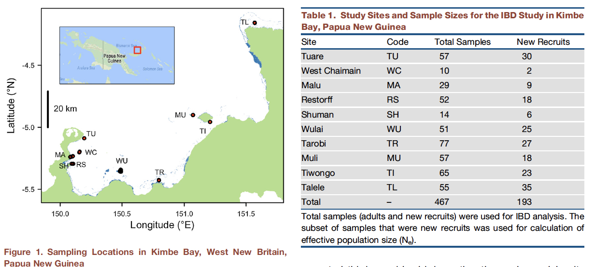
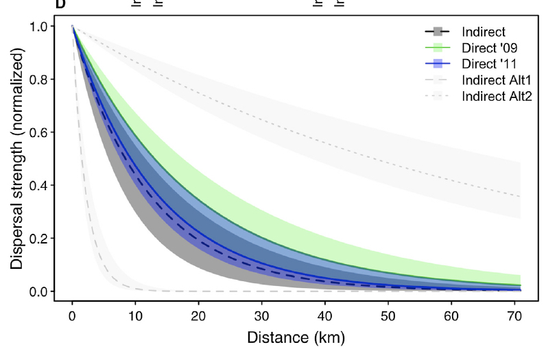

# Measuring structure in mtDNA data
Eric D. Crandall  
`r Sys.Date()`  

### Read in the data


```r
library(strataG)
library(gdistance)
library(ggplot2)
library(vegan)
library(knitr)

pcoel<-read.FASTA(file="../data/pcoelestis_aligned.fasta")

#put them in alphabetical order
pcoel<-pcoel[order(names(pcoel))]

image.DNAbin(pcoel)
```

<!-- -->

```r
pop<-gsub(names(pcoel),pattern = "_\\d+",replacement="") #create a vector of population assignments by stripping off the individual identifiers
pcoel<-as.matrix(pcoel)
pcoel_g<-sequence2gtypes(pcoel,strata=pop)

pcoel_g2<-labelHaplotypes(pcoel_g)
pcoel_g2
```

```
## $gtypes
## 
## <<< gtypes created on 2017-10-20 17:33:39 >>>
## 
## Contents: 410 samples, 1 locus, 24 strata
## 
## Strata summary:
##         num.samples num.missing num.alleles prop.unique.alleles
## Ashmore          32           0          27           0.8888889
## Bohnots          14           0          14           1.0000000
## Bootles          15           0          13           0.9230769
## Dili             11           0          11           1.0000000
## Dongsha          21           0          16           0.9375000
## Fiji              3           0           3           1.0000000
## Funakos          12           0          12           1.0000000
## GBR              44           0          29           0.7931034
## Kavieng          17           0          13           0.8461538
## Kominat          12           0          11           0.9090909
## Lautem            6           0           6           1.0000000
## Lihou            11           0          10           0.9000000
## Luhuito          13           0          11           0.9090909
## Male              8           0           8           1.0000000
## Moolool          15           0          13           0.9230769
## Nakanos          16           0          15           0.9333333
## Ndoke             7           0           7           1.0000000
## Ningalo          24           0          22           0.9090909
## Okinosh          18           0          17           0.9411765
## Sesoko           11           0          11           1.0000000
## Taiwan           62           0          50           0.8400000
## Tanegas          18           0          17           0.9411765
## Two               8           0           8           1.0000000
## Wingram          12           0           7           0.7142857
##         heterozygosity
## Ashmore      0.9838710
## Bohnots      1.0000000
## Bootles      0.9714286
## Dili         1.0000000
## Dongsha      0.9285714
## Fiji         1.0000000
## Funakos      1.0000000
## GBR          0.9365751
## Kavieng      0.9485294
## Kominat      0.9848485
## Lautem       1.0000000
## Lihou        0.9818182
## Luhuito      0.9615385
## Male         1.0000000
## Moolool      0.9714286
## Nakanos      0.9916667
## Ndoke        1.0000000
## Ningalo      0.9927536
## Okinosh      0.9934641
## Sesoko       1.0000000
## Taiwan       0.9915389
## Tanegas      0.9934641
## Two          1.0000000
## Wingram      0.8636364
## 
## Sequence summary:
##        num.seqs min.length mean.length max.length         a         c
## gene.1      238        337         337        337 0.3441274 0.1641128
##                g         t
## gene.1 0.1602632 0.3314966
## 
## 
## $unassigned
## $unassigned$gene.1
## NULL
```

### F-Statistics with DNA data

Thus far we have learned about calculating F<sub>st</sub> under the infinite sites model, i.e., we consider each allele to be different from each other allele, and always different by the same amount (whether that is one mutation or twenty mutations). What if we could measure the number of differences between each allele (or haplotype)? With DNA data we can! How can we incorporate this additional information into a similar measure of subpopulation differentiation?

Slightly different measures have been devised by different authors (as usual!), but the simplest of these to comprehend in light of our previous discussion is probably that of Nei (1982). What he did was to define a similar measure of population differentiation as F<sub>st</sub>, but this time using a measure of nucleotide diversity (π) within a population, in place of heterozygosity (H) or haplotype diversity (h). Recall, if we define $\pi_{ij}$ as the genetic distance between haplotype i and haplotype j (measured either by the simple proportion of nucleotide differences, or by some more complicated method, e.g., Jukes-Cantor, Kimura 2-parameter, etc.), then the nucleotide diversity within the total population is:

$$\pi =  \sum_{ij}x_ix_j\pi_{ij}$$
Where $x_i$ and $x_j$ are the respective frequencies of the ith and jth sequences in the sample and $\pi_{ij}$ is the number of nucleotide differences between these two sequences.

That is, the distances between haplotype pairs are simply weighted by how common they are, to arrive at an average. If we also define $\pi_s$ as the average nucleotide diversity within subpopulations, then we can derive a familiar expression for an F<sub>st</sub> –like nucleotide measure of subpopulation differentiation:
$$ \Phi_{ST} = \frac{\pi_T-\pi_S}{\pi_T} = \frac{\pi_B}{\pi_T}$$

This statistic could also be called $F_{ST}$ , but it was originally described by Nei (1982) as $\gamma_{ST}$ . A related statistic derived by Lynch & Crease (1990) was called $N_{ST}$ , one derived for mtDNA data by Takahata and Palumbi (1985), $G_{ST}$ , and one by Excoffier et al. (1992, see below), $\Phi_{ST}$ (phi-st). Although each of these statistics for nucleotide data is calculated slightly differently, in reality they are all trying to estimate the same parameter - the proportion of nucleotide diversity among subpopulations, relative to the total – and their values are usually quite similar, particularly with larger sample sizes. The same things can be said for all the different ways of calculating $F_{ST}$from allelic data. Given the multitude of different descriptor variables used by different authors, and the fact that within the two classes they are trying to estimate essentially the same parameters, my convention is to refer to the allelic form of the statistic as $F_{ST}$ , and the nucleotide diversity form as $\Phi_{ST}$ , and simply mention somewhere whose formulae or program you used to calculate them.

### Pairwise Statistics on Our Data


For our purposes now, we will first be calculating **pairwise** $\Phi_{ST}$. For pairwise F-statistics, we are taking every pair of populations, and calculating $\pi_B$ and $\pi_T$ and getting $\Phi_ST$ for each pair. In this way, we create a distance matrix of genetic distance between each pair of populations.


```r
pairwise_phi<-pairwiseTest(pcoel_g,stats="phist",nrep=1000,quietly=T,model="raw")

#pairwise_F<-pairwiseTest(pcoel_g,stats="Fst",nrep=1000,quietly=T)


head(pairwise_phi)
```

```
## $result
##                       pair.label strata.1 strata.2 n.1 n.2         PHIst
## 1   Ashmore (32) v. Bohnots (14)  Ashmore  Bohnots  32  14  5.985353e-02
## 2   Ashmore (32) v. Bootles (15)  Ashmore  Bootles  32  15  1.324877e-01
## 3      Ashmore (32) v. Dili (11)  Ashmore     Dili  32  11  3.943442e-02
## 4   Ashmore (32) v. Dongsha (21)  Ashmore  Dongsha  32  21  2.114151e-02
## 5       Ashmore (32) v. Fiji (3)  Ashmore     Fiji  32   3 -2.123994e-02
## 6   Ashmore (32) v. Funakos (12)  Ashmore  Funakos  32  12  6.174177e-04
## 7       Ashmore (32) v. GBR (44)  Ashmore      GBR  32  44  2.682843e-01
## 8   Ashmore (32) v. Kavieng (17)  Ashmore  Kavieng  32  17  1.478730e-01
## 9   Ashmore (32) v. Kominat (12)  Ashmore  Kominat  32  12 -1.166729e-02
## 10    Ashmore (32) v. Lautem (6)  Ashmore   Lautem  32   6  9.109764e-02
## 11    Ashmore (32) v. Lihou (11)  Ashmore    Lihou  32  11  7.017039e-02
## 12  Ashmore (32) v. Luhuito (13)  Ashmore  Luhuito  32  13 -9.131851e-03
## 13      Ashmore (32) v. Male (8)  Ashmore     Male  32   8  1.263547e-01
## 14  Ashmore (32) v. Moolool (15)  Ashmore  Moolool  32  15  8.665686e-02
## 15  Ashmore (32) v. Nakanos (16)  Ashmore  Nakanos  32  16 -2.753842e-02
## 16     Ashmore (32) v. Ndoke (7)  Ashmore    Ndoke  32   7  2.761358e-02
## 17  Ashmore (32) v. Ningalo (24)  Ashmore  Ningalo  32  24  7.017473e-02
## 18  Ashmore (32) v. Okinosh (18)  Ashmore  Okinosh  32  18  6.089428e-02
## 19   Ashmore (32) v. Sesoko (11)  Ashmore   Sesoko  32  11  4.100793e-03
## 20   Ashmore (32) v. Taiwan (62)  Ashmore   Taiwan  32  62 -2.197357e-03
## 21  Ashmore (32) v. Tanegas (18)  Ashmore  Tanegas  32  18  4.049588e-02
## 22       Ashmore (32) v. Two (8)  Ashmore      Two  32   8  1.892307e-04
## 23  Ashmore (32) v. Wingram (12)  Ashmore  Wingram  32  12  1.196392e-01
## 24  Bohnots (14) v. Bootles (15)  Bohnots  Bootles  14  15  2.467705e-01
## 25     Bohnots (14) v. Dili (11)  Bohnots     Dili  14  11  6.881611e-02
## 26  Bohnots (14) v. Dongsha (21)  Bohnots  Dongsha  14  21  1.117050e-01
## 27      Bohnots (14) v. Fiji (3)  Bohnots     Fiji  14   3 -8.574042e-02
## 28  Bohnots (14) v. Funakos (12)  Bohnots  Funakos  14  12 -2.068645e-04
## 29      Bohnots (14) v. GBR (44)  Bohnots      GBR  14  44  4.044602e-01
## 30  Bohnots (14) v. Kavieng (17)  Bohnots  Kavieng  14  17  2.354006e-01
## 31  Bohnots (14) v. Kominat (12)  Bohnots  Kominat  14  12 -1.764429e-02
## 32    Bohnots (14) v. Lautem (6)  Bohnots   Lautem  14   6  2.346102e-01
## 33    Bohnots (14) v. Lihou (11)  Bohnots    Lihou  14  11  1.782161e-01
## 34  Bohnots (14) v. Luhuito (13)  Bohnots  Luhuito  14  13  6.845443e-02
## 35      Bohnots (14) v. Male (8)  Bohnots     Male  14   8  2.536994e-01
## 36  Bohnots (14) v. Moolool (15)  Bohnots  Moolool  14  15  1.924581e-01
## 37  Bohnots (14) v. Nakanos (16)  Bohnots  Nakanos  14  16  4.814865e-02
## 38     Bohnots (14) v. Ndoke (7)  Bohnots    Ndoke  14   7  1.529930e-01
## 39  Bohnots (14) v. Ningalo (24)  Bohnots  Ningalo  14  24  1.088877e-01
## 40  Bohnots (14) v. Okinosh (18)  Bohnots  Okinosh  14  18 -1.453227e-02
## 41   Bohnots (14) v. Sesoko (11)  Bohnots   Sesoko  14  11  5.136735e-02
## 42   Bohnots (14) v. Taiwan (62)  Bohnots   Taiwan  14  62  3.310019e-02
## 43  Bohnots (14) v. Tanegas (18)  Bohnots  Tanegas  14  18 -1.111604e-02
## 44       Bohnots (14) v. Two (8)  Bohnots      Two  14   8  5.547452e-02
## 45  Bohnots (14) v. Wingram (12)  Bohnots  Wingram  14  12  2.598600e-01
## 46     Bootles (15) v. Dili (11)  Bootles     Dili  15  11  2.545593e-01
## 47  Bootles (15) v. Dongsha (21)  Bootles  Dongsha  15  21  3.067144e-01
## 48      Bootles (15) v. Fiji (3)  Bootles     Fiji  15   3  2.736516e-01
## 49  Bootles (15) v. Funakos (12)  Bootles  Funakos  15  12  9.672991e-02
## 50      Bootles (15) v. GBR (44)  Bootles      GBR  15  44  1.520118e-02
## 51  Bootles (15) v. Kavieng (17)  Bootles  Kavieng  15  17 -2.906518e-02
## 52  Bootles (15) v. Kominat (12)  Bootles  Kominat  15  12  1.489468e-01
## 53    Bootles (15) v. Lautem (6)  Bootles   Lautem  15   6  5.062252e-03
## 54    Bootles (15) v. Lihou (11)  Bootles    Lihou  15  11 -1.097038e-02
## 55  Bootles (15) v. Luhuito (13)  Bootles  Luhuito  15  13  7.289207e-02
## 56      Bootles (15) v. Male (8)  Bootles     Male  15   8 -3.447770e-02
## 57  Bootles (15) v. Moolool (15)  Bootles  Moolool  15  15 -2.172908e-02
## 58  Bootles (15) v. Nakanos (16)  Bootles  Nakanos  15  16  8.844055e-02
## 59     Bootles (15) v. Ndoke (7)  Bootles    Ndoke  15   7 -4.091092e-02
## 60  Bootles (15) v. Ningalo (24)  Bootles  Ningalo  15  24  4.817968e-02
## 61  Bootles (15) v. Okinosh (18)  Bootles  Okinosh  15  18  2.558558e-01
## 62   Bootles (15) v. Sesoko (11)  Bootles   Sesoko  15  11  2.248891e-01
## 63   Bootles (15) v. Taiwan (62)  Bootles   Taiwan  15  62  1.628598e-01
## 64  Bootles (15) v. Tanegas (18)  Bootles  Tanegas  15  18  2.135966e-01
## 65       Bootles (15) v. Two (8)  Bootles      Two  15   8  1.438930e-01
## 66  Bootles (15) v. Wingram (12)  Bootles  Wingram  15  12  3.621411e-01
## 67     Dili (11) v. Dongsha (21)     Dili  Dongsha  11  21  1.199651e-02
## 68         Dili (11) v. Fiji (3)     Dili     Fiji  11   3 -4.205306e-02
## 69     Dili (11) v. Funakos (12)     Dili  Funakos  11  12  3.407938e-02
## 70         Dili (11) v. GBR (44)     Dili      GBR  11  44  4.194767e-01
## 71     Dili (11) v. Kavieng (17)     Dili  Kavieng  11  17  2.426642e-01
## 72     Dili (11) v. Kominat (12)     Dili  Kominat  11  12  1.833612e-02
## 73       Dili (11) v. Lautem (6)     Dili   Lautem  11   6  1.525740e-01
## 74       Dili (11) v. Lihou (11)     Dili    Lihou  11  11  1.488018e-01
## 75     Dili (11) v. Luhuito (13)     Dili  Luhuito  11  13  5.178240e-02
## 76         Dili (11) v. Male (8)     Dili     Male  11   8  2.155983e-01
## 77     Dili (11) v. Moolool (15)     Dili  Moolool  11  15  1.755979e-01
## 78     Dili (11) v. Nakanos (16)     Dili  Nakanos  11  16  3.438872e-02
## 79        Dili (11) v. Ndoke (7)     Dili    Ndoke  11   7  1.290858e-01
## 80     Dili (11) v. Ningalo (24)     Dili  Ningalo  11  24  1.468283e-01
## 81     Dili (11) v. Okinosh (18)     Dili  Okinosh  11  18  2.452976e-02
## 82      Dili (11) v. Sesoko (11)     Dili   Sesoko  11  11  2.043362e-02
## 83      Dili (11) v. Taiwan (62)     Dili   Taiwan  11  62  3.681623e-02
## 84     Dili (11) v. Tanegas (18)     Dili  Tanegas  11  18  3.855106e-02
## 85          Dili (11) v. Two (8)     Dili      Two  11   8  4.710634e-02
## 86     Dili (11) v. Wingram (12)     Dili  Wingram  11  12  1.848414e-01
## 87      Dongsha (21) v. Fiji (3)  Dongsha     Fiji  21   3  5.522137e-03
## 88  Dongsha (21) v. Funakos (12)  Dongsha  Funakos  21  12  7.711325e-02
## 89      Dongsha (21) v. GBR (44)  Dongsha      GBR  21  44  4.440743e-01
## 90  Dongsha (21) v. Kavieng (17)  Dongsha  Kavieng  21  17  3.079575e-01
## 91  Dongsha (21) v. Kominat (12)  Dongsha  Kominat  21  12  5.439490e-02
## 92    Dongsha (21) v. Lautem (6)  Dongsha   Lautem  21   6  2.337190e-01
## 93    Dongsha (21) v. Lihou (11)  Dongsha    Lihou  21  11  2.049119e-01
## 94  Dongsha (21) v. Luhuito (13)  Dongsha  Luhuito  21  13  7.528701e-02
## 95      Dongsha (21) v. Male (8)  Dongsha     Male  21   8  2.849118e-01
## 96  Dongsha (21) v. Moolool (15)  Dongsha  Moolool  21  15  2.332006e-01
## 97  Dongsha (21) v. Nakanos (16)  Dongsha  Nakanos  21  16  5.121591e-02
## 98     Dongsha (21) v. Ndoke (7)  Dongsha    Ndoke  21   7  1.808312e-01
## 99  Dongsha (21) v. Ningalo (24)  Dongsha  Ningalo  21  24  1.937996e-01
## 100 Dongsha (21) v. Okinosh (18)  Dongsha  Okinosh  21  18  5.709129e-02
## 101  Dongsha (21) v. Sesoko (11)  Dongsha   Sesoko  21  11  3.867585e-02
## 102  Dongsha (21) v. Taiwan (62)  Dongsha   Taiwan  21  62  4.338102e-02
## 103 Dongsha (21) v. Tanegas (18)  Dongsha  Tanegas  21  18  6.717922e-02
## 104      Dongsha (21) v. Two (8)  Dongsha      Two  21   8  8.777995e-02
## 105 Dongsha (21) v. Wingram (12)  Dongsha  Wingram  21  12  1.783462e-01
## 106     Fiji (3) v. Funakos (12)     Fiji  Funakos   3  12 -4.821173e-02
## 107         Fiji (3) v. GBR (44)     Fiji      GBR   3  44  4.567178e-01
## 108     Fiji (3) v. Kavieng (17)     Fiji  Kavieng   3  17  2.453124e-01
## 109     Fiji (3) v. Kominat (12)     Fiji  Kominat   3  12 -5.255766e-02
## 110       Fiji (3) v. Lautem (6)     Fiji   Lautem   3   6  1.786969e-01
## 111       Fiji (3) v. Lihou (11)     Fiji    Lihou   3  11  1.240750e-01
## 112     Fiji (3) v. Luhuito (13)     Fiji  Luhuito   3  13  2.662386e-02
## 113         Fiji (3) v. Male (8)     Fiji     Male   3   8  2.111012e-01
## 114     Fiji (3) v. Moolool (15)     Fiji  Moolool   3  15  1.783566e-01
## 115     Fiji (3) v. Nakanos (16)     Fiji  Nakanos   3  16 -2.759961e-02
## 116        Fiji (3) v. Ndoke (7)     Fiji    Ndoke   3   7  1.382323e-01
## 117     Fiji (3) v. Ningalo (24)     Fiji  Ningalo   3  24  6.131522e-02
## 118     Fiji (3) v. Okinosh (18)     Fiji  Okinosh   3  18 -1.026120e-01
## 119      Fiji (3) v. Sesoko (11)     Fiji   Sesoko   3  11 -6.668986e-02
## 120      Fiji (3) v. Taiwan (62)     Fiji   Taiwan   3  62 -2.187264e-02
## 121     Fiji (3) v. Tanegas (18)     Fiji  Tanegas   3  18 -1.038504e-01
## 122          Fiji (3) v. Two (8)     Fiji      Two   3   8 -3.731163e-02
## 123     Fiji (3) v. Wingram (12)     Fiji  Wingram   3  12  1.349802e-01
## 124     Funakos (12) v. GBR (44)  Funakos      GBR  12  44  2.511461e-01
## 125 Funakos (12) v. Kavieng (17)  Funakos  Kavieng  12  17  9.173547e-02
## 126 Funakos (12) v. Kominat (12)  Funakos  Kominat  12  12 -3.888112e-02
## 127   Funakos (12) v. Lautem (6)  Funakos   Lautem  12   6  4.968115e-02
## 128   Funakos (12) v. Lihou (11)  Funakos    Lihou  12  11  3.333193e-02
## 129 Funakos (12) v. Luhuito (13)  Funakos  Luhuito  12  13 -2.105413e-02
## 130     Funakos (12) v. Male (8)  Funakos     Male  12   8  7.429200e-02
## 131 Funakos (12) v. Moolool (15)  Funakos  Moolool  12  15  5.223326e-02
## 132 Funakos (12) v. Nakanos (16)  Funakos  Nakanos  12  16 -1.497082e-02
## 133    Funakos (12) v. Ndoke (7)  Funakos    Ndoke  12   7  8.796902e-05
## 134 Funakos (12) v. Ningalo (24)  Funakos  Ningalo  12  24  4.246662e-02
## 135 Funakos (12) v. Okinosh (18)  Funakos  Okinosh  12  18  1.195219e-02
## 136  Funakos (12) v. Sesoko (11)  Funakos   Sesoko  12  11  6.571767e-03
## 137  Funakos (12) v. Taiwan (62)  Funakos   Taiwan  12  62 -6.239032e-04
## 138 Funakos (12) v. Tanegas (18)  Funakos  Tanegas  12  18 -1.780582e-02
## 139      Funakos (12) v. Two (8)  Funakos      Two  12   8 -1.596462e-02
## 140 Funakos (12) v. Wingram (12)  Funakos  Wingram  12  12  1.642475e-01
## 141     GBR (44) v. Kavieng (17)      GBR  Kavieng  44  17  2.300793e-02
## 142     GBR (44) v. Kominat (12)      GBR  Kominat  44  12  3.137938e-01
## 143       GBR (44) v. Lautem (6)      GBR   Lautem  44   6  9.119435e-02
## 144       GBR (44) v. Lihou (11)      GBR    Lihou  44  11  5.367566e-02
## 145     GBR (44) v. Luhuito (13)      GBR  Luhuito  44  13  2.102393e-01
## 146         GBR (44) v. Male (8)      GBR     Male  44   8  1.836018e-02
## 147     GBR (44) v. Moolool (15)      GBR  Moolool  44  15  5.085496e-02
## 148     GBR (44) v. Nakanos (16)      GBR  Nakanos  44  16  2.412287e-01
## 149        GBR (44) v. Ndoke (7)      GBR    Ndoke  44   7  6.622751e-02
## 150     GBR (44) v. Ningalo (24)      GBR  Ningalo  44  24  1.731670e-01
## 151     GBR (44) v. Okinosh (18)      GBR  Okinosh  44  18  4.167425e-01
## 152      GBR (44) v. Sesoko (11)      GBR   Sesoko  44  11  3.902485e-01
## 153      GBR (44) v. Taiwan (62)      GBR   Taiwan  44  62  2.933748e-01
## 154     GBR (44) v. Tanegas (18)      GBR  Tanegas  44  18  3.709402e-01
## 155          GBR (44) v. Two (8)      GBR      Two  44   8  3.137201e-01
## 156     GBR (44) v. Wingram (12)      GBR  Wingram  44  12  4.866772e-01
## 157 Kavieng (17) v. Kominat (12)  Kavieng  Kominat  17  12  1.528037e-01
## 158   Kavieng (17) v. Lautem (6)  Kavieng   Lautem  17   6 -2.206154e-02
## 159   Kavieng (17) v. Lihou (11)  Kavieng    Lihou  17  11 -2.452472e-02
## 160 Kavieng (17) v. Luhuito (13)  Kavieng  Luhuito  17  13  9.069650e-02
## 161     Kavieng (17) v. Male (8)  Kavieng     Male  17   8 -2.858487e-02
## 162 Kavieng (17) v. Moolool (15)  Kavieng  Moolool  17  15 -3.687022e-02
## 163 Kavieng (17) v. Nakanos (16)  Kavieng  Nakanos  17  16  1.115821e-01
## 164    Kavieng (17) v. Ndoke (7)  Kavieng    Ndoke  17   7 -1.659199e-02
## 165 Kavieng (17) v. Ningalo (24)  Kavieng  Ningalo  17  24  5.826625e-02
## 166 Kavieng (17) v. Okinosh (18)  Kavieng  Okinosh  17  18  2.489484e-01
## 167  Kavieng (17) v. Sesoko (11)  Kavieng   Sesoko  17  11  2.300290e-01
## 168  Kavieng (17) v. Taiwan (62)  Kavieng   Taiwan  17  62  1.769390e-01
## 169 Kavieng (17) v. Tanegas (18)  Kavieng  Tanegas  17  18  2.080274e-01
## 170      Kavieng (17) v. Two (8)  Kavieng      Two  17   8  1.495615e-01
## 171 Kavieng (17) v. Wingram (12)  Kavieng  Wingram  17  12  3.635764e-01
## 172   Kominat (12) v. Lautem (6)  Kominat   Lautem  12   6  1.172460e-01
## 173   Kominat (12) v. Lihou (11)  Kominat    Lihou  12  11  8.670353e-02
## 174 Kominat (12) v. Luhuito (13)  Kominat  Luhuito  12  13 -2.900172e-03
## 175     Kominat (12) v. Male (8)  Kominat     Male  12   8  1.506532e-01
## 176 Kominat (12) v. Moolool (15)  Kominat  Moolool  12  15  9.286425e-02
## 177 Kominat (12) v. Nakanos (16)  Kominat  Nakanos  12  16 -3.249081e-02
## 178    Kominat (12) v. Ndoke (7)  Kominat    Ndoke  12   7  4.788856e-02
## 179 Kominat (12) v. Ningalo (24)  Kominat  Ningalo  12  24  3.873782e-02
## 180 Kominat (12) v. Okinosh (18)  Kominat  Okinosh  12  18 -2.365432e-03
## 181  Kominat (12) v. Sesoko (11)  Kominat   Sesoko  12  11 -6.515875e-03
## 182  Kominat (12) v. Taiwan (62)  Kominat   Taiwan  12  62 -2.496208e-02
## 183 Kominat (12) v. Tanegas (18)  Kominat  Tanegas  12  18 -9.474003e-03
## 184      Kominat (12) v. Two (8)  Kominat      Two  12   8 -2.028664e-02
## 185 Kominat (12) v. Wingram (12)  Kominat  Wingram  12  12  1.707617e-01
## 186     Lautem (6) v. Lihou (11)   Lautem    Lihou   6  11 -7.211796e-02
## 187   Lautem (6) v. Luhuito (13)   Lautem  Luhuito   6  13  6.103165e-02
## 188       Lautem (6) v. Male (8)   Lautem     Male   6   8 -6.499538e-02
## 189   Lautem (6) v. Moolool (15)   Lautem  Moolool   6  15 -6.108374e-02
## 190   Lautem (6) v. Nakanos (16)   Lautem  Nakanos   6  16  6.365008e-02
## 191      Lautem (6) v. Ndoke (7)   Lautem    Ndoke   6   7 -2.111691e-02
## 192   Lautem (6) v. Ningalo (24)   Lautem  Ningalo   6  24  7.311411e-02
## 193   Lautem (6) v. Okinosh (18)   Lautem  Okinosh   6  18  2.026346e-01
## 194    Lautem (6) v. Sesoko (11)   Lautem   Sesoko   6  11  1.483442e-01
## 195    Lautem (6) v. Taiwan (62)   Lautem   Taiwan   6  62  1.417368e-01
## 196   Lautem (6) v. Tanegas (18)   Lautem  Tanegas   6  18  1.734167e-01
## 197        Lautem (6) v. Two (8)   Lautem      Two   6   8  1.019208e-01
## 198   Lautem (6) v. Wingram (12)   Lautem  Wingram   6  12  3.139635e-01
## 199   Lihou (11) v. Luhuito (13)    Lihou  Luhuito  11  13  1.852072e-02
## 200       Lihou (11) v. Male (8)    Lihou     Male  11   8 -4.727573e-02
## 201   Lihou (11) v. Moolool (15)    Lihou  Moolool  11  15 -4.854040e-02
## 202   Lihou (11) v. Nakanos (16)    Lihou  Nakanos  11  16  3.988974e-02
## 203      Lihou (11) v. Ndoke (7)    Lihou    Ndoke  11   7 -4.964969e-02
## 204   Lihou (11) v. Ningalo (24)    Lihou  Ningalo  11  24  5.842123e-02
## 205   Lihou (11) v. Okinosh (18)    Lihou  Okinosh  11  18  1.777524e-01
## 206    Lihou (11) v. Sesoko (11)    Lihou   Sesoko  11  11  1.389330e-01
## 207    Lihou (11) v. Taiwan (62)    Lihou   Taiwan  11  62  1.205448e-01
## 208   Lihou (11) v. Tanegas (18)    Lihou  Tanegas  11  18  1.427860e-01
## 209        Lihou (11) v. Two (8)    Lihou      Two  11   8  8.460412e-02
## 210   Lihou (11) v. Wingram (12)    Lihou  Wingram  11  12  2.818741e-01
## 211     Luhuito (13) v. Male (8)  Luhuito     Male  13   8  6.455494e-02
## 212 Luhuito (13) v. Moolool (15)  Luhuito  Moolool  13  15  4.432073e-02
## 213 Luhuito (13) v. Nakanos (16)  Luhuito  Nakanos  13  16 -2.702673e-02
## 214    Luhuito (13) v. Ndoke (7)  Luhuito    Ndoke  13   7 -4.619669e-02
## 215 Luhuito (13) v. Ningalo (24)  Luhuito  Ningalo  13  24  4.882642e-02
## 216 Luhuito (13) v. Okinosh (18)  Luhuito  Okinosh  13  18  7.258384e-02
## 217  Luhuito (13) v. Sesoko (11)  Luhuito   Sesoko  13  11  5.706864e-02
## 218  Luhuito (13) v. Taiwan (62)  Luhuito   Taiwan  13  62  1.914377e-02
## 219 Luhuito (13) v. Tanegas (18)  Luhuito  Tanegas  13  18  4.283735e-02
## 220      Luhuito (13) v. Two (8)  Luhuito      Two  13   8  2.953148e-02
## 221 Luhuito (13) v. Wingram (12)  Luhuito  Wingram  13  12  2.305460e-01
## 222     Male (8) v. Moolool (15)     Male  Moolool   8  15 -2.918006e-02
## 223     Male (8) v. Nakanos (16)     Male  Nakanos   8  16  8.606245e-02
## 224        Male (8) v. Ndoke (7)     Male    Ndoke   8   7 -3.895390e-02
## 225     Male (8) v. Ningalo (24)     Male  Ningalo   8  24  7.688304e-02
## 226     Male (8) v. Okinosh (18)     Male  Okinosh   8  18  2.404882e-01
## 227      Male (8) v. Sesoko (11)     Male   Sesoko   8  11  1.877737e-01
## 228      Male (8) v. Taiwan (62)     Male   Taiwan   8  62  1.757322e-01
## 229     Male (8) v. Tanegas (18)     Male  Tanegas   8  18  1.920040e-01
## 230          Male (8) v. Two (8)     Male      Two   8   8  1.208791e-01
## 231     Male (8) v. Wingram (12)     Male  Wingram   8  12  3.303695e-01
## 232 Moolool (15) v. Nakanos (16)  Moolool  Nakanos  15  16  5.059936e-02
## 233    Moolool (15) v. Ndoke (7)  Moolool    Ndoke  15   7 -4.165588e-02
## 234 Moolool (15) v. Ningalo (24)  Moolool  Ningalo  15  24  3.163201e-02
## 235 Moolool (15) v. Okinosh (18)  Moolool  Okinosh  15  18  1.978855e-01
## 236  Moolool (15) v. Sesoko (11)  Moolool   Sesoko  15  11  1.578692e-01
## 237  Moolool (15) v. Taiwan (62)  Moolool   Taiwan  15  62  1.208051e-01
## 238 Moolool (15) v. Tanegas (18)  Moolool  Tanegas  15  18  1.638933e-01
## 239      Moolool (15) v. Two (8)  Moolool      Two  15   8  8.874418e-02
## 240 Moolool (15) v. Wingram (12)  Moolool  Wingram  15  12  2.953765e-01
## 241    Nakanos (16) v. Ndoke (7)  Nakanos    Ndoke  16   7 -5.297686e-03
## 242 Nakanos (16) v. Ningalo (24)  Nakanos  Ningalo  16  24  2.228579e-02
## 243 Nakanos (16) v. Okinosh (18)  Nakanos  Okinosh  16  18  5.601688e-02
## 244  Nakanos (16) v. Sesoko (11)  Nakanos   Sesoko  16  11 -5.240947e-03
## 245  Nakanos (16) v. Taiwan (62)  Nakanos   Taiwan  16  62 -1.264368e-02
## 246 Nakanos (16) v. Tanegas (18)  Nakanos  Tanegas  16  18  3.575004e-02
## 247      Nakanos (16) v. Two (8)  Nakanos      Two  16   8 -2.332404e-02
## 248 Nakanos (16) v. Wingram (12)  Nakanos  Wingram  16  12  1.217078e-01
## 249    Ndoke (7) v. Ningalo (24)    Ndoke  Ningalo   7  24 -1.919495e-03
## 250    Ndoke (7) v. Okinosh (18)    Ndoke  Okinosh   7  18  1.548454e-01
## 251     Ndoke (7) v. Sesoko (11)    Ndoke   Sesoko   7  11  1.234697e-01
## 252     Ndoke (7) v. Taiwan (62)    Ndoke   Taiwan   7  62  7.346987e-02
## 253    Ndoke (7) v. Tanegas (18)    Ndoke  Tanegas   7  18  1.060239e-01
## 254         Ndoke (7) v. Two (8)    Ndoke      Two   7   8  5.758337e-02
## 255    Ndoke (7) v. Wingram (12)    Ndoke  Wingram   7  12  3.009304e-01
## 256 Ningalo (24) v. Okinosh (18)  Ningalo  Okinosh  24  18  1.475886e-01
## 257  Ningalo (24) v. Sesoko (11)  Ningalo   Sesoko  24  11  1.089404e-01
## 258  Ningalo (24) v. Taiwan (62)  Ningalo   Taiwan  24  62  6.636162e-02
## 259 Ningalo (24) v. Tanegas (18)  Ningalo  Tanegas  24  18  1.083789e-01
## 260      Ningalo (24) v. Two (8)  Ningalo      Two  24   8  1.250164e-02
## 261 Ningalo (24) v. Wingram (12)  Ningalo  Wingram  24  12  1.869102e-01
## 262  Okinosh (18) v. Sesoko (11)  Okinosh   Sesoko  18  11  2.454210e-02
## 263  Okinosh (18) v. Taiwan (62)  Okinosh   Taiwan  18  62  4.803003e-02
## 264 Okinosh (18) v. Tanegas (18)  Okinosh  Tanegas  18  18 -1.273453e-02
## 265      Okinosh (18) v. Two (8)  Okinosh      Two  18   8  4.917987e-02
## 266 Okinosh (18) v. Wingram (12)  Okinosh  Wingram  18  12  1.923873e-01
## 267   Sesoko (11) v. Taiwan (62)   Sesoko   Taiwan  11  62 -2.049015e-03
## 268  Sesoko (11) v. Tanegas (18)   Sesoko  Tanegas  11  18  1.526531e-02
## 269       Sesoko (11) v. Two (8)   Sesoko      Two  11   8 -3.159001e-02
## 270  Sesoko (11) v. Wingram (12)   Sesoko  Wingram  11  12  4.167992e-02
## 271  Taiwan (62) v. Tanegas (18)   Taiwan  Tanegas  62  18  3.145210e-02
## 272       Taiwan (62) v. Two (8)   Taiwan      Two  62   8 -9.890346e-03
## 273  Taiwan (62) v. Wingram (12)   Taiwan  Wingram  62  12  1.126774e-01
## 274      Tanegas (18) v. Two (8)  Tanegas      Two  18   8  1.373882e-02
## 275 Tanegas (18) v. Wingram (12)  Tanegas  Wingram  18  12  1.688875e-01
## 276      Two (8) v. Wingram (12)      Two  Wingram   8  12  4.567437e-02
##     PHIst.p.val
## 1   0.030969031
## 2   0.002997003
## 3   0.091908092
## 4   0.128871129
## 5   0.515484515
## 6   0.352647353
## 7   0.000999001
## 8   0.002997003
## 9   0.532467532
## 10  0.068931069
## 11  0.037962038
## 12  0.492507493
## 13  0.017982018
## 14  0.017982018
## 15  0.963036963
## 16  0.201798202
## 17  0.004995005
## 18  0.019980020
## 19  0.323676324
## 20  0.477522478
## 21  0.034965035
## 22  0.394605395
## 23  0.006993007
## 24  0.000999001
## 25  0.030969031
## 26  0.007992008
## 27  0.803196803
## 28  0.383616384
## 29  0.000999001
## 30  0.001998002
## 31  0.619380619
## 32  0.003996004
## 33  0.002997003
## 34  0.060939061
## 35  0.000999001
## 36  0.001998002
## 37  0.080919081
## 38  0.025974026
## 39  0.004995005
## 40  0.733266733
## 41  0.076923077
## 42  0.070929071
## 43  0.658341658
## 44  0.077922078
## 45  0.000999001
## 46  0.000999001
## 47  0.000999001
## 48  0.021978022
## 49  0.028971029
## 50  0.164835165
## 51  0.886113886
## 52  0.012987013
## 53  0.395604396
## 54  0.517482517
## 55  0.048951049
## 56  0.800199800
## 57  0.727272727
## 58  0.016983017
## 59  0.839160839
## 60  0.038961039
## 61  0.000999001
## 62  0.000999001
## 63  0.000999001
## 64  0.000999001
## 65  0.011988012
## 66  0.000999001
## 67  0.236763237
## 68  0.596403596
## 69  0.134865135
## 70  0.000999001
## 71  0.000999001
## 72  0.253746254
## 73  0.024975025
## 74  0.008991009
## 75  0.125874126
## 76  0.002997003
## 77  0.000999001
## 78  0.149850150
## 79  0.031968032
## 80  0.000999001
## 81  0.139860140
## 82  0.228771229
## 83  0.087912088
## 84  0.070929071
## 85  0.112887113
## 86  0.001998002
## 87  0.364635365
## 88  0.040959041
## 89  0.000999001
## 90  0.000999001
## 91  0.066933067
## 92  0.005994006
## 93  0.005994006
## 94  0.057942058
## 95  0.000999001
## 96  0.001998002
## 97  0.064935065
## 98  0.013986014
## 99  0.000999001
## 100 0.031968032
## 101 0.105894106
## 102 0.028971029
## 103 0.027972028
## 104 0.049950050
## 105 0.002997003
## 106 0.610389610
## 107 0.000999001
## 108 0.023976024
## 109 0.657342657
## 110 0.116883117
## 111 0.156843157
## 112 0.293706294
## 113 0.042957043
## 114 0.055944056
## 115 0.538461538
## 116 0.143856144
## 117 0.142857143
## 118 0.944055944
## 119 0.686313686
## 120 0.554445554
## 121 0.963036963
## 122 0.658341658
## 123 0.154845155
## 124 0.000999001
## 125 0.024975025
## 126 0.927072927
## 127 0.164835165
## 128 0.170829171
## 129 0.648351648
## 130 0.057942058
## 131 0.088911089
## 132 0.612387612
## 133 0.361638362
## 134 0.043956044
## 135 0.246753247
## 136 0.295704296
## 137 0.397602398
## 138 0.757242757
## 139 0.605394605
## 140 0.000999001
## 141 0.098901099
## 142 0.000999001
## 143 0.053946054
## 144 0.036963037
## 145 0.000999001
## 146 0.207792208
## 147 0.036963037
## 148 0.000999001
## 149 0.065934066
## 150 0.000999001
## 151 0.000999001
## 152 0.000999001
## 153 0.000999001
## 154 0.000999001
## 155 0.000999001
## 156 0.000999001
## 157 0.001998002
## 158 0.576423576
## 159 0.753246753
## 160 0.038961039
## 161 0.736263736
## 162 0.968031968
## 163 0.013986014
## 164 0.578421578
## 165 0.015984016
## 166 0.000999001
## 167 0.000999001
## 168 0.000999001
## 169 0.000999001
## 170 0.005994006
## 171 0.000999001
## 172 0.054945055
## 173 0.074925075
## 174 0.356643357
## 175 0.016983017
## 176 0.033966034
## 177 0.838161838
## 178 0.149850150
## 179 0.068931069
## 180 0.460539461
## 181 0.443556444
## 182 0.934065934
## 183 0.564435564
## 184 0.612387612
## 185 0.001998002
## 186 0.922077922
## 187 0.130869131
## 188 0.917082917
## 189 0.912087912
## 190 0.141858142
## 191 0.447552448
## 192 0.047952048
## 193 0.003996004
## 194 0.035964036
## 195 0.005994006
## 196 0.005994006
## 197 0.107892108
## 198 0.000999001
## 199 0.250749251
## 200 0.885114885
## 201 0.983016983
## 202 0.134865135
## 203 0.815184815
## 204 0.030969031
## 205 0.000999001
## 206 0.015984016
## 207 0.005994006
## 208 0.003996004
## 209 0.073926074
## 210 0.000999001
## 211 0.114885115
## 212 0.125874126
## 213 0.736263736
## 214 0.687312687
## 215 0.040959041
## 216 0.026973027
## 217 0.103896104
## 218 0.149850150
## 219 0.100899101
## 220 0.185814186
## 221 0.001998002
## 222 0.760239760
## 223 0.049950050
## 224 0.639360639
## 225 0.023976024
## 226 0.000999001
## 227 0.003996004
## 228 0.000999001
## 229 0.002997003
## 230 0.030969031
## 231 0.000999001
## 232 0.069930070
## 233 0.814185814
## 234 0.071928072
## 235 0.000999001
## 236 0.004995005
## 237 0.002997003
## 238 0.000999001
## 239 0.043956044
## 240 0.000999001
## 241 0.389610390
## 242 0.128871129
## 243 0.023976024
## 244 0.425574426
## 245 0.697302697
## 246 0.087912088
## 247 0.665334665
## 248 0.008991009
## 249 0.439560440
## 250 0.003996004
## 251 0.041958042
## 252 0.052947053
## 253 0.032967033
## 254 0.135864136
## 255 0.000999001
## 256 0.000999001
## 257 0.003996004
## 258 0.000999001
## 259 0.001998002
## 260 0.270729271
## 261 0.000999001
## 262 0.150849151
## 263 0.021978022
## 264 0.747252747
## 265 0.061938062
## 266 0.000999001
## 267 0.438561439
## 268 0.251748252
## 269 0.722277722
## 270 0.131868132
## 271 0.043956044
## 272 0.553446553
## 273 0.003996004
## 274 0.293706294
## 275 0.000999001
## 276 0.110889111
## 
## $pair.mat
## $pair.mat$PHIst
##               Ashmore       Bohnots      Bootles         Dili     Dongsha
## Ashmore            NA  0.0309690310  0.002997003  0.091908092 0.128871129
## Bohnots  0.0598535347            NA  0.000999001  0.030969031 0.007992008
## Bootles  0.1324876738  0.2467705356           NA  0.000999001 0.000999001
## Dili     0.0394344224  0.0688161107  0.254559340           NA 0.236763237
## Dongsha  0.0211415057  0.1117049606  0.306714351  0.011996511          NA
## Fiji    -0.0212399423 -0.0857404238  0.273651553 -0.042053061 0.005522137
## Funakos  0.0006174177 -0.0002068645  0.096729913  0.034079375 0.077113254
## GBR      0.2682842577  0.4044601895  0.015201179  0.419476721 0.444074265
## Kavieng  0.1478730321  0.2354006465 -0.029065179  0.242664174 0.307957504
## Kominat -0.0116672939 -0.0176442907  0.148946763  0.018336124 0.054394904
## Lautem   0.0910976409  0.2346101550  0.005062252  0.152574032 0.233719027
## Lihou    0.0701703867  0.1782160789 -0.010970379  0.148801846 0.204911881
## Luhuito -0.0091318510  0.0684544321  0.072892065  0.051782405 0.075287008
## Male     0.1263547020  0.2536993598 -0.034477704  0.215598304 0.284911791
## Moolool  0.0866568557  0.1924581473 -0.021729080  0.175597915 0.233200568
## Nakanos -0.0275384237  0.0481486459  0.088440553  0.034388716 0.051215912
## Ndoke    0.0276135837  0.1529929650 -0.040910925  0.129085785 0.180831234
## Ningalo  0.0701747276  0.1088877141  0.048179684  0.146828332 0.193799583
## Okinosh  0.0608942785 -0.0145322678  0.255855849  0.024529757 0.057091288
## Sesoko   0.0041007931  0.0513673523  0.224889061  0.020433619 0.038675851
## Taiwan  -0.0021973571  0.0331001935  0.162859780  0.036816228 0.043381023
## Tanegas  0.0404958781 -0.0111160394  0.213596561  0.038551057 0.067179220
## Two      0.0001892307  0.0554745201  0.143892960  0.047106335 0.087779949
## Wingram  0.1196391637  0.2598600488  0.362141060  0.184841372 0.178346190
##                Fiji       Funakos         GBR      Kavieng      Kominat
## Ashmore  0.51548452  3.526474e-01 0.000999001  0.002997003  0.532467532
## Bohnots  0.80319680  3.836164e-01 0.000999001  0.001998002  0.619380619
## Bootles  0.02197802  2.897103e-02 0.164835165  0.886113886  0.012987013
## Dili     0.59640360  1.348651e-01 0.000999001  0.000999001  0.253746254
## Dongsha  0.36463536  4.095904e-02 0.000999001  0.000999001  0.066933067
## Fiji             NA  6.103896e-01 0.000999001  0.023976024  0.657342657
## Funakos -0.04821173            NA 0.000999001  0.024975025  0.927072927
## GBR      0.45671783  2.511461e-01          NA  0.098901099  0.000999001
## Kavieng  0.24531241  9.173547e-02 0.023007935           NA  0.001998002
## Kominat -0.05255766 -3.888112e-02 0.313793756  0.152803747           NA
## Lautem   0.17869691  4.968115e-02 0.091194346 -0.022061545  0.117246023
## Lihou    0.12407499  3.333193e-02 0.053675662 -0.024524723  0.086703535
## Luhuito  0.02662386 -2.105413e-02 0.210239332  0.090696495 -0.002900172
## Male     0.21110120  7.429200e-02 0.018360183 -0.028584867  0.150653216
## Moolool  0.17835659  5.223326e-02 0.050854955 -0.036870218  0.092864251
## Nakanos -0.02759961 -1.497082e-02 0.241228742  0.111582114 -0.032490812
## Ndoke    0.13823231  8.796902e-05 0.066227510 -0.016591986  0.047888564
## Ningalo  0.06131522  4.246662e-02 0.173167041  0.058266249  0.038737818
## Okinosh -0.10261197  1.195219e-02 0.416742549  0.248948412 -0.002365432
## Sesoko  -0.06668986  6.571767e-03 0.390248474  0.230028983 -0.006515875
## Taiwan  -0.02187264 -6.239032e-04 0.293374815  0.176939001 -0.024962078
## Tanegas -0.10385038 -1.780582e-02 0.370940186  0.208027416 -0.009474003
## Two     -0.03731163 -1.596462e-02 0.313720128  0.149561533 -0.020286644
## Wingram  0.13498015  1.642475e-01 0.486677249  0.363576416  0.170761671
##               Lautem        Lihou      Luhuito         Male      Moolool
## Ashmore  0.068931069  0.037962038  0.492507493  0.017982018  0.017982018
## Bohnots  0.003996004  0.002997003  0.060939061  0.000999001  0.001998002
## Bootles  0.395604396  0.517482517  0.048951049  0.800199800  0.727272727
## Dili     0.024975025  0.008991009  0.125874126  0.002997003  0.000999001
## Dongsha  0.005994006  0.005994006  0.057942058  0.000999001  0.001998002
## Fiji     0.116883117  0.156843157  0.293706294  0.042957043  0.055944056
## Funakos  0.164835165  0.170829171  0.648351648  0.057942058  0.088911089
## GBR      0.053946054  0.036963037  0.000999001  0.207792208  0.036963037
## Kavieng  0.576423576  0.753246753  0.038961039  0.736263736  0.968031968
## Kominat  0.054945055  0.074925075  0.356643357  0.016983017  0.033966034
## Lautem            NA  0.922077922  0.130869131  0.917082917  0.912087912
## Lihou   -0.072117957           NA  0.250749251  0.885114885  0.983016983
## Luhuito  0.061031652  0.018520716           NA  0.114885115  0.125874126
## Male    -0.064995383 -0.047275728  0.064554935           NA  0.760239760
## Moolool -0.061083744 -0.048540396  0.044320730 -0.029180057           NA
## Nakanos  0.063650075  0.039889738 -0.027026728  0.086062452  0.050599359
## Ndoke   -0.021116915 -0.049649686 -0.046196685 -0.038953896 -0.041655876
## Ningalo  0.073114109  0.058421234  0.048826423  0.076883042  0.031632015
## Okinosh  0.202634638  0.177752379  0.072583841  0.240488233  0.197885516
## Sesoko   0.148344238  0.138932983  0.057068639  0.187773722  0.157869202
## Taiwan   0.141736816  0.120544780  0.019143771  0.175732186  0.120805102
## Tanegas  0.173416658  0.142786030  0.042837355  0.192003994  0.163893296
## Two      0.101920825  0.084604123  0.029531478  0.120879121  0.088744185
## Wingram  0.313963505  0.281874072  0.230545984  0.330369462  0.295376483
##              Nakanos        Ndoke     Ningalo      Okinosh       Sesoko
## Ashmore  0.963036963  0.201798202 0.004995005  0.019980020  0.323676324
## Bohnots  0.080919081  0.025974026 0.004995005  0.733266733  0.076923077
## Bootles  0.016983017  0.839160839 0.038961039  0.000999001  0.000999001
## Dili     0.149850150  0.031968032 0.000999001  0.139860140  0.228771229
## Dongsha  0.064935065  0.013986014 0.000999001  0.031968032  0.105894106
## Fiji     0.538461538  0.143856144 0.142857143  0.944055944  0.686313686
## Funakos  0.612387612  0.361638362 0.043956044  0.246753247  0.295704296
## GBR      0.000999001  0.065934066 0.000999001  0.000999001  0.000999001
## Kavieng  0.013986014  0.578421578 0.015984016  0.000999001  0.000999001
## Kominat  0.838161838  0.149850150 0.068931069  0.460539461  0.443556444
## Lautem   0.141858142  0.447552448 0.047952048  0.003996004  0.035964036
## Lihou    0.134865135  0.815184815 0.030969031  0.000999001  0.015984016
## Luhuito  0.736263736  0.687312687 0.040959041  0.026973027  0.103896104
## Male     0.049950050  0.639360639 0.023976024  0.000999001  0.003996004
## Moolool  0.069930070  0.814185814 0.071928072  0.000999001  0.004995005
## Nakanos           NA  0.389610390 0.128871129  0.023976024  0.425574426
## Ndoke   -0.005297686           NA 0.439560440  0.003996004  0.041958042
## Ningalo  0.022285794 -0.001919495          NA  0.000999001  0.003996004
## Okinosh  0.056016883  0.154845420 0.147588593           NA  0.150849151
## Sesoko  -0.005240947  0.123469748 0.108940354  0.024542102           NA
## Taiwan  -0.012643680  0.073469866 0.066361619  0.048030028 -0.002049015
## Tanegas  0.035750038  0.106023940 0.108378857 -0.012734527  0.015265313
## Two     -0.023324043  0.057583365 0.012501637  0.049179870 -0.031590012
## Wingram  0.121707790  0.300930388 0.186910238  0.192387310  0.041679924
##               Taiwan     Tanegas         Two     Wingram
## Ashmore  0.477522478 0.034965035 0.394605395 0.006993007
## Bohnots  0.070929071 0.658341658 0.077922078 0.000999001
## Bootles  0.000999001 0.000999001 0.011988012 0.000999001
## Dili     0.087912088 0.070929071 0.112887113 0.001998002
## Dongsha  0.028971029 0.027972028 0.049950050 0.002997003
## Fiji     0.554445554 0.963036963 0.658341658 0.154845155
## Funakos  0.397602398 0.757242757 0.605394605 0.000999001
## GBR      0.000999001 0.000999001 0.000999001 0.000999001
## Kavieng  0.000999001 0.000999001 0.005994006 0.000999001
## Kominat  0.934065934 0.564435564 0.612387612 0.001998002
## Lautem   0.005994006 0.005994006 0.107892108 0.000999001
## Lihou    0.005994006 0.003996004 0.073926074 0.000999001
## Luhuito  0.149850150 0.100899101 0.185814186 0.001998002
## Male     0.000999001 0.002997003 0.030969031 0.000999001
## Moolool  0.002997003 0.000999001 0.043956044 0.000999001
## Nakanos  0.697302697 0.087912088 0.665334665 0.008991009
## Ndoke    0.052947053 0.032967033 0.135864136 0.000999001
## Ningalo  0.000999001 0.001998002 0.270729271 0.000999001
## Okinosh  0.021978022 0.747252747 0.061938062 0.000999001
## Sesoko   0.438561439 0.251748252 0.722277722 0.131868132
## Taiwan            NA 0.043956044 0.553446553 0.003996004
## Tanegas  0.031452099          NA 0.293706294 0.000999001
## Two     -0.009890346 0.013738821          NA 0.110889111
## Wingram  0.112677381 0.168887539 0.045674369          NA
## 
## 
## $null.dist
## NULL
```

```r
# PhiST in lower triangle, p-value in upper triangle
kable(head(pairwise_phi$pair.mat$PHIst))
```

              Ashmore      Bohnots     Bootles         Dili     Dongsha        Fiji     Funakos         GBR     Kavieng     Kominat      Lautem       Lihou     Luhuito        Male     Moolool     Nakanos       Ndoke     Ningalo     Okinosh      Sesoko      Taiwan     Tanegas         Two     Wingram
--------  -----------  -----------  ----------  -----------  ----------  ----------  ----------  ----------  ----------  ----------  ----------  ----------  ----------  ----------  ----------  ----------  ----------  ----------  ----------  ----------  ----------  ----------  ----------  ----------
Ashmore            NA    0.0309690   0.0029970    0.0919081   0.1288711   0.5154845   0.3526474   0.0009990   0.0029970   0.5324675   0.0689311   0.0379620   0.4925075   0.0179820   0.0179820   0.9630370   0.2017982   0.0049950   0.0199800   0.3236763   0.4775225   0.0349650   0.3946054   0.0069930
Bohnots     0.0598535           NA   0.0009990    0.0309690   0.0079920   0.8031968   0.3836164   0.0009990   0.0019980   0.6193806   0.0039960   0.0029970   0.0609391   0.0009990   0.0019980   0.0809191   0.0259740   0.0049950   0.7332667   0.0769231   0.0709291   0.6583417   0.0779221   0.0009990
Bootles     0.1324877    0.2467705          NA    0.0009990   0.0009990   0.0219780   0.0289710   0.1648352   0.8861139   0.0129870   0.3956044   0.5174825   0.0489510   0.8001998   0.7272727   0.0169830   0.8391608   0.0389610   0.0009990   0.0009990   0.0009990   0.0009990   0.0119880   0.0009990
Dili        0.0394344    0.0688161   0.2545593           NA   0.2367632   0.5964036   0.1348651   0.0009990   0.0009990   0.2537463   0.0249750   0.0089910   0.1258741   0.0029970   0.0009990   0.1498501   0.0319680   0.0009990   0.1398601   0.2287712   0.0879121   0.0709291   0.1128871   0.0019980
Dongsha     0.0211415    0.1117050   0.3067144    0.0119965          NA   0.3646354   0.0409590   0.0009990   0.0009990   0.0669331   0.0059940   0.0059940   0.0579421   0.0009990   0.0019980   0.0649351   0.0139860   0.0009990   0.0319680   0.1058941   0.0289710   0.0279720   0.0499500   0.0029970
Fiji       -0.0212399   -0.0857404   0.2736516   -0.0420531   0.0055221          NA   0.6103896   0.0009990   0.0239760   0.6573427   0.1168831   0.1568432   0.2937063   0.0429570   0.0559441   0.5384615   0.1438561   0.1428571   0.9440559   0.6863137   0.5544456   0.9630370   0.6583417   0.1548452


### Isolation By Distance

Up to now, we have not let geographic distance into the picture. In general, organisms will disperse to nearby populations more frequently than they disperse to distant populations.  This would certainly seem to be the case for marine organisms that disperse via pelagic larvae. A more realistic model of $F_{ST}$, particularly for a series of populations, would involve migration rate as an inverse function of the distance between pairs of populations. In other words, $F_{ST}$ should be lower between nearby populations and higher between distant populations.

Rather than use the modeling approach we have previously, we will instead apply a model developed by [Rousset (1997)](http://www.genetics.org/content/145/4/1219.short) to some original data.  What he showed was that, if we consider distance to be one dimension, then in fact,  $\frac{F_{ST}}{1-F_{ST}}$ would be expected to be a linear function of geographic distance.


[Pinsky et al (2017)](http://www.sciencedirect.com/science/article/pii/S0960982216312878) reported a survey of microsatellite variation in clownfish in Kimbe Bay, Papua New Guinea. The locations are shown here:



When they plotted Roussett's relationship with distance they found the following relationship:


Based on the slope of this relationship and an estimate of the the effective population size of the whole population, they were able to estimate the dispersal kernel using the following relationship:

$$\sigma = \sqrt{\frac{1}{4D_em}}$$
Where $D_e$ is the effective density ($N_e$ per unit area) and m is the slope of the IBD relationship.

They found that the dispersal kernel was very close to dispersal kernels estimated from direct dispersal events that were estimated for the species using parentage-based tagging methods!!! (more on this later in the class)



#### Determining significance - Mantel's test

Think for a moment about what we have - two matrices, one of genetic differences and one of geographic ones.  If indeed isolation by distance exists, then we would expect the two matrices to be correlated, right?  But a simple correlation coefficient will not suffice, since the elements of the matrix are not independent of one another.  If for example, site one is moved, then its distance to all other n-1 sites is also changed.  Thus, we need another method.  

The Mantel Test is one of those, and involves a randomization process similar to what we have done in other cases.  The process is conceptually simple:

1.  Calculate the correlation between the two matrices
2.  Randomize the rows and columns of one of the two (usually the genetic distance matrix)
3.  Calculate the correlation between the fixed and randomized values
4.  Repeat, and look at the distributions


#### Using our data

First you need to load in your metadata and use it to calculate a great-circle distance between all sampled points. 

```r
pcoel_metadata<-read.csv("../data/pcoel_metadata_2.csv")
pcoel_unique<-unique(pcoel_metadata[,c("locality","decimalLatitude","decimalLongitude")]) #pull out just locality and lat/longs, and get unique values
pcoel_unique<-pcoel_unique[order(pcoel_unique$locality),] #put them in alphabetical order

pcoel_unique
```

```
##                                 locality decimalLatitude decimalLongitude
## 1                           Ashmore Reef      -12.307183         122.9852
## 33            Bohnotsu, Kagoshima, Japan       31.170510         131.0010
## 47                          Bootless Bay       -9.533967         147.2948
## 61                                  Dili       -8.554227         125.5006
## 64                         Dongsha Atoll       20.698691         116.7263
## 85                                  Fiji      -17.266728         177.8906
## 88               Funakoshi, Ehime, Japan       32.948687         132.5179
## 100                                  GBR      -23.455050         151.9236
## 120                              Kavieng       -2.580000         150.7703
## 137               Kominato, Chiba, Japan       35.116398         140.1948
## 149                               Lautem       -8.410000         127.3200
## 155                           Lihou Reef      -17.116233         151.9989
## 165       Luhuitou, Hainan Island, China       18.212638         109.4740
## 175                     Male Male Island       -8.788564         158.2522
## 183                           Mooloolaba      -26.648050         153.1827
## 184 Nakanoshima Island, Kagoshima, Japan       29.867443         129.8337
## 200                   Ndoke Ndoke island       -8.338567         157.5027
## 207                 Ningaloo Marine Park      -23.040900         113.8202
## 229    Okinoshima Island, Fukuoka, Japan       34.243311         130.0984
## 247        Sesoko Island, Okinawa, Japan       26.654209         127.8596
## 258                               Taiwan       25.015307         121.9899
## 259 Tanegashima Island, Kagoshima, Japan       30.423291         130.5858
## 273                 Two Fat Thom, Brunei        4.794048         114.6053
## 281                       Wingram Island      -11.774390         136.5332
```

Verify that you have a data frame containing the same number of populations in the same order as what is listed by your gtypes object. Then calculate great circle distances thusly:


```r
gdist<-pointDistance(p1=pcoel_unique[,c(3,2)], lonlat=T,allpairs=T) #measure great circle distance between points in meters
gdist<-gdist/1000 # convert to km
gdist<-as.dist(gdist) #convert to distance object
```

Then pull out the PhiST matrix, linearize it, and perform a Mantel test

```r
pair_phi<-as.dist(pairwise_phi$pair.mat$PHIst) #convert phi_st to distance object
pair_phi<-pair_phi/(1-pair_phi) #linearize PhiST

phi_mantel<-mantel.randtest(pair_phi,gdist)

phi_mantel
```

```
## Monte-Carlo test
## Call: mantel.randtest(m1 = pair_phi, m2 = gdist)
## 
## Observation: 0.1927606 
## 
## Based on 999 replicates
## Simulated p-value: 0.013 
## Alternative hypothesis: greater 
## 
##      Std.Obs  Expectation     Variance 
##  2.928786053 -0.002402584  0.004440383
```

And plot it

```r
plot(gdist,pair_phi)
identify(gdist,pair_phi) # use this if you want to identify outliers
```

<!-- -->

```
## integer(0)
```

```r
phi_plot<-ggplot(as.data.frame(cbind(gdist,pair_phi)),aes(x=gdist,y=pair_phi)) + geom_point() + geom_smooth(method=lm) + xlab("Great Circle Distance (km)") + ylab(expression(Phi["ST"]/1-Phi["ST"]))

phi_plot
```

<!-- -->

```r
# just the points relating to Dongsha

#pull out just the fifth column (corresponding to Dongsha) from the PhiST and Geographic distance matrices
dongsha<-as.data.frame(cbind(as.matrix(pair_phi)[,5],as.matrix(gdist)[,5]))

phi_plot_dongsha<-phi_plot+geom_point(data=dongsha,aes(x=V2,y=V1),color="red")
```

### Non-metric Dimensional Scaling (NMDS)

Because we only have data from a single locus, a principal component analysis will be of little use to us. However, we are still able to take advantage of ordination techniques to visualize our pairwise $\Phi_{ST}$ results. Non-metric dimensional scaling has the goal of taking a distance matrix (such as pairwise $\Phi_{ST}$) and placing points that have small values close together and points with large values far apart. This generally means that the actual distances need to be modified somewhat to get them to all fit together, but NMDS seeks only to preserve the rank order of the original distances. Carrying out a NMDS analysis requires the following steps, as laid out in Gotelli and Ellison 2013:

1. Generate a distance matrix **D** from the data, with elements $d_{ij}$
2. Choose the number of dimensions *n* to be used to draw the ordination (typically 2 or 3)
3. Start the ordination by placing the *m* observations in n-dimensional space. The following steps can depend strongly on this initialization, so it can be important to try several different ones. Or you may want to start with a geographic relationship, which is already in two dimensions.
4. Compute new Euclidean distances $\delta_{ij}$ between the observations in this initial configuration.
5. Regress $\delta_{ij}$ on $d_{ij}$. The result of the regression is a set of predicted values $\hat\delta_{ij}$.
6. Compute a goodness of fit between $\delta_{ij}$ and $\hat\delta_{ij}$. This goodness of fit is known as a stress:

$$Stress = \sqrt{\frac{\sum\limits_{i=1}^m\sum\limits_{j=1}^n(\delta_{ij} - \hat\delta_{ij})}{\sum\limits_{i=1}^m\sum\limits_{j=1}^n\hat\delta_{ij}}}$$
7. Change the position of the *m* observations in *n* dimensional space slightly in order to reduce the stress
8. Repeat steps 4-7 until the stress cannot be reduced further.
9. Plot the position of the m observations in n-dimensional space for which stress is minimal.

This approach was used by [Crandall et al. 2014](http://www.ingentaconnect.com/content/umrsmas/bullmar/2014/00000090/00000001/art00016) to show a striking resemblance of the NMDS plot to geography, suggesting a strong role for isolation-by-distance.


```r
NMDS_phi<-metaMDSiter(dist = pair_phi, k=2, try = 20, trymax = 100)
```

```
## Warning in monoMDS(dist, y = cmdscale(dist, k = k), k = k, maxit = maxit, :
## some dissimilarities are negative -- is this intentional?
```

```
## Run 0 stress 0.09452484
```

```
## Warning in monoMDS(dist, init[, , 1], k = k, maxit = maxit, ...): some
## dissimilarities are negative -- is this intentional?
```

```
## Run 1 stress 0.09957547
```

```
## Warning in monoMDS(dist, init[, , 1], k = k, maxit = maxit, ...): some
## dissimilarities are negative -- is this intentional?
```

```
## Run 2 stress 0.09567203
```

```
## Warning in monoMDS(dist, init[, , 1], k = k, maxit = maxit, ...): some
## dissimilarities are negative -- is this intentional?
```

```
## Run 3 stress 0.09508764
```

```
## Warning in monoMDS(dist, init[, , 1], k = k, maxit = maxit, ...): some
## dissimilarities are negative -- is this intentional?
```

```
## Run 4 stress 0.1050656
```

```
## Warning in monoMDS(dist, init[, , 1], k = k, maxit = maxit, ...): some
## dissimilarities are negative -- is this intentional?
```

```
## Run 5 stress 0.1005591
```

```
## Warning in monoMDS(dist, init[, , 1], k = k, maxit = maxit, ...): some
## dissimilarities are negative -- is this intentional?
```

```
## Run 6 stress 0.09445759 
## ... New best solution
## ... Procrustes: rmse 0.009494018  max resid 0.03206671
```

```
## Warning in monoMDS(dist, init[, , 1], k = k, maxit = maxit, ...): some
## dissimilarities are negative -- is this intentional?
```

```
## Run 7 stress 0.09792861
```

```
## Warning in monoMDS(dist, init[, , 1], k = k, maxit = maxit, ...): some
## dissimilarities are negative -- is this intentional?
```

```
## Run 8 stress 0.09452467 
## ... Procrustes: rmse 0.009544148  max resid 0.03201156
```

```
## Warning in monoMDS(dist, init[, , 1], k = k, maxit = maxit, ...): some
## dissimilarities are negative -- is this intentional?
```

```
## Run 9 stress 0.09956807
```

```
## Warning in monoMDS(dist, init[, , 1], k = k, maxit = maxit, ...): some
## dissimilarities are negative -- is this intentional?
```

```
## Run 10 stress 0.1013124
```

```
## Warning in monoMDS(dist, init[, , 1], k = k, maxit = maxit, ...): some
## dissimilarities are negative -- is this intentional?
```

```
## Run 11 stress 0.1148443
```

```
## Warning in monoMDS(dist, init[, , 1], k = k, maxit = maxit, ...): some
## dissimilarities are negative -- is this intentional?
```

```
## Run 12 stress 0.0979296
```

```
## Warning in monoMDS(dist, init[, , 1], k = k, maxit = maxit, ...): some
## dissimilarities are negative -- is this intentional?
```

```
## Run 13 stress 0.1058529
```

```
## Warning in monoMDS(dist, init[, , 1], k = k, maxit = maxit, ...): some
## dissimilarities are negative -- is this intentional?
```

```
## Run 14 stress 0.09452407 
## ... Procrustes: rmse 0.009666081  max resid 0.03213002
```

```
## Warning in monoMDS(dist, init[, , 1], k = k, maxit = maxit, ...): some
## dissimilarities are negative -- is this intentional?
```

```
## Run 15 stress 0.09793012
```

```
## Warning in monoMDS(dist, init[, , 1], k = k, maxit = maxit, ...): some
## dissimilarities are negative -- is this intentional?
```

```
## Run 16 stress 0.0950859
```

```
## Warning in monoMDS(dist, init[, , 1], k = k, maxit = maxit, ...): some
## dissimilarities are negative -- is this intentional?
```

```
## Run 17 stress 0.09846852
```

```
## Warning in monoMDS(dist, init[, , 1], k = k, maxit = maxit, ...): some
## dissimilarities are negative -- is this intentional?
```

```
## Run 18 stress 0.09445761 
## ... Procrustes: rmse 8.712524e-05  max resid 0.0002308018 
## ... Similar to previous best
```

```
## Warning in monoMDS(dist, init[, , 1], k = k, maxit = maxit, ...): some
## dissimilarities are negative -- is this intentional?
```

```
## Run 19 stress 0.09653062
```

```
## Warning in monoMDS(dist, init[, , 1], k = k, maxit = maxit, ...): some
## dissimilarities are negative -- is this intentional?
```

```
## Run 20 stress 0.09653173 
## *** Solution reached
```

```r
plot(NMDS_phi)
```

<!-- -->

Compare to the sample map:

So it seems like the first NMDS axis captures some North-South variation on it! Interestingly, Dongsha falls out closest to Okinawa for *Pomacentrus coelestis*, rather than populations on Taiwan.

### AMOVA - Analysis of Molecular Variance.


When we conduct an analysis of heirarchical F-statistics like with the salamanders, what we are actually doing is conducting a nested analysis of variance (ANOVA). Because we are doing it with molecular data we call it an analysis of molecular variance (AMOVA).

#### Reviewing ANOVA
Recall a standard ANOVA - let's say we are comparing the mean length of humpback whales among subpopulations in the Atlantic and Pacific. We have an equation:

$$ Y_{ij} = \mu + A_i + \epsilon_{ij} $$
Where $Y_{ij}$ stands for the length of any given individual j associated with subpopulation i. $\mu$ is the grand population mean, $A_i$ is the important terms - the effect of subpopulation on whale length, and $\epsilon_{ij}$ is the error not explained by $\mu$ and $A_i$.

Here's the data:

| Indiv | Atlantic | Pacific | Grand Mean |
|-------|----------|---------|---------|
| 1     | 4        | 8       |         |
| 2     | 5        | 9       |         |
| 3     | 6        | 10      |         |
| Mean  | 5        | 9       | 7       |

And we can see that every individual can be explained by the equation

Atlantic 1 =4 = Grand mean(7) + (Ai = Atlantic Mean - GrandMean)(-2) + error(-1)
.
.
.
Pacific  3 =10 = Grand mean(7) + (Ai = Pacific Mean - GrandMean)(2) + error(1)

If we compare the variance across $A_i$ ($\sigma_A^2$) and compare it to the variance ($\sigma^2$) across all individuals we get:

$$ F = \frac{\sigma_A^2}{\sigma^2}$$
Which is the F-ratio (distantly related to F-statistics).

We do the same with AMOVA, but we use genetic distances instead of length data. For infinite site data, where each distinct haplotype is just considered different from each other one, this is what an AMOVA set up would look like (for $F_{ST}$):


And for $\Phi_{ST}$ where we are considering the distances among sequences:


From this analysis, if we use two hierarchical levels (Subpopulations=S and Regions = C), then we have three levels of genetic variation:

$F_{CT}$ = the amount of genetic variation that is found between regions
$F_{SC}$ = the amount of genetic variation that is found between subpopulations within regions
$F_{ST}$ = the amount of genetic variation that is found between all subpopulations

We can use AMOVA in a hypothesis-testing framework by seeking the set of regions that best explains genetic variation (i.e. maximizes $F_{CT}$).

Below I will test the hypotheses that genetic variation is partitioned by continent (Asia vs. Indonesia vs. Australia) or by Ocean (Indian vs. Pacific) or by NMDS grouping.


```r
write.csv(pop,"amova_hypotheses.csv",row.names = F)
#Open this file up in a spreadsheet program and fill out your hypotheses for higher level hierarchies, with the name of your hypothesis in the header, and pop as the name of the population column

#read them back into R
amovahyps<-read.csv("amova_hypotheses1.csv")
continent<-amovahyps$Continent
ocean<-amovahyps$Ocean
nmds1<-as.factor(amovahyps$NMDS)
pop1<-as.factor(pop)

#Calculate the p-distance among all sequences
dists<-dist.dna(pcoel,model="raw")
```

Test the continent hypothesis

```r
amova_out<-pegas::amova(formula=dists~continent/pop1,nperm=1)


FCT<-amova_out$varcomp[1,1]/sum(amova_out$varcomp[,1])
FCTp<-amova_out$varcomp[1,2]
     
FSC<-amova_out$varcomp[2,1]/(amova_out$varcomp[2,1]+amova_out$varcomp[3,1])
FSCp<-amova_out$varcomp[2,2]
      
FST<-(amova_out$varcomp[1,1]+amova_out$varcomp[2,1])/sum(amova_out$varcomp[,1])
FSTp<-NA

continent_result<-c(FCT,FSC,FST)
```


Test the ocean hypothesis

```r
amova_out<-pegas::amova(formula=dists~ocean/pop1,nperm=1)


FCT<-amova_out$varcomp[1,1]/sum(amova_out$varcomp[,1])
FCTp<-amova_out$varcomp[1,2]
     
FSC<-amova_out$varcomp[2,1]/(amova_out$varcomp[2,1]+amova_out$varcomp[3,1])
FSCp<-amova_out$varcomp[2,2]
      
FST<-(amova_out$varcomp[1,1]+amova_out$varcomp[2,1])/sum(amova_out$varcomp[,1])
FSTp<-NA

ocean_result<-c(FCT,FSC,FST)
```

Test the nmds hypothesis

```r
amova_out<-pegas::amova(formula=dists~nmds1/pop1,nperm=1)


FCT<-amova_out$varcomp[1,1]/sum(amova_out$varcomp[,1])
FCTp<-amova_out$varcomp[1,2]
     
FSC<-amova_out$varcomp[2,1]/(amova_out$varcomp[2,1]+amova_out$varcomp[3,1])
FSCp<-amova_out$varcomp[2,2]
      
FST<-(amova_out$varcomp[1,1]+amova_out$varcomp[2,1])/sum(amova_out$varcomp[,1])
FSTp<-NA

nmds_result<-c(FCT,FSC,FST)
```


```r
AMOVA_result<-cbind(c("Among Regions","Among Populations within Regions", "Among Populations"),continent_result,ocean_result,nmds_result)

kable(AMOVA_result)
```

                                   continent_result    ocean_result          nmds_result        
---------------------------------  ------------------  --------------------  -------------------
Among Regions                      0.165109658647063   -0.0902880050844682   0.356780132338094  
Among Populations within Regions   0.198454186513767   0.306038924961027     0.0461463641109638 
Among Populations                  0.330797142168461   0.243382563889485     0.386462390554626  

It's not really "fair" to use the NMDS result in AMOVA, since it is not an *a priori* hypothesis, but rather one I made up after looking at the data. But comparison of the other two suggests that the "Indo-Pacific Barrier" is not really a factor for *Pomacentrus coelestis*, but the larval dispersal does seem to hug coastlines...
