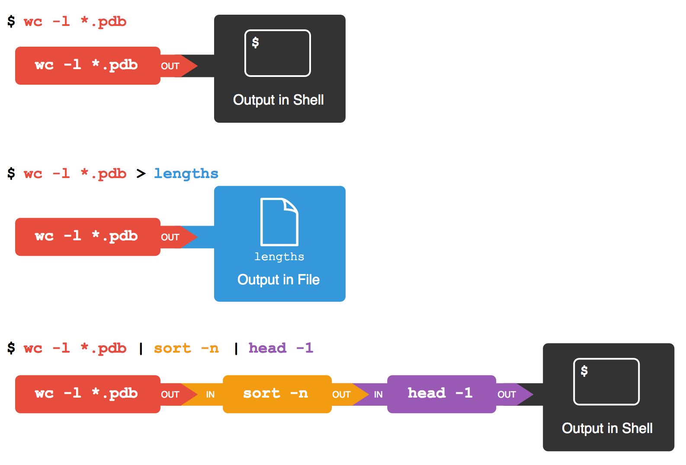

# Introduction to Linux/Unix
Software Carpentry & Eric D. Crandall  
`r Sys.Date()`  


#### Datasets that we will use in this lesson:
  - Nelle's Filesystem 
    - [*Google Drive*](https://drive.google.com/open?id=0B04rMcAYCuEdV3pEUU00SG4tSlU)
    - [*Webserver*](https://ericcrandall.github.io/BIO444/lessons/unix/unix_figures/filesystem.zip)
 
##### Downloading Nelle's Filesystem

If you are having difficulty in downloading, unzipping and locating the filesystem in your graphical user interface, then run this command at your command line:

~~~
$ curl https://ericcrandall.github.io/BIO444/lessons/unix/unix_figures/filesystem.zip > filesystem.zip
$ unzip filesystem.zip
~~~

  

---
title: "Introducing the Shell"
teaching: 5
exercises: 0
questions:
- "What is a command shell and why would I use one?"
objectives:
- "Explain how the shell relates to the keyboard, the screen, the operating system, and users' programs."
- "Explain when and why command-line interfaces should be used instead of graphical interfaces."
keypoints:
- "Explain the similarities and differences between a file and a directory."
- "Translate an absolute path into a relative path and vice versa."
- "Construct absolute and relative paths that identify specific files and directories."
- "Explain the steps in the shell's read-run-print cycle."
- "Identify the actual command, flags, and filenames in a command-line call."
- "Demonstrate the use of tab completion and explain its advantages."
keypoints:
- "A shell is a program whose primary purpose is to read commands and run other programs."
- "The shell's main advantages are its high action-to-keystroke ratio, its support for automating repetitive tasks, and its capacity to access networked machines."
- "The shell's main disadvantages are its primarily textual nature and how cryptic its commands and operation can be."
---
# Introducing the Shell
## Background
At a high level, computers do four things:

-   run programs
-   store data
-   communicate with each other, and
-   interact with us

They can do the last of these in many different ways,
including direct brain-computer interfaces and speech recognition, using systems such as Alexa or Google Home.
While such hardware interfaces are becoming more commonplace, most interaction is still
done using screens, mice, touchpads and keyboards.
Although most modern desktop operating systems communicate with their human users by
means of windows, icons and pointers, these software technologies didn't become
widespread until the 1980s. The roots of such *graphical user interfaces* go back
to Doug Engelbart's work in the 1960s, which you can see in what has been
called "[The Mother of All Demos](http://www.youtube.com/watch?v=a11JDLBXtPQ)".

### The Command-Line Interface
Going back even further,
the only way to interact with early computers was to rewire them.
But in between,
from the 1950s to the 1980s,
most people used line printers.
These devices only allowed input and output of the letters, numbers, and punctuation found on a standard keyboard,
so programming languages and software interfaces had to be designed around that constraint.

This kind of interface is called a
**command-line interface**, or CLI,
to distinguish it from a
**graphical user interface**, or GUI,
which most people now use.
The heart of a CLI is a **read-evaluate-print loop**, or REPL:
when the user types a command and then presses the Enter (or Return) key,
the computer reads it,
executes it,
and prints its output.
The user then types another command,
and so on until the user logs off.

### The Shell
This description makes it sound as though the user sends commands directly to the computer,
and the computer sends output directly to the user.
In fact,
there is usually a program in between called a
**command shell**.
What the user types goes into the shell,
which then figures out what commands to run and orders the computer to execute them.
(Note that the shell is called "the shell" because it encloses the operating system
in order to hide some of its complexity and make it simpler to interact with.)

A shell is a program like any other.
What's special about it is that its job is to run other programs
rather than to do calculations itself.
The most popular Unix shell is Bash,
the Bourne Again SHell
(so-called because it's derived from a shell written by Stephen Bourne).
Bash is the default shell on most modern implementations of Unix
and in most packages that provide Unix-like tools for Windows.

### Why bother?
Using Bash or any other shell
sometimes feels more like programming than like using a mouse.
Commands are terse (often only a couple of characters long),
their names are frequently cryptic,
and their output is lines of text rather than something visual like a graph.
On the other hand,
with only a few keystrokes, the shell allows us to combine existing tools into 
powerful pipelines and handle large volumes of data automatically. This automation
not only makes us more productive but also improves the reproducibility of our workflows by 
allowing us to repeat them with few simple commands.
In addition, the command line is often the easiest way to interact with remote machines and supercomputers.
Familiarity with the shell is near essential to run a variety of specialized tools and resources
including high-performance computing systems.
As clusters and cloud computing systems become more popular for scientific data crunching,
being able to interact with the shell is becoming a necessary skill.
We can build on the command-line skills covered here
to tackle a wide range of scientific questions and computational challenges.

## Nelle's Pipeline: Starting Point

Nelle Nemo, a marine biologist,
has just returned from a six-month survey of the
[North Pacific Gyre](http://en.wikipedia.org/wiki/North_Pacific_Gyre),
where she has been sampling gelatinous marine life in the
[Great Pacific Garbage Patch](http://en.wikipedia.org/wiki/Great_Pacific_Garbage_Patch).
She has 1520 samples in all and now needs to:

1.  Run each sample through an assay machine
    that will measure the relative abundance of 300 different proteins.
    The machine's output for a single sample is
    a file with one line for each protein.
2.  Calculate statistics for each of the proteins separately
    using a program her supervisor wrote called `goostat`.
3.  Compare the statistics for each protein
    with corresponding statistics for each other protein
    using a program one of the other graduate students wrote called `goodiff`.
4.  Write up results.
    Her supervisor would really like her to do this by the end of the month
    so that her paper can appear in an upcoming special issue of *Aquatic Goo Letters*.

It takes about half an hour for the assay machine to process each sample.
The good news is that
it only takes two minutes to set each one up.
Since her lab has eight assay machines that she can use in parallel,
this step will "only" take about two weeks.

The bad news is that if she has to run `goostat` and `goodiff` by hand,
she'll have to enter filenames and click "OK" 46,370 times
(1520 runs of `goostat`, plus 300*299/2 (half of 300 times 299) runs of `goodiff`).
At 30 seconds each,
that will take more than two weeks.
Not only would she miss her paper deadline,
the chances of her typing all of those commands right are practically zero.

The next few lessons will explore what she should do instead.
More specifically,
they explain how she can use a command shell
to automate the repetitive steps in her processing pipeline
so that her computer can work 24 hours a day while she writes her paper.
As a bonus,
once she has put a processing pipeline together,
she will be able to use it again whenever she collects more data.


# Navigating Files and Directories

#### Questions:
- "How can I move around on my computer?"
- "How can I see what files and directories I have?"
- "How can I specify the location of a file or directory on my computer?"

The part of the operating system responsible for managing files and directories
is called the **file system**.
It organizes our data into files,
which hold information,
and directories (also called "folders"),
which hold files or other directories.

## Commands
Several commands are frequently used to create, inspect, rename, and delete files and directories.
To start exploring them,
let's open a shell window:

> #### Note: Prompt Magic
>
> If you type the command:
> `PS1='$ '`
> into your shell, followed by pressing the 'enter' key,
> your window should look like our example in this lesson.  
> This isn't necessary to follow along (in fact, your prompt may have
> other helpful information you want to know about).  This is up to you!  
~~~
$
~~~

The dollar sign is a **prompt**, which shows us that the shell is waiting for input;
your shell may use a different character as a prompt and may add information before
the prompt. When typing commands, either from these lessons or from other sources,
do not type the prompt, only the commands that follow it.

Type the command `whoami`,
then press the Enter key (sometimes marked Return) to send the command to the shell.
The command's output is the ID of the current user,
i.e.,
it shows us who the shell thinks we are:

~~~
$ whoami
~~~

~~~
nelle
~~~


More specifically, when we type `whoami` the shell:

1.  finds a program called `whoami`,
2.  runs that program,
3.  displays that program's output, then
4.  displays a new prompt to tell us that it's ready for more commands.


> #### Username Variation
>
> In this lesson, we have used the username `nelle` (associated
> with our hypothetical scientist Nelle) in example input and output throughout.  
> However, when
> you type this lesson's commands on your computer,
> you should see and use something different,
> namely, the username associated with the user account on your computer.  This
> username will be the output from `whoami`.  In
> what follows, `nelle` should always be replaced by that username.  


> #### Unknown commands
> Remember, the Shell is a program that runs other programs rather than doing
> calculations itself. So the commands you type must be the names of existing
> programs.
> If you type the name of a program that does not exist and hit enter, you
> will see an error message similar to this:
> 
> ~~~
> $ mycommand
> ~~~
> 
> ~~~
> -bash: mycommand: command not found
> ~~~
> 
> The Shell (Bash) tells you that it cannot find the program `mycommand`
> because the program you are trying to run does not exist on your computer.
> We will touch quite a few commands in the course of this tutorial, but there
> are actually many more than we can cover here.


Next,
let's find out where we are by running a command called `pwd`
(which stands for "print working directory").
At any moment,
our **current working directory**
is our current default directory,
i.e.,
the directory that the computer assumes we want to run commands in
unless we explicitly specify something else.
Here,
the computer's response is `/Users/nelle`,
which is Nelle's **home directory**:

~~~
$ pwd
~~~


~~~
/Users/nelle
~~~


> #### Home Directory Variation
>
> The home directory path will look different on different operating systems.
> On Linux it may look like `/home/nelle`,
> and on Windows it will be similar to `C:\Documents and Settings\nelle` or
> `C:\Users\nelle`.  
> (Note that it may look slightly different for different versions of Windows.)
> In future examples, we've used Mac output as the default - Linux and Windows
> output may differ slightly, but should be generally similar.  

## The File System

To understand what a "home directory" is,
let's have a look at how the file system as a whole is organized.  For the
sake of example, we'll be
illustrating the filesystem on our scientist Nelle's computer.  After this
illustration, you'll be learning commands to explore your own filesystem,
which will be constructed in a similar way, but not be exactly identical.  

On Nelle's computer, the filesystem looks like this:


At the top is the **root directory**
that holds everything else.
We refer to it using a slash character `/` on its own;
this is the leading slash in `/Users/nelle`.

Inside that directory are several other directories:
`bin` (which is where some built-in programs are stored),
`data` (for miscellaneous data files),
`Users` (where users' personal directories are located),
`tmp` (for temporary files that don't need to be stored long-term),
and so on.  

We know that our current working directory `/Users/nelle` is stored inside `/Users`
because `/Users` is the first part of its name.
Similarly,
we know that `/Users` is stored inside the root directory `/`
because its name begins with `/`.

> #### Note:Slashes
>
> Notice that there are two meanings for the `/` character.
> When it appears at the front of a file or directory name,
> it refers to the root directory. When it appears *inside* a name,
> it's just a separator.


Underneath `/Users`,
we find one directory for each user with an account on Nelle's machine,
her colleagues the Mummy and Wolfman.  


The Mummy's files are stored in `/Users/imhotep`,
Wolfman's in `/Users/larry`,
and Nelle's in `/Users/nelle`.  Because Nelle is the user in our
examples here, this is why we get `/Users/nelle` as our home directory.  
Typically, when you open a new command prompt you will be in
your home directory to start.  

Now let's learn the command that will let us see the contents of our
own filesystem.  We can see what's in our home directory by running `ls`,
which stands for "listing":

~~~
$ ls
~~~


~~~
Applications Documents    Library      Music        Public
Desktop      Downloads    Movies       Pictures
~~~


(Again, your results may be slightly different depending on your operating
system and how you have customized your filesystem.)

`ls` prints the names of the files and directories in the current directory in
alphabetical order,
arranged neatly into columns.
We can make its output more comprehensible by using the **flag** `-F`,
which tells `ls` to add a trailing `/` to the names of directories:

~~~
$ ls -F
~~~


~~~
Applications/ Documents/    Library/      Music/        Public/
Desktop/      Downloads/    Movies/       Pictures/
~~~


`ls` has lots of other options. To find out what they are, we can type:

~~~
$ ls --help
~~~

Many bash commands, and programs that people have written that can be
run from within bash, support a `--help` flag to display more
information on how to use the commands or programs.

> #### Note: Unsupported comand-line options
> If you try to use an option that is not supported, `ls` and other programs
> will print an error message similar to this:
>
> ~~~
> $ ls -j
> ~~~
> 
> 
> ~~~
> ls: invalid option -- 'j'
> Try 'ls --help' for more information.
> ~~~
> 


For more information on how to use `ls` we can type `man ls`.
`man` is the Unix "manual" command:
it prints a description of a command and its options,
and (if you're lucky) provides a few examples of how to use it.

> #### Note: `man` and Git for Windows
>
> The bash shell provided by Git for Windows does not
> support the `man` command. Doing a web search for
> `unix man page COMMAND` (e.g. `unix man page grep`)
> provides links to numerous copies of the Unix manual
> pages online.
> For example, GNU provides links to its
> [manuals](http://www.gnu.org/manual/manual.html):
> these include [grep](http://www.gnu.org/software/grep/manual/),
> and the
> [core GNU utilities](http://www.gnu.org/software/coreutils/manual/coreutils.html),
> which covers many commands introduced within this lesson.


To navigate through the `man` pages,
you may use the up and down arrow keys to move line-by-line,
or try the "b" and spacebar keys to skip up and down by full page.
Quit the `man` pages by typing "q".

Here,
we can see that our home directory contains mostly **sub-directories**.
Any names in your output that don't have trailing slashes,
are plain old **files**.
And note that there is a space between `ls` and `-F`:
without it,
the shell thinks we're trying to run a command called `ls-F`,
which doesn't exist.


We can also use `ls` to see the contents of a different directory.  Let's take a
look at our `Desktop` directory by running `ls -F Desktop`,
i.e.,
the command `ls` with the **arguments** `-F` and `Desktop`.
The second argument --- the one *without* a leading dash --- tells `ls` that
we want a listing of something other than our current working directory:

~~~
$ ls -F Desktop
~~~


Your output should be a list of all the files and sub-directories on your
Desktop, including the `filesystem` directory you downloaded at
the start of the lesson.  Take a look at your Desktop to confirm that
your output is accurate.  

As you may now see, using a bash shell is strongly dependent on the idea that
your files are organized in an hierarchical file system.  
Organizing things hierarchically in this way helps us keep track of our work:
it's possible to put hundreds of files in our home directory,
just as it's possible to pile hundreds of printed papers on our desk,
but it's a self-defeating strategy.

### Moving Around the Filesystem
Now that we know the `filesystem` directory is located on our Desktop, we
can do two things.  

First, we can look at its contents, using the same strategy as before, passing
a directory name to `ls`:

~~~
$ ls -F Desktop/filesystem
~~~


~~~
Users/	bin/	data/	tmp/
~~~


Second, we can actually change our location to a different directory, so
we are no longer located in
our home directory.  

The command to change locations is `cd` followed by a
directory name to change our working directory.
`cd` stands for "change directory",
which is a bit misleading:
the command doesn't change the directory,
it changes the shell's idea of what directory we are in.

Let's say we want to move to the `data` directory we saw above.  We can
use the following series of commands to get there:

~~~
$ cd Desktop
$ cd filesystem
$ cd data
~~~


These commands will move us from our home directory onto our Desktop, then into
the `filesystem` directory, then into the `data` directory.  `cd` doesn't print anything,
but if we run `pwd` after it, we can see that we are now
in `/Users/nelle/Desktop/filesystem/data`.
If we run `ls` without arguments now,
it lists the contents of `/Users/nelle/Desktop/filesystem/data`,
because that's where we now are:

~~~
$ pwd
~~~


~~~
/Users/nelle/Desktop/filesystem/data
~~~


~~~
$ ls -F
~~~


~~~
amino-acids.txt   elements/     pdb/	        salmon.txt
animals.txt       morse.txt     planets.txt     sunspot.txt
~~~


We now know how to go down the directory tree, but
how do we go up?  We might try the following:

~~~
$ cd filesystem
~~~


~~~
-bash: cd: filesystem: No such file or directory
~~~


But we get an error!  Why is this?  

With our methods so far,
`cd` can only see sub-directories inside your current directory.  There are
different ways to see directories above your current location; we'll start
with the simplest.  

There is a shortcut in the shell to move up one directory level
that looks like this:

~~~
$ cd ..
~~~


`..` is a special directory name meaning
"the directory containing this one",
or more succinctly,
the **parent** of the current directory.
Sure enough,
if we run `pwd` after running `cd ..`, we're back in `/Users/nelle/Desktop/filesystem`:

~~~
$ pwd
~~~


~~~
/Users/nelle/Desktop/filesystem
~~~


The special directory `..` doesn't usually show up when we run `ls`.  If we want
to display it, we can give `ls` the `-a` flag:

~~~
$ ls -F -a
~~~


~~~
./		.DS_Store	bin/		tmp/
../		Users/		data/
~~~


`-a` stands for "show all";
it forces `ls` to show us file and directory names that begin with `.`,
such as `..` (which, if we're in `/Users/nelle`, refers to the `/Users` directory)
As you can see,
it also displays another special directory that's just called `.`,
which means "the current working directory".
It may seem redundant to have a name for it,
but we'll see some uses for it soon.

Note that in most command line tools, multiple parameters can be combined 
with a single `-` and no spaces between the parameters: `ls -F -a` is 
equivalent to `ls -Fa`.

> #### Note: Other Hidden Files
>
> In addition to the hidden directories `..` and `.`, you may also see a file
> called `.bash_profile`. This file usually contains shell configuration
> settings. You may also see other files and directories beginning
> with `.`. These are usually files and directories that are used to configure
> different programs on your computer. The prefix `.` is used to prevent these
> configuration files from cluttering the terminal when a standard `ls` command
> is used.


> #### Note: Orthogonality
>
> The special names `.` and `..` don't belong to `cd`;
> they are interpreted the same way by every program.
> For example,
> if we are in `/Users/nelle/data`,
> the command `ls ..` will give us a listing of `/Users/nelle`.
> When the meanings of the parts are the same no matter how they're combined,
> programmers say they are **orthogonal**:
> Orthogonal systems tend to be easier for people to learn
> because there are fewer special cases and exceptions to keep track of.


These then, are the basic commands for navigating the filesystem on your computer:
`pwd`, `ls` and `cd`.  Let's explore some variations on those commands.  What happens
if you type `cd` on its own, without giving
a directory?  

~~~
$ cd
~~~


How can you check what happened?  `pwd` gives us the answer!  

~~~
$ pwd
~~~


~~~
/Users/nelle
~~~


It turns out that `cd` without an argument will return you to your home directory,
which is great if you've gotten lost in your own filesystem.  

Let's try returning to the `data` directory from before.  Last time, we used
three commands, but we can actually string together the list of directories
to move to `data` in one step:

~~~
$ cd Desktop/filesystem/data
~~~


Check that we've moved to the right place by running `pwd` and `ls -F`  

If we want to move up one level from the data directory, we could use `cd ..`.  But
there is another way to move to any directory, regardless of your
current location.  

So far, when specifying directory names, or even a directory path (as above),
we have been using **relative paths**.  When you use a relative path with a command
like `ls` or `cd`, it tries to find that location  from where we are,
rather than from the root of the file system.  

However, it is possible to specify the **absolute path** to a directory by
including its entire path from the root directory, which is indicated by a
leading slash.  The leading `/` tells the computer to follow the path from
the root of the file system, so it always refers to exactly one directory,
no matter where we are when we run the command.

This allows us to move to our `filesystem` directory from anywhere on
the filesystem (including from inside `data`).  To find the absolute path
we're looking for, we can use `pwd` and then extract the piece we need
to move to `filesystem`.  

~~~
$ pwd
~~~


~~~
/Users/nelle/Desktop/filesystem/data
~~~


~~~
$ cd /Users/nelle/Desktop/filesystem
~~~


Run `pwd` and `ls -F` to ensure that we're in the directory we expect.  

> #### Note: Two More Shortcuts
>
> The shell interprets the character `~` (tilde) at the start of a path to
> mean "the current user's home directory". For example, if Nelle's home
> directory is `/Users/nelle`, then `~/data` is equivalent to
> `/Users/nelle/data`. This only works if it is the first character in the
> path: `here/there/~/elsewhere` is *not* `here/there/Users/nelle/elsewhere`.
>
> Another shortcut is the `-` (dash) character.  `cd` will translate `-` into
> *the previous directory I was in*, which is faster than having to remember,
> then type, the full path.  This is a *very* efficient way of moving back
> and forth between directories. The difference between `cd ..` and `cd -` is
> that the former brings you *up*, while the latter brings you *back*. You can
> think of it as the *Last Channel* button on a TV remote.


## Nelle's Pipeline: Organizing Files

Knowing just this much about files and directories,
Nelle is ready to organize the files that the protein assay machine will create.
First,
she creates a directory called `north-pacific-gyre`
(to remind herself where the data came from).
Inside that,
she creates a directory called `2012-07-03`,
which is the date she started processing the samples.
She used to use names like `conference-paper` and `revised-results`,
but she found them hard to understand after a couple of years.
(The final straw was when she found herself creating
a directory called `revised-revised-results-3`.)

> #### Note: Sorting Output
>
> Nelle names her directories "year-month-day",
> with leading zeroes for months and days,
> because the shell displays file and directory names in alphabetical order.
> If she used month names,
> December would come before July;
> if she didn't use leading zeroes,
> November ('11') would come before July ('7'). Similarly, putting the year first
> means that June 2012 will come before June 2013.


Each of her physical samples is labelled according to her lab's convention
with a unique ten-character ID,
such as "NENE01729A".
This is what she used in her collection log
to record the location, time, depth, and other characteristics of the sample,
so she decides to use it as part of each data file's name.
Since the assay machine's output is plain text,
she will call her files `NENE01729A.txt`, `NENE01812A.txt`, and so on.
All 1520 files will go into the same directory.

Now in her current directory `filesystem/Users/nelle/`,
Nelle can see what files she has using the command:

~~~
$ ls north-pacific-gyre/2012-07-03/
~~~


This is a lot to type,
but she can let the shell do most of the work through what is called **tab completion**.
If she types:

~~~
$ ls nor
~~~


and then presses tab (the tab key on her keyboard),
the shell automatically completes the directory name for her:

~~~
$ ls north-pacific-gyre/
~~~


If she presses tab again,
Bash will add `2012-07-03/` to the command,
since it's the only possible completion.
Pressing tab again does nothing,
since there are 19 possibilities;
pressing tab twice brings up a list of all the files,
and so on.
This is called **tab completion**,
and we will see it in many other tools as we go on.


## Challenges

> #### Challenge:Absolute vs Relative Paths
>
> Starting from `/Users/amanda/data/`,
> which of the following commands could Amanda use to navigate to her home directory,
> which is `/Users/amanda`?
>
> 1. `cd .`
> 2. `cd /`
> 3. `cd /home/amanda`
> 4. `cd ../..`
> 5. `cd ~`
> 6. `cd home`
> 7. `cd ~/data/..`
> 8. `cd`
> 9. `cd ..`
>


> #### Challenge:Relative Path Resolution
>
> Using the filesystem diagram below, if `pwd` displays `/Users/thing`,
> what will `ls ../backup` display?
>
> 1.  `../backup: No such file or directory`
> 2.  `2012-12-01 2013-01-08 2013-01-27`
> 3.  `2012-12-01/ 2013-01-08/ 2013-01-27/`
> 4.  `original pnas_final pnas_sub`
>


> #### Challenge: `ls` Reading Comprehension
>
> Assuming a directory structure as in the above Figure
> (File System for Challenge Questions), if `pwd` displays `/Users/backup`,
> and `-r` tells `ls` to display things in reverse order,
> what command will display:
>
> ~~~
> pnas_sub/ pnas_final/ original/
> ~~~
> 
>
> 1.  `ls pwd`
> 2.  `ls -r -F`
> 3.  `ls -r -F /Users/backup`
> 4.  Either #2 or #3 above, but not #1.


> #### Challenge:Exploring More `ls` Arguments
>
> What does the command `ls` do when used with the `-l` and `-h` arguments?
>
> Some of its output is about properties that we do not cover in this lesson (such
> as file permissions and ownership), but the rest should be useful
> nevertheless.
>


> #### Challenge:Listing Recursively and By Time
>
> The command `ls -R` lists the contents of directories recursively, i.e., lists
> their sub-directories, sub-sub-directories, and so on in alphabetical order
> at each level. The command `ls -t` lists things by time of last change, with
> most recently changed files or directories first.
> In what order does `ls -R -t` display things? Hint: `ls -l` uses a long listing
> format to view timestamps.


---
title: "Working With Files and Directories"
teaching: 15
exercises: 0
questions:
- "How can I create, copy, and delete files and directories?"
- "How can I edit files?"
objectives:
- "Create a directory hierarchy that matches a given diagram."
- "Create files in that hierarchy using an editor or by copying and renaming existing files."
- "Display the contents of a directory using the command line."
- "Delete specified files and/or directories."
keypoints:
- "`cp old new` copies a file."
- "`mkdir path` creates a new directory."
- "`mv old new` moves (renames) a file or directory."
- "`rm path` removes (deletes) a file."
- "Use of the Control key may be described in many ways, including `Ctrl-X`, `Control-X`, and `^X`."
- "The shell does not have a trash bin: once something is deleted, it's really gone."
- "Depending on the type of work you do, you may need a more powerful text editor than Nano."
---
# Working With Files and Directories

#### Questions:
- "How can I create, copy, and delete files and directories?"
- "How can I edit files?"

#### Objectives:
- "Create a directory hierarchy that matches a given diagram."
- "Create files in that hierarchy using an editor or by copying and renaming existing files."
- "Display the contents of a directory using the command line."
- "Delete specified files and/or directories."

## Creating, Editing and Deleting Files

We now know how to explore files and directories,
but how do we create them in the first place?
Let's go back to our `filesystem` directory on the Desktop
and use `ls -F` to see what it contains:

~~~
$ pwd
~~~


~~~
/Users/nelle/Desktop/filesystem/Users/nelle/
~~~


~~~
$ ls -F
~~~


~~~
creatures/  molecules/           pizza.cfg
data/       north-pacific-gyre/  solar.pdf
Desktop/    notes.txt            writing/
~~~


Let's create a new directory called `thesis` using the command `mkdir thesis`
(which has no output):

~~~
$ mkdir thesis
~~~


As you might guess from its name,
`mkdir` means "make directory".
Since `thesis` is a relative path
(i.e., doesn't have a leading slash),
the new directory is created in the current working directory:

~~~
$ ls -F
~~~


~~~
creatures/  north-pacific-gyre/  thesis/
data/       notes.txt            writing/
Desktop/    pizza.cfg
molecules/  solar.pdf
~~~


> #### Note: Two ways of doing the same thing
> Using the shell to create a directory is no different than using a file explorer.
> If you open the current directory using your operating system's graphical file explorer,
> the `thesis` directory will appear there too.
> While they are two different ways of interacting with the files,
> the files and directories themselves are the same.


> #### Note: Good names for files and directories
>
> Complicated names of files and directories can make your life painful
> when working on the command line. Here we provide a few useful
> tips for the names of your files.
>
> 1. Don't use whitespaces.
>
>    Whitespaces can make a name more meaningful
>    but since whitespace is used to break arguments on the command line
>    is better to avoid them on name of files and directories.
>    You can use `-` or `_` instead of whitespace.
>
> 2. Don't begin the name with `-` (dash).
>
>    Commands treat names starting with `-` as options.
>
> 3. Stick with letters, numbers, `.` (period), `-` (dash) and `_` (underscore).
>
>    Many other characters have special meanings on the command line.
>    We will learn about some of these during this lesson.
>    There are special characters that can cause your command to not work as
>    expected and can even result in data loss.
>
> If you need to refer to names of files or directories that have whitespace
> or another non-alphanumeric character, you should surround the name in quotes (`""`).


Since we've just created the `thesis` directory, there's nothing in it yet:

~~~
$ ls -F thesis
~~~


Let's change our working directory to `thesis` using `cd`,
then run a text editor called Nano to create a file called `draft.txt`:

~~~
$ cd thesis
$ nano draft.txt
~~~


> #### Note: Which Editor?
>
> When we say, "`nano` is a text editor," we really do mean "text": it can
> only work with plain character data, not tables, images, or any other
> human-friendly media. We use it in examples because it is one of the 
> least complex text editors. However, because of this trait, it may 
> not be powerful enough or flexible enough for the work you need to do
> after this workshop. On Unix systems (such as Linux and Mac OS X),
> many programmers use [Emacs](http://www.gnu.org/software/emacs/) or
> [Vim](http://www.vim.org/) (both of which require more time to learn), 
> or a graphical editor such as
> [Gedit](http://projects.gnome.org/gedit/), [Atom](http://atom.org/), or BBEdit(http://bbedit.org/). On Windows, you may wish to
> use [Notepad++](http://notepad-plus-plus.org/).  Windows also has a built-in
> editor called `notepad` that can be run from the command line in the same
> way as `nano` for the purposes of this lesson.  
>
> No matter what editor you use, you will need to know where it searches
> for and saves files. If you start it from the shell, it will (probably)
> use your current working directory as its default location. If you use
> your computer's start menu, it may want to save files in your desktop or
> documents directory instead. You can change this by navigating to
> another directory the first time you "Save As..."


Let's type in a few lines of text.
Once we're happy with our text, we can press `Ctrl-O` (press the Ctrl or Control key and, while
holding it down, press the O key) to write our data to disk
(we'll be asked what file we want to save this to:
press Return to accept the suggested default of `draft.txt`).


Once our file is saved, we can use `Ctrl-X` to quit the editor and
return to the shell.

> #### Note: Control, Ctrl, or ^ Key
>
> The Control key is also called the "Ctrl" key. There are various ways
> in which using the Control key may be described. For example, you may
> see an instruction to press the Control key and, while holding it down,
> press the X key, described as any of:
>
> * `Control-X`
> * `Control+X`
> * `Ctrl-X`
> * `Ctrl+X`
> * `^X`
> * `C-x`
>
> In nano, along the bottom of the screen you'll see `^G Get Help ^O WriteOut`.
> This means that you can use `Control-G` to get help and `Control-O` to save your
> file.


`nano` doesn't leave any output on the screen after it exits,
but `ls` now shows that we have created a file called `draft.txt`:

~~~
$ ls
~~~


~~~
draft.txt
~~~


Let's tidy up by running `rm draft.txt`:

~~~
$ rm draft.txt
~~~


This command removes files (`rm` is short for "remove").
If we run `ls` again,
its output is empty once more,
which tells us that our file is gone:

~~~
$ ls
~~~


> #### Note:Deleting Is Forever
>
> The Unix shell doesn't have a trash bin that we can recover deleted
> files from (though most graphical interfaces to Unix do).  Instead,
> when we delete files, they are unhooked from the file system so that
> their storage space on disk can be recycled. Tools for finding and
> recovering deleted files do exist, but there's no guarantee they'll
> work in any particular situation, since the computer may recycle the
> file's disk space right away.


Let's re-create that file
and then move up one directory to `/Users/nelle/Desktop/filesystem/nelle` using `cd ..`:

~~~
$ pwd
~~~


~~~
/Users/nelle/Desktop/filesystem/nelle/thesis
~~~


~~~
$ nano draft.txt
$ ls
~~~


~~~
draft.txt
~~~


~~~
$ cd ..
~~~


If we try to remove the entire `thesis` directory using `rm thesis`,
we get an error message:

~~~
$ rm thesis
~~~


~~~
rm: cannot remove `thesis': Is a directory
~~~


This happens because `rm` by default only works on files, not directories.

To really get rid of `thesis` we must also delete the file `draft.txt`.
We can do this with the [recursive](https://en.wikipedia.org/wiki/Recursion) option for `rm`:

~~~
$ rm -r thesis
~~~


> #### Note: With Great Power Comes Great Responsibility
>
> Removing the files in a directory recursively can be very dangerous
> operation. If we're concerned about what we might be deleting we can
> add the "interactive" flag `-i` to `rm` which will ask us for confirmation
> before each step
>
> ~~~
> $ rm -r -i thesis
> rm: descend into directory ‘thesis’? y
> rm: remove regular file ‘thesis/draft.txt’? y
> rm: remove directory ‘thesis’? y
> ~~~
> 
>
> This removes everything in the directory, then the directory itself, asking
> at each step for you to confirm the deletion.

## Moving, Renaming and Copying Files

Let's create that directory and file one more time.
(Note that this time we're running `nano` with the path `thesis/draft.txt`,
rather than going into the `thesis` directory and running `nano` on `draft.txt` there.)

~~~
$ pwd
~~~


~~~
/Users/nelle/Desktop/filesystem/Users/nelle/
~~~


~~~
$ mkdir thesis
$ nano thesis/draft.txt
$ ls thesis
~~~


~~~
draft.txt
~~~


`draft.txt` isn't a particularly informative name,
so let's change the file's name using `mv`,
which is short for "move":

~~~
$ mv thesis/draft.txt thesis/quotes.txt
~~~


The first parameter tells `mv` what we're "moving",
while the second is where it's to go.
In this case,
we're moving `thesis/draft.txt` to `thesis/quotes.txt`,
which has the same effect as renaming the file.
Sure enough,
`ls` shows us that `thesis` now contains one file called `quotes.txt`:

~~~
$ ls thesis
~~~


~~~
quotes.txt
~~~


One has to be careful when specifying the target file name, since `mv` will
silently overwrite any existing file with the same name, which could
lead to data loss. An additional flag, `mv -i` (or `mv --interactive`),
can be used to make `mv` ask you for confirmation before overwriting.

Just for the sake of consistency,
`mv` also works on directories *without* a recursive flag ;-)

Let's move `quotes.txt` into the current working directory.
We use `mv` once again,
but this time we'll just use the name of a directory as the second parameter
to tell `mv` that we want to keep the filename,
but put the file somewhere new.
(This is why the command is called "move".)
In this case,
the directory name we use is the special directory name `.` that we mentioned earlier.

~~~
$ mv thesis/quotes.txt .
~~~


The effect is to move the file from the directory it was in to the current working directory.
`ls` now shows us that `thesis` is empty:

~~~
$ ls thesis
~~~


Further,
`ls` with a filename or directory name as a parameter only lists that file or directory.
We can use this to see that `quotes.txt` is still in our current directory:

~~~
$ ls quotes.txt
~~~


~~~
quotes.txt
~~~


The `cp` command works very much like `mv`,
except it copies a file instead of moving it.
We can check that it did the right thing using `ls`
with two paths as parameters --- like most Unix commands,
`ls` can be given multiple paths at once:

~~~
$ cp quotes.txt thesis/quotations.txt
$ ls quotes.txt thesis/quotations.txt
~~~


~~~
quotes.txt   thesis/quotations.txt
~~~


To prove that we made a copy,
let's delete the `quotes.txt` file in the current directory
and then run that same `ls` again.

~~~
$ rm quotes.txt
$ ls quotes.txt thesis/quotations.txt
~~~


~~~
ls: cannot access quotes.txt: No such file or directory
thesis/quotations.txt
~~~


This time it tells us that it can't find `quotes.txt` in the current directory,
but it does find the copy in `thesis` that we didn't delete.

> #### Note: What's In A Name?
>
> You may have noticed that all of Nelle's files' names are "something dot
> something", and in this part of the lesson, we always used the extension
> `.txt`.  This is just a convention: we can call a file `mythesis` or
> almost anything else we want. However, most people use two-part names
> most of the time to help them (and their programs) tell different kinds
> of files apart. The second part of such a name is called the
> **filename extension**, and indicates
> what type of data the file holds: `.txt` signals a plain text file, `.pdf`
> indicates a PDF document, `.cfg` is a configuration file full of parameters
> for some program or other, `.png` is a PNG image, and so on.
>
> This is just a convention, albeit an important one. Files contain
> bytes: it's up to us and our programs to interpret those bytes
> according to the rules for plain text files, PDF documents, configuration
> files, images, and so on.
>
> Naming a PNG image of a whale as `whale.mp3` doesn't somehow
> magically turn it into a recording of whalesong, though it *might*
> cause the operating system to try to open it with a music player
> when someone double-clicks it.

## Challenges

> #### Challenge: Renaming Files
>
> Suppose that you created a `.txt` file in your current directory to contain a list of the
> statistical tests you will need to do to analyze your data, and named it: `statstics.txt`
>
> After creating and saving this file you realize you misspelled the filename! You want to
> correct the mistake, which of the following commands could you use to do so?
>
> 1. `cp statstics.txt statistics.txt`
> 2. `mv statstics.txt statistics.txt`
> 3. `mv statstics.txt .`
> 4. `cp statstics.txt .`


> #### Challenge: Moving and Copying
>
> What is the output of the closing `ls` command in the sequence shown below?
>
> ~~~
> $ pwd
> ~~~
> 
> ~~~
> /Users/jamie/data
> ~~~
> 
> ~~~
> $ ls
> ~~~
> 
> ~~~
> proteins.dat
> ~~~
> 
> ~~~
> $ mkdir recombine
> $ mv proteins.dat recombine
> $ cp recombine/proteins.dat ../proteins-saved.dat
> $ ls
> ~~~
> 
>
> 1.   `proteins-saved.dat recombine`
> 2.   `recombine`
> 3.   `proteins.dat recombine`
> 4.   `proteins-saved.dat`
>


> #### Challenge: Organizing Directories and Files
>
> Jamie is working on a project and she sees that her files aren't very well
> organized:
>
> ~~~
> $ ls -F
> ~~~
> 
> ~~~
> analyzed/  fructose.dat    raw/   sucrose.dat
> ~~~
> 
>
> The `fructose.dat` and `sucrose.dat` files contain output from her data
> analysis. What command(s) covered in this lesson does she need to run so that the commands below will
> produce the output shown?
>
> ~~~
> $ ls -F
> ~~~
> 
> ~~~
> analyzed/   raw/
> ~~~
> 
> ~~~
> $ ls analyzed
> ~~~
> 
> ~~~
> fructose.dat    sucrose.dat
> ~~~
> 


> #### Challenge: Copy with Multiple Filenames
>
> For this exercise, you can test the commands in the `filesystem/data directory`.
>
> In the example below, what does `cp` do when given several filenames and a directory name?
>
> ~~~
> $ mkdir backup
> $ cp amino-acids.txt animals.txt backup/
> ~~~
> 
>
> In the example below, what does `cp` do when given three or more file names?
>
> ~~~
> $ ls -F
> ~~~
> 
> ~~~
> amino-acids.txt  animals.txt  backup/  elements/  morse.txt  pdb/  planets.txt  salmon.txt  sunspot.txt
> ~~~
> 
> ~~~
> $ cp amino-acids.txt animals.txt morse.txt 
> ~~~
> 


> #### Challenge: Listing Recursively and By Time
>
> The command `ls -R` lists the contents of directories recursively,
> i.e., lists their sub-directories, sub-sub-directories, and so on
> in alphabetical order at each level.
> The command `ls -t` lists things by time of last change,
> with most recently changed files or directories first.
> In what order does `ls -R -t` display things?


> #### Note and Challenge: Creating Files a Different Way
>
> We have seen how to create text files using the `nano` editor.
> Now, try the following command in your home directory:
>
> ~~~
> $ cd                  # go to your home directory
> $ touch my_file.txt
> ~~~
> 
>
> 1.  What did the touch command do?
>     When you look at your home directory using the GUI file explorer,
>     does the file show up?
>
> 2.  Use `ls -l` to inspect the files.  How large is `my_file.txt`?
>
> 3.  When might you want to create a file this way?

```r
 #### Note:Solution
 1.  The touch command generates a new file called 'my_file.txt' in
     your home directory.  If you are in your home directory, you
     can observe this newly generated file by typing 'ls' at the 
     command line prompt.  'my_file.txt' can also be viewed in your
     GUI file explorer.

 2.  When you inspect the file with 'ls -l', note that the size of
     'my_file.txt' is 0kb.  In other words, it contains no data.
     If you open 'my_file.txt' using your text editor it is blank.

 3.  Some programs do not generate output files themselves, but
     instead require that empty files have already been generated.
     When the program is run, it searches for an existing file to
     populate with its output.  The touch command allows you to
     efficiently generate a blank text file to be used by such
     programs.
> 
```

> #### Challenge: Moving to the Current Folder
>
> After running the following commands,
> Jamie realizes that she put the files `sucrose.dat` and `maltose.dat` into the wrong folder:
>
> ~~~
> $ ls -F
> raw/ analyzed/
> $ ls -F analyzed
> fructose.dat glucose.dat maltose.dat sucrose.dat
> $ cd raw/
> ~~~
> 
>
> What commands could she use to move these files to the current folder?
> (i.e., the one she is currently in):
>


> #### Challenge: Using `rm` Safely
>
> What happens when we type `rm -i thesis/quotations.txt`?
> Why would we want this protection when using `rm`?


> #### Challenge: Copy a folder structure sans files
>
> You're starting a new experiment, and would like to duplicate the file
> structure from your previous experiment without the data files so you can
> add new data.
>
> Assume that the file structure is in a folder called '2016-05-18-data',
> which contains folders named 'raw' and 'processed' that contain data files.
> The goal is to copy the file structure of the `2016-05-18-data` folder
> into a folder called `2016-05-20-data` and remove the data files from
> the directory you just created.
>
> Which of the following set of commands would achieve this objective?
> What would the other commands do?
>
> ~~~
> $ cp -r 2016-05-18-data/ 2016-05-20-data/
> $ rm 2016-05-20-data/data/raw/*
> $ rm 2016-05-20-data/data/processed/*
> ~~~
> 
> ~~~
> $ rm 2016-05-20-data/data/raw/*
> $ rm 2016-05-20-data/data/processed/*
> $ cp -r 2016-05-18-data/ 2016-5-20-data/
> ~~~
> 
> ~~~
> $ cp -r 2016-05-18-data/ 2016-05-20-data/
> $ rm -r -i 2016-05-20-data/
> ~~~
> 


---
title: "Pipes and Filters"
teaching: 15
exercises: 0
questions:
- "How can I combine existing commands to do new things?"
objectives:
- "Redirect a command's output to a file."
- "Process a file instead of keyboard input using redirection."
- "Construct command pipelines with two or more stages."
- "Explain what usually happens if a program or pipeline isn't given any input to process."
- "Explain Unix's 'small pieces, loosely joined' philosophy."
keypoints:
- "`cat` displays the contents of its inputs."
- "`head` displays the first few lines of its input."
- "`tail` displays the last few lines of its input."
- "`sort` sorts its inputs."
- "`wc` counts lines, words, and characters in its inputs."
- "`*` matches zero or more characters in a filename, so `*.txt` matches all files ending in `.txt`."
- "`?` matches any single character in a filename, so `?.txt` matches `a.txt` but not `any.txt`."
- "`command > file` redirects a command's output to a file."
- "`first | second` is a pipeline: the output of the first command is used as the input to the second."
- "The best way to use the shell is to use pipes to combine simple single-purpose programs (filters)."
---

# Pipes and Filters

#### Questions:

- "How can I combine existing commands to do new things?"

#### Objectives:

- "Redirect a command's output to a file."
- "Process a file instead of keyboard input using redirection."
- "Construct command pipelines with two or more stages."
- "Explain what usually happens if a program or pipeline isn't given any input to process."
- "Explain Unix's 'small pieces, loosely joined' philosophy."


Now that we know a few basic commands,
we can finally look at the shell's most powerful feature:
the ease with which it lets us combine existing programs in new ways.
We'll start with a directory called `molecules`
that contains six files describing some simple organic molecules.
The `.pdb` extension indicates that these files are in Protein Data Bank format,
a simple text format that specifies the type and position of each atom in the molecule.

~~~
$ pwd
/Users/nelle/Desktop/filesystem/Users/nelle/
$ ls molecules
~~~


~~~
cubane.pdb    ethane.pdb    methane.pdb
octane.pdb    pentane.pdb   propane.pdb
~~~


Let's go into that directory with `cd` and run the command `wc *.pdb`.
`wc` is the "word count" command:
it counts the number of lines, words, and characters in files.
The `*` in `*.pdb` matches zero or more characters,
so the shell turns `*.pdb` into a list of all `.pdb` files in the current directory:

~~~
$ cd molecules
$ wc *.pdb
~~~


~~~
  20  156 1158 cubane.pdb
  12   84  622 ethane.pdb
   9   57  422 methane.pdb
  30  246 1828 octane.pdb
  21  165 1226 pentane.pdb
  15  111  825 propane.pdb
 107  819 6081 total
~~~


> #### Note: Wildcards
>
> `*` is a **wildcard**. It matches zero or more
> characters, so `*.pdb` matches `ethane.pdb`, `propane.pdb`, and every
> file that ends with '.pdb'. On the other hand, `p*.pdb` only matches
> `pentane.pdb` and `propane.pdb`, because the 'p' at the front only
> matches filenames that begin with the letter 'p'.
>
> `?` is also a wildcard, but it only matches a single character. This
> means that `p?.pdb` would match `pi.pdb` or `p5.pdb` (if we had these two
> files in the `molecules` directory), but not `propane.pdb`.
> We can use any number of wildcards at a time: for example, `p*.p?*`
> matches anything that starts with a 'p' and ends with '.', 'p', and at
> least one more character (since the `?` has to match one character, and
> the final `*` can match any number of characters). Thus, `p*.p?*` would
> match `preferred.practice`, and even `p.pi` (since the first `*` can
> match no characters at all), but not `quality.practice` (doesn't start
> with 'p') or `preferred.p` (there isn't at least one character after the
> '.p').
>
> When the shell sees a wildcard, it expands the wildcard to create a
> list of matching filenames *before* running the command that was
> asked for. As an exception, if a wildcard expression does not match
> any file, Bash will pass the expression as a parameter to the command
> as it is. For example typing `ls *.pdf` in the `molecules` directory
> (which contains only files with names ending with `.pdb`) results in
> an error message that there is no file called `*.pdf`.
> However, generally commands like `wc` and `ls` see the lists of
> file names matching these expressions, but not the wildcards
> themselves. It is the shell, not the other programs, that deals with
> expanding wildcards, and this is another example of orthogonal design.


> #### Challenge: Using Wildcards
>
> When run in the `molecules` directory, which `ls` command(s) will
> produce this output?
>
> `ethane.pdb   methane.pdb`
>
> 1. `ls *t*ane.pdb`
> 2. `ls *t?ne.*`
> 3. `ls *t??ne.pdb`
> 4. `ls ethane.*`


If we run `wc -l` instead of just `wc`,
the output shows only the number of lines per file:

~~~
$ wc -l *.pdb
~~~


~~~
  20  cubane.pdb
  12  ethane.pdb
   9  methane.pdb
  30  octane.pdb
  21  pentane.pdb
  15  propane.pdb
 107  total
~~~


We can also use `-w` to get only the number of words,
or `-c` to get only the number of characters.

Which of these files is shortest?
It's an easy question to answer when there are only six files,
but what if there were 6000?
Our first step toward a solution is to run the command:

~~~
$ wc -l *.pdb > lengths.txt
~~~


The greater than symbol, `>`, tells the shell to **redirect** the command's output
to a file instead of printing it to the screen. (This is why there is no screen output:
everything that `wc` would have printed has gone into the
file `lengths.txt` instead.)  The shell will create
the file if it doesn't exist. If the file exists, it will be
silently overwritten, which may lead to data loss and thus requires
some caution.
`ls lengths.txt` confirms that the file exists:

~~~
$ ls lengths.txt
~~~


~~~
lengths.txt
~~~


We can now send the content of `lengths.txt` to the screen using `cat lengths.txt`.
`cat` stands for "concatenate":
it prints the contents of files one after another.
There's only one file in this case,
so `cat` just shows us what it contains:

~~~
$ cat lengths.txt
~~~


~~~
  20  cubane.pdb
  12  ethane.pdb
   9  methane.pdb
  30  octane.pdb
  21  pentane.pdb
  15  propane.pdb
 107  total
~~~


> #### Note: Output Page by Page
>
> We'll continue to use `cat` in this lesson, for convenience and consistency,
> but it has the disadvantage that it always dumps the whole file onto your screen.
> More useful in practice is the command `less`,
> which you use with `$ less lengths.txt`.
> This displays a screenful of the file, and then stops.
> You can go forward one screenful by pressing the spacebar,
> or back one by pressing `b`.  Press `q` to quit.


Now let's use the `sort` command to sort its contents.
We will also use the `-n` flag to specify that the sort is
numerical instead of alphabetical.
This does *not* change the file;
instead, it sends the sorted result to the screen:

~~~
$ sort -n lengths.txt
~~~


~~~
  9  methane.pdb
 12  ethane.pdb
 15  propane.pdb
 20  cubane.pdb
 21  pentane.pdb
 30  octane.pdb
107  total
~~~


We can put the sorted list of lines in another temporary file called `sorted-lengths.txt`
by putting `> sorted-lengths.txt` after the command,
just as we used `> lengths.txt` to put the output of `wc` into `lengths.txt`.
Once we've done that,
we can run another command called `head` to get the first few lines in `sorted-lengths.txt`:

~~~
$ sort -n lengths.txt > sorted-lengths.txt
$ head -n 1 sorted-lengths.txt
~~~


~~~
  9  methane.pdb
~~~


Using the parameter `-n 1` with `head` tells it that
we only want the first line of the file;
`-n 20` would get the first 20,
and so on.
Since `sorted-lengths.txt` contains the lengths of our files ordered from least to greatest,
the output of `head` must be the file with the fewest lines.

> #### Note: Redirecting to the same file
>
> It's a very bad idea to try redirecting
> the output of a command that operates on a file
> to the same file. For example:
>
> ~~~
> $ sort -n lengths.txt > lengths.txt
> ~~~
> 
>
> Doing something like this may give you
> incorrect results and/or delete
> the contents of `lengths.txt`.


If you think this is confusing,
you're in good company:
even once you understand what `wc`, `sort`, and `head` do,
all those intermediate files make it hard to follow what's going on.
We can make it easier to understand by running `sort` and `head` together:

~~~
$ sort -n lengths.txt | head -n 1
~~~


~~~
  9  methane.pdb
~~~


The vertical bar, `|`, between the two commands is called a **pipe**.
It tells the shell that we want to use
the output of the command on the left
as the input to the command on the right.
The computer might create a temporary file if it needs to,
or copy data from one program to the other in memory,
or something else entirely;
we don't have to know or care.

Nothing prevents us from chaining pipes consecutively.
That is, we can for example send the output of `wc` directly to `sort`,
and then the resulting output to `head`.
Thus we first use a pipe to send the output of `wc` to `sort`:

~~~
$ wc -l *.pdb | sort -n
~~~


~~~
   9 methane.pdb
  12 ethane.pdb
  15 propane.pdb
  20 cubane.pdb
  21 pentane.pdb
  30 octane.pdb
 107 total
~~~


And now we send the output of this pipe, through another pipe, to `head`, so that the full pipeline becomes:

~~~
$ wc -l *.pdb | sort -n | head -n 1
~~~


~~~
   9  methane.pdb
~~~


This is exactly like a mathematician nesting functions like *log(3x)*
and saying "the log of three times *x*".
In our case,
the calculation is "head of sort of line count of `*.pdb`".

Here's what actually happens behind the scenes when we create a pipe.
When a computer runs a program --- any program --- it creates a **process**
in memory to hold the program's software and its current state.
Every process has an input channel called **standard input**.
(By this point, you may be surprised that the name is so memorable, but don't worry:
most Unix programmers call it "stdin").
Every process also has a default output channel called **standard output**
(or "stdout"). A third output channel called **standard error** (stderr) also 
exists. This channel is typically used for error or diagnostic messages, and it
allows a user to pipe the output of one program into another while still receiving 
error messages in the terminal. 

The shell is actually just another program.
Under normal circumstances,
whatever we type on the keyboard is sent to the shell on its standard input,
and whatever it produces on standard output is displayed on our screen.
When we tell the shell to run a program,
it creates a new process
and temporarily sends whatever we type on our keyboard to that process's standard input,
and whatever the process sends to standard output to the screen.

Here's what happens when we run `wc -l *.pdb > lengths.txt`.
The shell starts by telling the computer to create a new process to run the `wc` program.
Since we've provided some filenames as parameters,
`wc` reads from them instead of from standard input.
And since we've used `>` to redirect output to a file,
the shell connects the process's standard output to that file.

If we run `wc -l *.pdb | sort -n` instead,
the shell creates two processes
(one for each process in the pipe)
so that `wc` and `sort` run simultaneously.
The standard output of `wc` is fed directly to the standard input of `sort`;
since there's no redirection with `>`,
`sort`'s output goes to the screen.
And if we run `wc -l *.pdb | sort -n | head -n 1`,
we get three processes with data flowing from the files,
through `wc` to `sort`,
and from `sort` through `head` to the screen.



This simple idea is why Unix has been so successful.
Instead of creating enormous programs that try to do many different things,
Unix programmers focus on creating lots of simple tools that each do one job well,
and that work well with each other.
This programming model is called "pipes and filters".
We've already seen pipes;
a **filter** is a program like `wc` or `sort`
that transforms a stream of input into a stream of output.
Almost all of the standard Unix tools can work this way:
unless told to do otherwise,
they read from standard input,
do something with what they've read,
and write to standard output.

The key is that any program that reads lines of text from standard input
and writes lines of text to standard output
can be combined with every other program that behaves this way as well.
You can *and should* write your programs this way
so that you and other people can put those programs into pipes to multiply their power.

> #### Note: Redirecting Input
>
> As well as using `>` to redirect a program's output, we can use `<` to
> redirect its input, i.e., to read from a file instead of from standard
> input. For example, instead of writing `wc ammonia.pdb`, we could write
> `wc < ammonia.pdb`. In the first case, `wc` gets a command line
> parameter telling it what file to open. In the second, `wc` doesn't have
> any command line parameters, so it reads from standard input, but we
> have told the shell to send the contents of `ammonia.pdb` to `wc`'s
> standard input.


## Nelle's Pipeline: Checking Files

Nelle has run her samples through the assay machines
and created 1520 files in the `north-pacific-gyre/2012-07-03` directory described earlier.
As a quick sanity check, starting from her home directory, Nelle types:

~~~
$ cd north-pacific-gyre/2012-07-03
$ wc -l *.txt
~~~


The output is 1520 lines that look like this:

~~~
300 NENE01729A.txt
300 NENE01729B.txt
300 NENE01736A.txt
300 NENE01751A.txt
300 NENE01751B.txt
300 NENE01812A.txt
... ...
~~~


Now she types this:

~~~
$ wc -l *.txt | sort -n | head -n 5
~~~


~~~
 240 NENE02018B.txt
 300 NENE01729A.txt
 300 NENE01729B.txt
 300 NENE01736A.txt
 300 NENE01751A.txt
~~~


Whoops: one of the files is 60 lines shorter than the others.
When she goes back and checks it,
she sees that she did that assay at 8:00 on a Monday morning --- someone
was probably in using the machine on the weekend,
and she forgot to reset it.
Before re-running that sample,
she checks to see if any files have too much data:

~~~
$ wc -l *.txt | sort -n | tail -n 5
~~~


~~~
 300 NENE02040B.txt
 300 NENE02040Z.txt
 300 NENE02043A.txt
 300 NENE02043B.txt
5040 total
~~~


Those numbers look good --- but what's that 'Z' doing there in the third-to-last line?
All of her samples should be marked 'A' or 'B';
by convention,
her lab uses 'Z' to indicate samples with missing information.
To find others like it, she does this:

~~~
$ ls *Z.txt
~~~


~~~
NENE01971Z.txt    NENE02040Z.txt
~~~


Sure enough,
when she checks the log on her laptop,
there's no depth recorded for either of those samples.
Since it's too late to get the information any other way,
she must exclude those two files from her analysis.
She could just delete them using `rm`,
but there are actually some analyses she might do later where depth doesn't matter,
so instead, she'll just be careful later on to select files using the wildcard expression `*[AB].txt`.
As always,
the `*` matches any number of characters;
the expression `[AB]` matches either an 'A' or a 'B',
so this matches all the valid data files she has.

> #### Challenge: What Does `sort -n` Do?
>
> If we run `sort` on this file:
>
> ~~~
> 10
> 2
> 19
> 22
> 6
> ~~~
> 
>
> the output is:
>
> ~~~
> 10
> 19
> 2
> 22
> 6
> ~~~
> 
>
> If we run `sort -n` on the same input, we get this instead:
>
> ~~~
> 2
> 6
> 10
> 19
> 22
> ~~~
> 
>
> Explain why `-n` has this effect.


> #### Challenge: What Does `<` Mean?
>
> Change directory to `filesystem` (the top level of our downloaded example data).
>
> What is the difference between:
>
> ~~~
> $ wc -l notes.txt
> ~~~
> 
>
> and:
>
> ~~~
> $ wc -l < notes.txt
> ~~~
> 


> #### Challenge: What Does `>>` Mean?
> What is the difference between:
>
> ~~~
> $ echo hello > testfile01.txt
> ~~~
> 
>
> and:
>
> ~~~
> $ echo hello >> testfile02.txt
> ~~~
> 
>
> Hint: Try executing each command twice in a row and then examining the output files.


> #### Challenge: More on Wildcards
>
> Sam has a directory containing calibration data, datasets, and descriptions of
> the datasets:
>
> ~~~
> 2015-10-23-calibration.txt
> 2015-10-23-dataset1.txt
> 2015-10-23-dataset2.txt
> 2015-10-23-dataset_overview.txt
> 2015-10-26-calibration.txt
> 2015-10-26-dataset1.txt
> 2015-10-26-dataset2.txt
> 2015-10-26-dataset_overview.txt
> 2015-11-23-calibration.txt
> 2015-11-23-dataset1.txt
> 2015-11-23-dataset2.txt
> 2015-11-23-dataset_overview.txt
> ~~~
> 
>
> Before heading off to another field trip, she wants to back up her data and
> send some datasets to her colleague Bob. Sam uses the following commands
> to get the job done:
>
> ~~~
> $ cp *dataset* /backup/datasets
> $ cp ____calibration____ /backup/calibration
> $ cp 2015-____-____ ~/send_to_bob/all_november_files/
> $ cp ____ ~/send_to_bob/all_datasets_created_on_a_23rd/
> ~~~
> 
>
> Help Sam by filling in the blanks.


> #### Challenge: Piping Commands Together
>
> In our current directory, we want to find the 3 files which have the least number of
> lines. Which command listed below would work?
>
> 1. `wc -l * > sort -n > head -n 3`
> 2. `wc -l * | sort -n | head -n 1-3`
> 3. `wc -l * | head -n 3 | sort -n`
> 4. `wc -l * | sort -n | head -n 3`


> #### Challenge: Why Does `uniq` Only Remove Adjacent Duplicates?
>
> The command `uniq` removes adjacent duplicated lines from its input.
> For example, the file `filesystem/data/salmon.txt` contains:
>
> ~~~
> coho
> coho
> steelhead
> coho
> steelhead
> steelhead
> ~~~
> 
>
> Running the command `uniq salmon.txt` from the `filesystem/data` directory produces:
>
> ~~~
> coho
> steelhead
> coho
> steelhead
> ~~~
> 
>
> Why do you think `uniq` only removes *adjacent* duplicated lines?
> (Hint: think about very large data sets.) What other command could
> you combine with it in a pipe to remove all duplicated lines?


> #### Challenge: Pipe Reading Comprehension

> A file called `animals.txt` (in the `Users/nelle/data` folder) contains the following data:
>
> ~~~
> 2012-11-05,deer
> 2012-11-05,rabbit
> 2012-11-05,raccoon
> 2012-11-06,rabbit
> 2012-11-06,deer
> 2012-11-06,fox
> 2012-11-07,rabbit
> 2012-11-07,bear
> ~~~
> 
>
> What text passes through each of the pipes and the final redirect in the pipeline below?
>
> ~~~
> $ cat animals.txt | head -n 5 | tail -n 3 | sort -r > final.txt
> ~~~
> 
> Hint: build the pipeline up one command at a time to test your understanding


> #### Challenge: Pipe Construction
> For the file `animals.txt` from the previous exercise, the command:
>
> ~~~
> $ cut -d , -f 2 animals.txt
> ~~~
> 
>
> produces the following output:
>
> ~~~
> deer
> rabbit
> raccoon
> rabbit
> deer
> fox
> rabbit
> bear
> ~~~
> 
>
> What other command(s) could be added to this in a pipeline to find
> out what animals the file contains (without any duplicates in their
> names)?


> #### Challenge: Removing Unneeded Files

> Suppose you want to delete your processed data files, and only keep
> your raw files and processing script to save storage.
> The raw files end in `.dat` and the processed files end in `.txt`.
> Which of the following would remove all the processed data files,
> and *only* the processed data files?
>
> 1. `rm ?.txt`
> 2. `rm *.txt`
> 3. `rm * .txt`
> 4. `rm *.*`


> #### Challenge: Wildcard Expressions

> Wildcard expressions can be very complex, but you can sometimes write
> them in ways that only use simple syntax, at the expense of being a bit
> more verbose.  
> Consider the directory `filesystem/north-pacific-gyre/2012-07-03` :
> the wildcard expression `*[AB].txt`
> matches all files ending in `A.txt` or `B.txt`. Imagine you forgot about
> this.
>
> 1.  Can you match the same set of files with basic wildcard expressions
>     that do not use the `[]` syntax? *Hint*: You may need more than one
>     expression.
>
> 2.  The expression that you found and the expression from the lesson match the
>     same set of files in this example. What is the small difference between the
>     outputs?
>
> 3.  Under what circumstances would your new expression produce an error message
>     where the original one would not?


> #### Challenge: Which Pipe?
>
> The file `filesystem/Users/nelle/data/animals.txt` contains lines of data formatted as follows:
>
> ~~~
> 2012-11-05,deer
> 2012-11-05,rabbit
> 2012-11-05,raccoon
> 2012-11-06,rabbit
> ...
> ~~~
> 
>
> Assuming your current directory is `filesystem/Users/nelle/data/`,
> what command would you use to produce a table that shows
> the total count of each type of animal in the file?
>
> 1.  `grep {deer, rabbit, raccoon, deer, fox, bear} animals.txt | wc -l`
> 2.  `sort animals.txt | uniq -c`
> 3.  `sort -t, -k2,2 animals.txt | uniq -c`
> 4.  `cut -d, -f 2 animals.txt | uniq -c`
> 5.  `cut -d, -f 2 animals.txt | sort | uniq -c`
> 6.  `cut -d, -f 2 animals.txt | sort | uniq -c | wc -l`


> #### Challenge: Appending Data
>
> Consider the file `animals.txt`, used in previous exercise.
> After these commands, select the answer that
> corresponds to the file `animalsUpd.txt`:
>
> ~~~
> $ head -3 animals.txt > animalsUpd.txt
> $ tail -2 animals.txt >> animalsUpd.txt
> ~~~
> 
>
> 1. The first three lines of `animals.txt`
> 2. The last two lines of `animals.txt`
> 3. The first three lines and the last two lines of `animals.txt`
> 4. The second and third lines of `animals.txt`


---
title: "Loops"
teaching: 15
exercises: 0
questions:
- "How can I perform the same actions on many different files?"
objectives:
- "Write a loop that applies one or more commands separately to each file in a set of files."
- "Trace the values taken on by a loop variable during execution of the loop."
- "Explain the difference between a variable's name and its value."
- "Explain why spaces and some punctuation characters shouldn't be used in file names."
- "Demonstrate how to see what commands have recently been executed."
- "Re-run recently executed commands without retyping them."
keypoints:
- "A `for` loop repeats commands once for every thing in a list."
- "Every `for` loop needs a variable to refer to the thing it is currently operating on."
- "Use `$name` to expand a variable (i.e., get its value). `${name}` can also be used."
- "Do not use spaces, quotes, or wildcard characters such as '*' or '?' in filenames, as it complicates variable expansion."
- "Give files consistent names that are easy to match with wildcard patterns to make it easy to select them for looping."
- "Use the up-arrow key to scroll up through previous commands to edit and repeat them."
- "Use `Ctrl-R` to search through the previously entered commands."
- "Use `history` to display recent commands, and `!number` to repeat a command by number."
---

# Loops

#### Questions:

- "How can I perform the same actions on many different files?"

#### Objectives:

- "Write a loop that applies one or more commands separately to each file in a set of files."
- "Trace the values taken on by a loop variable during execution of the loop."
- "Explain the difference between a variable's name and its value."
- "Explain why spaces and some punctuation characters shouldn't be used in file names."
- "Demonstrate how to see what commands have recently been executed."
- "Re-run recently executed commands without retyping them."

**Loops** are key to productivity improvements through automation as they allow us to execute
commands repetitively. Similar to wildcards and tab completion, using loops also reduces the
amount of typing (and typing mistakes).
Suppose we have several hundred genome data files for ficticious creatures named `basilisk.dat`, `unicorn.dat`, and so on that we would like to analyze.
In this example,
we'll use the `creatures` directory which only has two example files,
but the principles can be applied to many many more files at once.
We would like to modify these files, but also save a version of the original files, naming the copies
`original-basilisk.dat` and `original-unicorn.dat`.
We can't use:

~~~
$ cp *.dat original-*.dat
~~~


because that would expand to:

~~~
$ cp basilisk.dat unicorn.dat original-*.dat
~~~


This wouldn't back up our files, instead we get an error:

~~~
cp: target `original-*.dat' is not a directory
~~~


This problem arises when `cp` receives more than two inputs. When this happens, it
expects the last input to be a directory where it can copy all the files it was passed.
Since there is no directory named `original-*.dat` in the `creatures` directory we get an
error.

## For Loops

Instead, we can use a **loop**
to do some operation once for each thing in a list.
Here's a simple example that displays the first three lines of each file in turn:

~~~
$ for filename in basilisk.dat unicorn.dat
> do
>    head -n 3 $filename
> done
~~~


~~~
COMMON NAME: basilisk
CLASSIFICATION: basiliscus vulgaris
UPDATED: 1745-05-02
COMMON NAME: unicorn
CLASSIFICATION: equus monoceros
UPDATED: 1738-11-24
~~~


When the shell sees the keyword `for`,
it knows to repeat a command (or group of commands) once for each thing `in` a list.
For each iteration,
the name of the each thing is sequentially assigned to
the **variable** and the commands inside the loop are executed before moving on to 
the next thing in the list.
Inside the loop,
we call for the variable's value by putting `$` in front of it.
The `$` tells the shell interpreter to treat
the **variable** as a variable name and substitute its value in its place,
rather than treat it as text or an external command. 

In this example, the list is two filenames: `basilisk.dat` and `unicorn.dat`.
Each time the loop iterates, it will assign a file name to the variable `filename`
and run the `head` command.
The first time through the loop,
`$filename` is `basilisk.dat`. 
The interpreter runs the command `head` on `basilisk.dat`, 
and the prints the 
first three lines of `basilisk.dat`.
For the second iteration, `$filename` becomes 
`unicorn.dat`. This time, the shell runs `head` on `unicorn.dat`
and prints the first three lines of `unicorn.dat`. 
Since the list was only two items, the shell exits the `for` loop.

When using variables it is also
possible to put the names into curly braces to clearly delimit the variable
name: `$filename` is equivalent to `${filename}`, but is different from
`${file}name`. You may find this notation in other people's programs.

> #### Note: Follow the Prompt
>
> The shell prompt changes from `$` to `>` and back again as we were
> typing in our loop. The second prompt, `>`, is different to remind
> us that we haven't finished typing a complete command yet. A semicolon, `;`,
> can be used to separate two commands written on a single line.


> #### Note: Same Symbols, Different Meanings
>
> Here we see `>` being used a shell prompt, whereas `>` is also
> used to redirect output.
> Similarly, `$` is used as a shell prompt, but, as we saw earler,
> it is also used to ask the shell to get the value of a variable.
>
> If the *shell* prints `>` or `$` then it expects you to type something,
> and the symbol is a prompt.
>
> If *you* type `>` or `$` yourself, it is an instruction from you that
> the shell to redirect output or get the value of a variable.


We have called the variable in this loop `filename`
in order to make its purpose clearer to human readers.
The shell itself doesn't care what the variable is called;
if we wrote this loop as:

~~~
for x in basilisk.dat unicorn.dat
do
    head -n 3 $x
done
~~~


or:

~~~
for temperature in basilisk.dat unicorn.dat
do
    head -n 3 $temperature
done
~~~


it would work exactly the same way.
*Don't do this.*
Programs are only useful if people can understand them,
so meaningless names (like `x`) or misleading names (like `temperature`)
increase the odds that the program won't do what its readers think it does.

Here's a slightly more complicated loop:

~~~
for filename in *.dat
do
    echo $filename
    head -n 100 $filename | tail -n 20
done
~~~


The shell starts by expanding `*.dat` to create the list of files it will process.
The **loop body**
then executes two commands for each of those files.
The first, `echo`, just prints its command-line parameters to standard output.
For example:

~~~
$ echo hello there
~~~


prints:

~~~
hello there
~~~


In this case,
since the shell expands `$filename` to be the name of a file,
`echo $filename` just prints the name of the file.
Note that we can't write this as:

~~~
for filename in *.dat
do
    $filename
    head -n 100 $filename | tail -n 20
done
~~~


because then the first time through the loop,
when `$filename` expanded to `basilisk.dat`, the shell would try to run `basilisk.dat` as a program.
Finally,
the `head` and `tail` combination selects lines 81-100
from whatever file is being processed
(assuming the file has at least 100 lines).

> #### Note: Spaces in Names
>
> Whitespace is used to separate the elements on the list
> that we are going to loop over. If on the list we have elements
> with whitespace we need to quote those elements
> and our variable when using it.
> Suppose our data files are named:
>
> ~~~
> red dragon.dat
> purple unicorn.dat
> ~~~
> 
> 
> We need to use
> 
> ~~~
> for filename in "red dragon.dat" "purple unicorn.dat"
> do
>     head -n 100 "$filename" | tail -n 20
> done
> ~~~
> 
>
> It is simpler just to avoid using whitespaces (or other special characters) in filenames.
>
> The files above don't exist, so if we run the above code, the `head` command will be unable
> to find them, however the error message returned will show the name of the files it is
> expecting:
> ```
> head: cannot open ‘red dragon.dat’ for reading: No such file or directory
> head: cannot open ‘purple unicorn.dat’ for reading: No such file or directory
> ```
> 
> Try removing the quotes around `$filename` in the loop above to see the effect of the quote
> marks on whitespace:
> ```
> head: cannot open ‘red’ for reading: No such file or directory
> head: cannot open ‘dragon.dat’ for reading: No such file or directory
> head: cannot open ‘purple’ for reading: No such file or directory
> head: cannot open ‘unicorn.dat’ for reading: No such file or directory
> ```


Going back to our original file copying problem,
we can solve it using this loop:

~~~
for filename in *.dat
do
    cp $filename original-$filename
done
~~~


This loop runs the `cp` command once for each filename.
The first time,
when `$filename` expands to `basilisk.dat`,
the shell executes:

~~~
cp basilisk.dat original-basilisk.dat
~~~


The second time, the command is:

~~~
cp unicorn.dat original-unicorn.dat
~~~


Since the `cp` command does not normally produce any output, it's hard to check 
that the loop is doing the correct thing. By prefixing the command with `echo` 
it is possible to see each command as it _would_ be executed. The following diagram 
shows what happens when the modified script is executed, and demonstrates how the 
judicious use of `echo` is a good debugging technique.


## Nelle's Pipeline: Processing Files

Nelle is now ready to process her data files.
Since she's still learning how to use the shell,
she decides to build up the required commands in stages.
Her first step is to make sure that she can select the right files --- remember,
these are ones whose names end in 'A' or 'B', rather than 'Z'. Starting from her home directory, Nelle types:

~~~
$ cd north-pacific-gyre/2012-07-03
$ for datafile in *[AB].txt
> do
>     echo $datafile
> done
~~~


~~~
NENE01729A.txt
NENE01729B.txt
NENE01736A.txt
...
NENE02043A.txt
NENE02043B.txt
~~~


Her next step is to decide
what to call the files that the `goostats` analysis program will create.
Prefixing each input file's name with "stats" seems simple,
so she modifies her loop to do that:

~~~
$ for datafile in *[AB].txt
> do
>     echo $datafile stats-$datafile
> done
~~~


~~~
NENE01729A.txt stats-NENE01729A.txt
NENE01729B.txt stats-NENE01729B.txt
NENE01736A.txt stats-NENE01736A.txt
...
NENE02043A.txt stats-NENE02043A.txt
NENE02043B.txt stats-NENE02043B.txt
~~~


She hasn't actually run `goostats` yet,
but now she's sure she can select the right files and generate the right output filenames.

Typing in commands over and over again is becoming tedious,
though,
and Nelle is worried about making mistakes,
so instead of re-entering her loop,
she presses the up arrow.
In response,
the shell redisplays the whole loop on one line
(using semi-colons to separate the pieces):

~~~
$ for datafile in *[AB].txt; do echo $datafile stats-$datafile; done
~~~


Using the left arrow key,
Nelle backs up and changes the command `echo` to `bash goostats`:

~~~
$ for datafile in *[AB].txt; do bash goostats $datafile stats-$datafile; done
~~~


When she presses Enter,
the shell runs the modified command.
However, nothing appears to happen --- there is no output.
After a moment, Nelle realizes that since her script doesn't print anything to the screen any longer,
she has no idea whether it is running, much less how quickly.
She kills the running command by typing `Ctrl-C`,
uses up-arrow to repeat the command,
and edits it to read:

~~~
$ for datafile in *[AB].txt; do echo $datafile; bash goostats $datafile stats-$datafile; done
~~~


> #### Note: Beginning and End
>
> We can move to the beginning of a line in the shell by typing `Ctrl-A`
> and to the end using `Ctrl-E`.


When she runs her program now,
it produces one line of output every five seconds or so:

~~~
NENE01729A.txt
NENE01729B.txt
NENE01736A.txt
...
~~~


1518 times 5 seconds,
divided by 60,
tells her that her script will take about two hours to run.
As a final check,
she opens another terminal window,
goes into `north-pacific-gyre/2012-07-03`,
and uses `cat stats-NENE01729B.txt`
to examine one of the output files.
It looks good,
so she decides to get some coffee and catch up on her reading.

> #### Note: Those Who Know History Can Choose to Repeat It
>
> Another way to repeat previous work is to use the `history` command to
> get a list of the last few hundred commands that have been executed, and
> then to use `!123` (where "123" is replaced by the command number) to
> repeat one of those commands. For example, if Nelle types this:
>
> ~~~
> $ history | tail -n 5
> ~~~
> 
> ~~~
>   456  ls -l NENE0*.txt
>   457  rm stats-NENE01729B.txt.txt
>   458  bash goostats NENE01729B.txt stats-NENE01729B.txt
>   459  ls -l NENE0*.txt
>   460  history
> ~~~
> 
>
> then she can re-run `goostats` on `NENE01729B.txt` simply by typing
> `!458`.


> #### Other History Commands
>
> There are a number of other shortcut commands for getting at the history.
>
> - `Ctrl-R` enters a history search mode "reverse-i-search" and finds the 
> most recent command in your history that matches the text you enter next.
> Press `Ctrl-R` one or more additional times to search for earlier matches.
> - `!!` retrieves the immediately preceding command 
> (you may or may not find this more convenient than using the up-arrow)
> - `!$` retrieves the last word of the last command.
> That's useful more often than you might expect: after
> `bash goostats NENE01729B.txt stats-NENE01729B.txt`, you can type
> `less !$` to look at the file `stats-NENE01729B.txt`, which is
> quicker than doing up-arrow and editing the command-line.

## Challenges

> #### Challenge: Variables in Loops
>
> This exercise refers to the `filesystem/Users/nelle/molecules` directory.
> `ls` gives the following output:
>
> ~~~
> cubane.pdb  ethane.pdb  methane.pdb  octane.pdb  pentane.pdb  propane.pdb
> ~~~
> 
>
> What is the output of the following code?
>
> ~~~
> for datafile in *.pdb
> do
>     ls *.pdb
> done
> ~~~
> 
>
> Now, what is the output of the following code?
>
> ~~~
> for datafile in *.pdb
> do
>	ls $datafile
> done
> ~~~
> 
>
> Why do these two loops give different outputs?
>


> #### Challenge: Saving to a File in a Loop - Part One
>
> In the same directory, what is the effect of this loop?
>
> ~~~
> for alkanes in *.pdb
> do
>     echo $alkanes
>     cat $alkanes > alkanes.pdb
> done
> ~~~
> 
>
> 1.  Prints `cubane.pdb`, `ethane.pdb`, `methane.pdb`, `octane.pdb`, `pentane.pdb` and `propane.pdb`,
>     and the text from `propane.pdb` will be saved to a file called `alkanes.pdb`.
> 2.  Prints `cubane.pdb`, `ethane.pdb`, and `methane.pdb`, and the text from all three files would be
>     concatenated and saved to a file called `alkanes.pdb`.
> 3.  Prints `cubane.pdb`, `ethane.pdb`, `methane.pdb`, `octane.pdb`, and `pentane.pdb`, and the text
>     from `propane.pdb` will be saved to a file called `alkanes.pdb`.
> 4.  None of the above.
>


> #### Challenge: Saving to a File in a Loop - Part Two
>
> In the same directory, what would be the output of the following loop?
>
> ~~~
> for datafile in *.pdb
> do
>     cat $datafile >> all.pdb
> done
> ~~~
> 
>
> 1.  All of the text from `cubane.pdb`, `ethane.pdb`, `methane.pdb`, `octane.pdb`, and
>     `pentane.pdb` would be concatenated and saved to a file called `all.pdb`.
> 2.  The text from `ethane.pdb` will be saved to a file called `all.pdb`.
> 3.  All of the text from `cubane.pdb`, `ethane.pdb`, `methane.pdb`, `octane.pdb`, `pentane.pdb`
>     and `propane.pdb` would be concatenated and saved to a file called `all.pdb`.
> 4.  All of the text from `cubane.pdb`, `ethane.pdb`, `methane.pdb`, `octane.pdb`, `pentane.pdb`
>     and `propane.pdb` would be printed to the screen and saved to a file called `all.pdb`.
>


> #### Challenge: Limiting Sets of Files
>
> In the same directory, what would be the output of the following loop?
>
> ~~~
> for filename in c*
> do
>     ls $filename 
> done
> ~~~
> 
>
> 1.  No files are listed.
> 2.  All files are listed.
> 3.  Only `cubane.pdb`, `octane.pdb` and `pentane.pdb` are listed.
> 4.  Only `cubane.pdb` is listed.
>

>
> How would the output differ from using this command instead?
>
> ~~~
> for filename in *c*
> do
>     ls $filename 
> done
> ~~~
> 
>
> 1.  The same files would be listed.
> 2.  All the files are listed this time.
> 3.  No files are listed this time.
> 4.  The files `cubane.pdb` and `octane.pdb` will be listed.
> 5.  Only the file `octane.pdb` will be listed.


> #### Note and Challenge: Doing a Dry Run
>
> A loop is a way to do many things at once --- or to make many mistakes at
> once if it does the wrong thing. One way to check what a loop *would* do
> is to `echo` the commands it would run instead of actually running them.
> 
> Suppose we want to preview the commands the following loop will execute
> without actually running those commands:
>
> ~~~
> for file in *.pdb
> do
>   analyze $file > analyzed-$file
> done
> ~~~
> 
>
> What is the difference between the two loops below, and which one would we
> want to run?
>
> ~~~
> # Version 1
> for file in *.pdb
> do
>   echo analyze $file > analyzed-$file
> done
> ~~~
> 
>
> ~~~
> # Version 2
> for file in *.pdb
> do
>   echo "analyze $file > analyzed-$file"
> done
> ~~~
> 
>


> #### Challenge: Nested Loops
>
> Suppose we want to set up up a directory structure to organize
> some experiments measuring reaction rate constants with different compounds
> *and* different temperatures.  What would be the
> result of the following code:
>
> ~~~
> for species in cubane ethane methane
> do
>     for temperature in 25 30 37 40
>     do
>         mkdir $species-$temperature
>     done
> done
> ~~~
> 


---
title: "Shell Scripts"
teaching: 15
exercises: 0
questions:
- "How can I save and re-use commands?"
objectives:
- "Write a shell script that runs a command or series of commands for a fixed set of files."
- "Run a shell script from the command line."
- "Write a shell script that operates on a set of files defined by the user on the command line."
- "Create pipelines that include shell scripts you, and others, have written."
keypoints:
- "Save commands in files (usually called shell scripts) for re-use."
- "`bash filename` runs the commands saved in a file."
- "`$@` refers to all of a shell script's command-line parameters."
- "`$1`, `$2`, etc., refer to the first command-line parameter, the second command-line parameter, etc."
- "Place variables in quotes if the values might have spaces in them."
- "Letting users decide what files to process is more flexible and more consistent with built-in Unix commands."
---
# Shell Scripts

#### Questions:

- "How can I save and re-use commands?"

#### Objectives:

- "Write a shell script that runs a command or series of commands for a fixed set of files."
- "Run a shell script from the command line."
- "Write a shell script that operates on a set of files defined by the user on the command line."
- "Create pipelines that include shell scripts you, and others, have written."

We are finally ready to see what makes the shell such a powerful programming environment.
We are going to take the commands we repeat frequently and save them in files
so that we can re-run all those operations again later by typing a single command.
For historical reasons,
a bunch of commands saved in a file is usually called a **shell script**,
but make no mistake:
these are actually small programs.

## Writing a First Script
Let's start by going back to `molecules/` and creating a new file, `middle.sh` which will
become our shell script:

~~~
$ cd molecules
$ nano middle.sh
~~~


The command `nano middle.sh` opens the file `middle.sh` within the text editor "nano"
(which runs within the shell).
If the file does not exist, it will be created.
We can use the text editor to directly edit the file -- we'll simply insert the following line:

~~~
head -n 15 octane.pdb | tail -n 5
~~~


This is a variation on the pipe we constructed earlier:
it selects lines 11-15 of the file `octane.pdb`.
Remember, we are *not* running it as a command just yet:
we are putting the commands in a file.

Then we save the file (`Ctrl-O` in nano),
 and exit the text editor (`Ctrl-X` in nano).
Check that the directory `molecules` now contains a file called `middle.sh`.

Once we have saved the file,
we can ask the shell to execute the commands it contains.
Our shell is called `bash`, so we run the following command:

~~~
$ bash middle.sh
~~~


~~~
ATOM      9  H           1      -4.502   0.681   0.785  1.00  0.00
ATOM     10  H           1      -5.254  -0.243  -0.537  1.00  0.00
ATOM     11  H           1      -4.357   1.252  -0.895  1.00  0.00
ATOM     12  H           1      -3.009  -0.741  -1.467  1.00  0.00
ATOM     13  H           1      -3.172  -1.337   0.206  1.00  0.00
~~~


Sure enough,
our script's output is exactly what we would get if we ran that pipeline directly.

> #### Note: Text vs. Whatever
>
> We usually call programs like Microsoft Word or LibreOffice Writer "text
> editors", but we need to be a bit more careful when it comes to
> programming. By default, Microsoft Word uses `.docx` files to store not
> only text, but also formatting information about fonts, headings, and so
> on. This extra information isn't stored as characters, and doesn't mean
> anything to tools like `head`: they expect input files to contain
> nothing but the letters, digits, and punctuation on a standard computer
> keyboard. When editing programs, therefore, you must either use a plain
> text editor, or be careful to save files as plain text.

## Adding Parameters to a Script
What if we want to select lines from an arbitrary file?
We could edit `middle.sh` each time to change the filename,
but that would probably take longer than just retyping the command.
Instead, let's edit `middle.sh` and make it more versatile:

~~~
$ nano middle.sh
~~~


Now, within "nano", replace the text `octane.pdb` with the special variable called `$1`:

~~~
head -n 15 "$1" | tail -n 5
~~~


Inside a shell script,
`$1` means "the first filename (or other parameter) on the command line".
We can now run our script like this:

~~~
$ bash middle.sh octane.pdb
~~~


~~~
ATOM      9  H           1      -4.502   0.681   0.785  1.00  0.00
ATOM     10  H           1      -5.254  -0.243  -0.537  1.00  0.00
ATOM     11  H           1      -4.357   1.252  -0.895  1.00  0.00
ATOM     12  H           1      -3.009  -0.741  -1.467  1.00  0.00
ATOM     13  H           1      -3.172  -1.337   0.206  1.00  0.00
~~~


or on a different file like this:

~~~
$ bash middle.sh pentane.pdb
~~~


~~~
ATOM      9  H           1       1.324   0.350  -1.332  1.00  0.00
ATOM     10  H           1       1.271   1.378   0.122  1.00  0.00
ATOM     11  H           1      -0.074  -0.384   1.288  1.00  0.00
ATOM     12  H           1      -0.048  -1.362  -0.205  1.00  0.00
ATOM     13  H           1      -1.183   0.500  -1.412  1.00  0.00
~~~


> #### Note: Double-Quotes Around Arguments
>
> For the same reason that we put the loop variable inside double-quotes,
> in case the filename happens to contain any spaces,
> we surround `$1` with double-quotes.


We still need to edit `middle.sh` each time we want to adjust the range of lines,
though.
Let's fix that by using the special variables `$2` and `$3` for the
number of lines to be passed to `head` and `tail` respectively:

~~~
$ nano middle.sh
~~~


~~~
head -n "$2" "$1" | tail -n "$3"
~~~


We can now run:

~~~
$ bash middle.sh pentane.pdb 15 5
~~~


~~~
ATOM      9  H           1       1.324   0.350  -1.332  1.00  0.00
ATOM     10  H           1       1.271   1.378   0.122  1.00  0.00
ATOM     11  H           1      -0.074  -0.384   1.288  1.00  0.00
ATOM     12  H           1      -0.048  -1.362  -0.205  1.00  0.00
ATOM     13  H           1      -1.183   0.500  -1.412  1.00  0.00
~~~


By changing the arguments to our command we can change our script's
behaviour:

~~~
$ bash middle.sh pentane.pdb 20 5
~~~


~~~
ATOM     14  H           1      -1.259   1.420   0.112  1.00  0.00
ATOM     15  H           1      -2.608  -0.407   1.130  1.00  0.00
ATOM     16  H           1      -2.540  -1.303  -0.404  1.00  0.00
ATOM     17  H           1      -3.393   0.254  -0.321  1.00  0.00
TER      18              1
~~~


This works,
but it may take the next person who reads `middle.sh` a moment to figure out what it does.
We can improve our script by adding some **comments** at the top:

~~~
$ nano middle.sh
~~~


~~~
# Select lines from the middle of a file.
# Usage: bash middle.sh filename end_line num_lines
head -n "$2" "$1" | tail -n "$3"
~~~


A comment starts with a `#` character and runs to the end of the line.
The computer ignores comments,
but they're invaluable for helping people (including your future self) understand and use scripts.
The only caveat is that each time you modify the script,
you should check that the comment is still accurate:
an explanation that sends the reader in the wrong direction is worse than none at all.

What if we want to process many files in a single pipeline?
For example, if we want to sort our `.pdb` files by length, we would type:

~~~
$ wc -l *.pdb | sort -n
~~~


because `wc -l` lists the number of lines in the files
(recall that `wc` stands for 'word count', adding the `-l` flag means 'count lines' instead)
and `sort -n` sorts things numerically.
We could put this in a file,
but then it would only ever sort a list of `.pdb` files in the current directory.
If we want to be able to get a sorted list of other kinds of files,
we need a way to get all those names into the script.
We can't use `$1`, `$2`, and so on
because we don't know how many files there are.
Instead, we use the special variable `$@`,
which means,
"All of the command-line parameters to the shell script."
We also should put `$@` inside double-quotes
to handle the case of parameters containing spaces
(`"$@"` is equivalent to `"$1"` `"$2"` ...)
Here's an example:

~~~
$ nano sorted.sh
~~~


~~~
# Sort filenames by their length.
# Usage: bash sorted.sh one_or_more_filenames
wc -l "$@" | sort -n
~~~


~~~
$ bash sorted.sh *.pdb ../creatures/*.dat
~~~


~~~
9 methane.pdb
12 ethane.pdb
15 propane.pdb
20 cubane.pdb
21 pentane.pdb
30 octane.pdb
163 ../creatures/basilisk.dat
163 ../creatures/unicorn.dat
~~~


> #### Note: Why Isn't It Doing Anything?
>
> What happens if a script is supposed to process a bunch of files, but we
> don't give it any filenames? For example, what if we type:
>
> ~~~
> $ bash sorted.sh
> ~~~
> 
>
> but don't say `*.dat` (or anything else)? In this case, `$@` expands to
> nothing at all, so the pipeline inside the script is effectively:
>
> ~~~
> $ wc -l | sort -n
> ~~~
> 
>
> Since it doesn't have any filenames, `wc` assumes it is supposed to
> process standard input, so it just sits there and waits for us to give
> it some data interactively. From the outside, though, all we see is it
> sitting there: the script doesn't appear to do anything.


## Making a Script from History

Suppose we have just run a series of commands that did something useful --- for example,
that created a graph we'd like to use in a paper.
We'd like to be able to re-create the graph later if we need to,
so we want to save the commands in a file.
Instead of typing them in again
(and potentially getting them wrong)
we can do this:

~~~
$ history | tail -n 5 > redo-figure-3.sh
~~~


The file `redo-figure-3.sh` now contains:

~~~
297 bash goostats -r NENE01729B.txt stats-NENE01729B.txt
298 bash goodiff stats-NENE01729B.txt /data/validated/01729.txt > 01729-differences.txt
299 cut -d ',' -f 2-3 01729-differences.txt > 01729-time-series.txt
300 ygraph --format scatter --color bw --borders none 01729-time-series.txt figure-3.png
301 history | tail -n 5 > redo-figure-3.sh
~~~


After a moment's work in an editor to remove the serial numbers on the commands,
and to remove the final line where we called the `history` command,
we have a completely accurate record of how we created that figure.

In practice, most people develop shell scripts by running commands at the shell prompt a few times
to make sure they're doing the right thing,
then saving them in a file for re-use.
This style of work allows people to recycle
what they discover about their data and their workflow with one call to `history`
and a bit of editing to clean up the output
and save it as a shell script.

## Nelle's Pipeline: Creating a Script

An off-hand comment from her supervisor has made Nelle realize that
she should have provided a couple of extra parameters to `goostats` when she processed her files.
This might have been a disaster if she had done all the analysis by hand,
but thanks to `for` loops,
it will only take a couple of hours to re-do.

But experience has taught her that if something needs to be done twice,
it will probably need to be done a third or fourth time as well.
She runs the editor and writes the following:

~~~
# Calculate reduced stats for data files at J = 100 c/bp.
for datafile in "$@"
do
    echo $datafile
    bash goostats -J 100 -r $datafile stats-$datafile
done
~~~


(The parameters `-J 100` and `-r` are the ones her supervisor said she should have used.)
She saves this in a file called `do-stats.sh`
so that she can now re-do the first stage of her analysis by typing:

~~~
$ bash do-stats.sh *[AB].txt
~~~


She can also do this:

~~~
$ bash do-stats.sh *[AB].txt | wc -l
~~~


so that the output is just the number of files processed
rather than the names of the files that were processed.

One thing to note about Nelle's script is that
it lets the person running it decide what files to process.
She could have written it as:

~~~
# Calculate reduced stats for Site A and Site B data files at J = 100 c/bp.
for datafile in *[AB].txt
do
    echo $datafile
    bash goostats -J 100 -r $datafile stats-$datafile
done
~~~


The advantage is that this always selects the right files:
she doesn't have to remember to exclude the 'Z' files.
The disadvantage is that it *always* selects just those files --- she can't run it on all files
(including the 'Z' files),
or on the 'G' or 'H' files her colleagues in Antarctica are producing,
without editing the script.
If she wanted to be more adventurous,
she could modify her script to check for command-line parameters,
and use `*[AB].txt` if none were provided.
Of course, this introduces another tradeoff between flexibility and complexity.

## Challenges

> #### Challenge: Variables in Shell Scripts
>
> In the `molecules` directory, imagine you have a shell script called `script.sh` containing the
> following commands:
>
> ~~~
> head -n $2 $1
> tail -n $3 $1
> ~~~
> 
>
> While you are in the `molecules` directory, you type the following command:
>
> ~~~
> bash script.sh '*.pdb' 1 1
> ~~~
> 
>
> Which of the following outputs would you expect to see?
>
> 1. All of the lines between the first and the last lines of each file ending in `.pdb`
>    in the `molecules` directory
> 2. The first and the last line of each file ending in `.pdb` in the `molecules` directory
> 3. The first and the last line of each file in the `molecules` directory
> 4. An error because of the quotes around `*.pdb`


> #### Challenge: List Unique Species
>
> Leah has several hundred data files, each of which is formatted like this:
>
> ~~~
> 2013-11-05,deer,5
> 2013-11-05,rabbit,22
> 2013-11-05,raccoon,7
> 2013-11-06,rabbit,19
> 2013-11-06,deer,2
> 2013-11-06,fox,1
> 2013-11-07,rabbit,18
> 2013-11-07,bear,1
> ~~~
> 
>
> An example of this type of file is given in `filesystem/data/animals.txt`.
> 
> Write a shell script called `species.sh` that takes any number of
> filenames as command-line parameters, and uses `cut`, `sort`, and
> `uniq` to print a list of the unique species appearing in each of
> those files separately.


> #### Challenge: Find the Longest File With a Given Extension
>
> Write a shell script called `longest.sh` that takes the name of a
> directory and a filename extension as its parameters, and prints
> out the name of the file with the most lines in that directory
> with that extension. For example:
>
> ~~~
> $ bash longest.sh /tmp/data pdb
> ~~~
> 
>
> would print the name of the `.pdb` file in `/tmp/data` that has
> the most lines.


> #### Challenge: Why Record Commands in the History Before Running Them?
>
> If you run the command:
>
> ~~~
> $ history | tail -n 5 > recent.sh
> ~~~
> 
>
> the last command in the file is the `history` command itself, i.e.,
> the shell has added `history` to the command log before actually
> running it. In fact, the shell *always* adds commands to the log
> before running them. Why do you think it does this?


> #### Challenge: Script Reading Comprehension
>
> For this question, consider the `filesystem/molecules` directory once again.
> This contains a number of `.pdb` files in addition to any other files you
> may have created.
> Explain what a script called `example.sh` would do when run as
> `bash example.sh *.pdb` if it contained the following lines:
>
> ~~~
> # Script 1
> echo *.*
> ~~~
> 
>
> ~~~
> # Script 2
> for filename in $1 $2 $3
> do
>     cat $filename
> done
> ~~~
> 
>
> ~~~
> # Script 3
> echo $@.pdb
> ~~~
> 


> #### Note and Challenge: Debugging Scripts
>
> Suppose you have saved the following script in a file called `do-errors.sh`
> in Nelle's `north-pacific-gyre/2012-07-03` directory:
>
> ~~~
> # Calculate reduced stats for data files at J = 100 c/bp.
> for datafile in "$@"
> do
>     echo $datfile
>     bash goostats -J 100 -r $datafile stats-$datafile
> done
> ~~~
> 
>
> When you run it:
>
> ~~~
> $ bash do-errors.sh *[AB].txt
> ~~~
> 
>
> the output is blank.
> To figure out why, re-run the script using the `-x` option:
>
> ~~~
> bash -x do-errors.sh *[AB].txt
> ~~~
> 
>
> What is the output showing you?
> Which line is responsible for the error?


---
title: "Finding Things"
teaching: 15
exercises: 0
questions:
- "How can I find files?"
- "How can I find things in files?"
objectives:
- "Use `grep` to select lines from text files that match simple patterns."
- "Use `find` to find files whose names match simple patterns."
- "Use the output of one command as the command-line parameters to another command."
- "Explain what is meant by 'text' and 'binary' files, and why many common tools don't handle the latter well."
keypoints:
- "`find` finds files with specific properties that match patterns."
- "`grep` selects lines in files that match patterns."
- "`--help` is a flag supported by many bash commands, and programs that can be run from within Bash, to display more information on how to use these commands or programs."
- "`man command` displays the manual page for a given command."
- "`$(command)` inserts a command's output in place."
---

# Grepping and Finding Things

#### Questions:

- "How can I find files?"
- "How can I find things in files?"

#### Objectives:

- "Use `grep` to select lines from text files that match simple patterns."
- "Use `find` to find files whose names match simple patterns."
- "Use the output of one command as the command-line parameters to another command."
- "Explain what is meant by 'text' and 'binary' files, and why many common tools don't handle the latter well."

## "Grepping" things

In the same way that many of us now use "Google" as a 
verb meaning "to find", Unix programmers often use the 
word "grep".
"grep" is a contraction of "global/regular expression/print",
a common sequence of operations in early Unix text editors.
It is also the name of a very useful command-line program.

`grep` finds and prints lines in files that match a pattern.
For our examples,
we will use a file that contains three haikus taken from a
1998 competition in *Salon* magazine. For this set of examples,
we're going to be working in the writing subdirectory:

~~~
$ cd
$ cd writing
$ cat haiku.txt
~~~


~~~
The Tao that is seen
Is not the true Tao, until
You bring fresh toner.

With searching comes loss
and the presence of absence:
"My Thesis" not found.

Yesterday it worked
Today it is not working
Software is like that.
~~~


> #### Forever, or Five Years
>
> We haven't linked to the original haikus because they don't appear to be on *Salon*'s site any longer.
> As [Jeff Rothenberg said](http://www.clir.org/pubs/archives/ensuring.pdf),
> "Digital information lasts forever --- or five years, whichever comes first."


Let's find lines that contain the word "not":

~~~
$ grep not haiku.txt
~~~


~~~
Is not the true Tao, until
"My Thesis" not found
Today it is not working
~~~


Here, `not` is the pattern we're searching for. The grep command searches through the file, looking for matches to the pattern specified. To use it type grep, then the pattern we're searching for and finally the name of the file (or files) we're searching in.

The output is the three lines in the file that contain the letters "not".

Let's try a different pattern: "The".

~~~
$ grep The haiku.txt
~~~


~~~
The Tao that is seen
"My Thesis" not found.
~~~


This time,
two lines that include the letters "The" are outputted.
However, one instance of those letters is contained within a larger word,
"Thesis".

To restrict matches to lines containing the word "The" on its own,
we can give `grep` with the `-w` flag.
This will limit matches to word boundaries.

~~~
$ grep -w The haiku.txt
~~~


~~~
The Tao that is seen
~~~


Note that a "word boundary" includes the start and end of a line, so not
just letters surrounded by spaces. 
Sometimes we don't
want to search for a single word, but a phrase. This is also easy to do with
`grep` by putting the phrase in quotes.

~~~
$ grep -w "is not" haiku.txt
~~~


~~~
Today it is not working
~~~


We've now seen that you don't have to have quotes around single words,
but it is useful to use quotes when searching for multiple words.
It also helps to make it easier to distinguish between the search term or phrase
and the file being searched.
We will use quotes in the remaining examples.

Another useful option is `-n`, which numbers the lines that match:

~~~
$ grep -n "it" haiku.txt
~~~


~~~
5:With searching comes loss
9:Yesterday it worked
10:Today it is not working
~~~


Here, we can see that lines 5, 9, and 10 contain the letters "it".

We can combine options (i.e. flags) as we do with other Unix commands.
For example, let's find the lines that contain the word "the". We can combine
the option `-w` to find the lines that contain the word "the" and `-n` to number the lines that match:

~~~
$ grep -n -w "the" haiku.txt
~~~


~~~
2:Is not the true Tao, until
6:and the presence of absence:
~~~


Now we want to use the option `-i` to make our search case-insensitive:

~~~
$ grep -n -w -i "the" haiku.txt
~~~


~~~
1:The Tao that is seen
2:Is not the true Tao, until
6:and the presence of absence:
~~~


Now, we want to use the option `-v` to invert our search, i.e., we want to output
the lines that do not contain the word "the".

~~~
$ grep -n -w -v "the" haiku.txt
~~~


~~~
1:The Tao that is seen
3:You bring fresh toner.
4:
5:With searching comes loss
7:"My Thesis" not found.
8:
9:Yesterday it worked
10:Today it is not working
11:Software is like that.
~~~


`grep` has lots of other options. To find out what they are, we can type:

~~~
$ grep --help
~~~


~~~
Usage: grep [OPTION]... PATTERN [FILE]...
Search for PATTERN in each FILE or standard input.
PATTERN is, by default, a basic regular expression (BRE).
Example: grep -i 'hello world' menu.h main.c

Regexp selection and interpretation:
  -E, --extended-regexp     PATTERN is an extended regular expression (ERE)
  -F, --fixed-strings       PATTERN is a set of newline-separated fixed strings
  -G, --basic-regexp        PATTERN is a basic regular expression (BRE)
  -P, --perl-regexp         PATTERN is a Perl regular expression
  -e, --regexp=PATTERN      use PATTERN for matching
  -f, --file=FILE           obtain PATTERN from FILE
  -i, --ignore-case         ignore case distinctions
  -w, --word-regexp         force PATTERN to match only whole words
  -x, --line-regexp         force PATTERN to match only whole lines
  -z, --null-data           a data line ends in 0 byte, not newline

Miscellaneous:
...        ...        ...
~~~


> #### Note: Wildcards
>
> `grep`'s real power doesn't come from its options, though; it comes from
> the fact that patterns can include wildcards. (The technical name for
> these is **regular expressions**, which
> is what the "re" in "grep" stands for.) Regular expressions are both complex
> and powerful; if you want to do complex searches, please look at the lesson
> on [the Software Carpentry website](http://v4.software-carpentry.org/regexp/index.html). I have also included a lesson on regular expressions below. 
> As a taster, find lines that have an 'o' in the second position like this:
>
> ~~~
> $ grep -E '^.o' haiku.txt
> ~~~
> 
>
> ~~~
> You bring fresh toner.
> Today it is not working
> Software is like that.
> ~~~
> 
>
> We use the `-E` flag and put the pattern in quotes to prevent the shell
> from trying to interpret it. (If the pattern contained a `*`, for
> example, the shell would try to expand it before running `grep`.) The
> `^` in the pattern anchors the match to the start of the line. The `.`
> matches a single character (just like `?` in the shell), while the `o`
> matches an actual 'o'.

## Finding Things

While `grep` finds lines in files,
the `find` command finds files themselves.
Again,
it has a lot of options;
to show how the simplest ones work, we'll use the directory tree in Figure 6.


Nelle's `writing` directory contains one file called `haiku.txt` and four subdirectories:
`thesis` (which contains a sadly empty file, `empty-draft.md`),
`data` (which contains two files `one.txt` and `two.txt`),
a `tools` directory that contains the programs `format` and `stats`,
and a subdirectory called `old`, with a file `oldtool`.

For our first command,
let's run `find .`.

~~~
$ find .
~~~


~~~
.
./old
./old/.gitkeep
./data
./data/one.txt
./data/two.txt
./tools
./tools/format
./tools/old
./tools/old/oldtool
./tools/stats
./haiku.txt
./thesis
./thesis/empty-draft.md
~~~


As always,
the `.` on its own means the current working directory,
which is where we want our search to start.
`find`'s output is the names of every file **and** directory
under the current working directory.
This can seem useless at first but `find` has many options
to filter the output and in this lesson we will discover some 
of them.

The first option in our list is
`-type d` that means "things that are directories".
Sure enough,
`find`'s output is the names of the six directories in our little tree
(including `.`):

~~~
$ find . -type d
~~~


~~~
./
./old
./data
./thesis
./tools
./tools/old
~~~


Notice that the objects `find` finds are not listed in any particular order.
If we change `-type d` to `-type f`,
we get a listing of all the files instead:

~~~
$ find . -type f
~~~


~~~
./haiku.txt
./tools/stats
./tools/old/oldtool
./tools/format
./thesis/empty-draft.md
./data/one.txt
./data/two.txt
~~~


Now let's try matching by name:

~~~
$ find . -name *.txt
~~~


~~~
./haiku.txt
~~~


We expected it to find all the text files,
but it only prints out `./haiku.txt`.
The problem is that the shell expands wildcard characters like `*` *before* commands run.
Since `*.txt` in the current directory expands to `haiku.txt`,
the command we actually ran was:

~~~
$ find . -name haiku.txt
~~~


`find` did what we asked; we just asked for the wrong thing.

To get what we want,
let's do what we did with `grep`:
put `*.txt` in single quotes to prevent the shell from expanding the `*` wildcard.
This way,
`find` actually gets the pattern `*.txt`, not the expanded filename `haiku.txt`:

~~~
$ find . -name '*.txt'
~~~


~~~
./data/one.txt
./data/two.txt
./haiku.txt
~~~


> #### Listing vs. Finding
>
> `ls` and `find` can be made to do similar things given the right options,
> but under normal circumstances,
> `ls` lists everything it can,
> while `find` searches for things with certain properties and shows them.


As we said earlier,
the command line's power lies in combining tools.
We've seen how to do that with pipes;
let's look at another technique.
As we just saw,
`find . -name '*.txt'` gives us a list of all text files in or below the current directory.
How can we combine that with `wc -l` to count the lines in all those files?

The simplest way is to put the `find` command inside `$()`:

~~~
$ wc -l $(find . -name '*.txt')
~~~


~~~
11 ./haiku.txt
300 ./data/two.txt
70 ./data/one.txt
381 total
~~~


When the shell executes this command,
the first thing it does is run whatever is inside the `$()`.
It then replaces the `$()` expression with that command's output.
Since the output of `find` is the three filenames `./data/one.txt`, `./data/two.txt`, and `./haiku.txt`,
the shell constructs the command:

~~~
$ wc -l ./data/one.txt ./data/two.txt ./haiku.txt
~~~


which is what we wanted.
This expansion is exactly what the shell does when it expands wildcards like `*` and `?`,
but lets us use any command we want as our own "wildcard".

It's very common to use `find` and `grep` together.
The first finds files that match a pattern;
the second looks for lines inside those files that match another pattern.
Here, for example, we can find PDB files that contain iron atoms
by looking for the string "FE" in all the `.pdb` files above the current directory:

~~~
$ grep "FE" $(find .. -name '*.pdb')
~~~


~~~
../data/pdb/heme.pdb:ATOM     25 FE           1      -0.924   0.535  -0.518
~~~


> #### Note: Binary Files
>
> We have focused exclusively on finding things in text files. What if
> your data is stored as images, in databases, or in some other format?
> One option would be to extend tools like `grep` to handle those formats.
> This hasn't happened, and probably won't, because there are too many
> formats to support.
>
> The second option is to convert the data to text, or extract the
> text-ish bits from the data. This is probably the most common approach,
> since it only requires people to build one tool per data format (to
> extract information). On the one hand, it makes simple things easy to
> do. On the negative side, complex things are usually impossible. For
> example, it's easy enough to write a program that will extract X and Y
> dimensions from image files for `grep` to play with, but how would you
> write something to find values in a spreadsheet whose cells contained
> formulas?
>
> The third choice is to recognize that the shell and text processing have
> their limits, and to use another programming language.
> When the time comes to do this, don't be too hard on the shell: many
> modern programming languages have borrowed a lot of
> ideas from it, and imitation is also the sincerest form of praise.


The Unix shell is older than most of the people who use it. It has
survived so long because it is one of the most productive programming
environments ever created --- maybe even *the* most productive. Its syntax
may be cryptic, but people who have mastered it can experiment with
different commands interactively, then use what they have learned to
automate their work. Graphical user interfaces may be better at the
first, but the shell is still unbeaten at the second. And as Alfred
North Whitehead wrote in 1911, "Civilization advances by extending the
number of important operations which we can perform without thinking
about them."

## Challenges

> #### Challenge: Using `grep`
>
> Referring to `haiku.txt`
> presented at the begin of this topic,
> which command would result in the following output:
>
> ~~~
> and the presence of absence:
> ~~~
> 
>
> 1. `grep "of" haiku.txt`
> 2. `grep -E "of" haiku.txt`
> 3. `grep -w "of" haiku.txt`
> 4. `grep -i "of" haiku.txt`


> #### Challenge: `find` Pipeline Reading Comprehension
>
> Write a short explanatory comment for the following shell script:
>
> ~~~
> wc -l $(find . -name '*.dat') | sort -n
> ~~~
> 


> #### Challenge: Matching and Subtracting
>
> The `-v` flag to `grep` inverts pattern matching, so that only lines
> which do *not* match the pattern are printed. Given that, which of
> the following commands will find all files in `/data` whose names
> end in `s.txt` (e.g., `animals.txt` or `planets.txt`), but do
> *not* contain the word `net`?
> Once you have thought about your answer, you can test the commands in the ``
> directory.
>
> 1.  `find data -name '*s.txt' | grep -v net`
> 2.  `find data -name *s.txt | grep -v net`
> 3.  `grep -v "temp" $(find data -name '*s.txt')`
> 4.  None of the above.


> #### Challenge: Tracking a Species

> Leah has several hundred 
> data files saved in one directory, each of which is formatted like this:
> 
> ~~~
> 2013-11-05,deer,5
> 2013-11-05,rabbit,22
> 2013-11-05,raccoon,7
> 2013-11-06,rabbit,19
> 2013-11-06,deer,2
> ~~~
> 
>
> She wants to write a shell script that takes a species as the first command-line argument 
> and a directory as the second argument. The script should return one file called `species.txt` 
> containing a list of dates and the number of that species seen on each date.
> For example using the data shown above, `rabbits.txt` would contain:
> 
> ~~~
> 2013-11-05,22
> 2013-11-06,19
> ~~~
> 
>
> Put these commands and pipes in the right order to achieve this:
> 
> ~~~
> cut -d : -f 2  
> >  
> |  
> grep -w $1 -r $2  
> |  
> $1.txt  
> cut -d , -f 1,3  
> ~~~
> 
>
> Hint: use `man grep` to look for how to grep text recursively in a directory
> and `man cut` to select more than one field in a line.
>
> An example of such a file is provided in `/data/animal-counts/animals.txt`


> #### Challenge: Little Women
>
> You and your friend, having just finished reading *Little Women* by
> Louisa May Alcott, are in an argument.  Of the four sisters in the
> book, Jo, Meg, Beth, and Amy, your friend thinks that Jo was the
> most mentioned.  You, however, are certain it was Amy.  Luckily, you
> have a file `LittleWomen.txt` containing the full text of the novel
> (`/writing/data/LittleWomen.txt`).
> Using a `for` loop, how would you tabulate the number of times each
> of the four sisters is mentioned?
>
> Hint: one solution might employ
> the commands `grep` and `wc` and a `|`, while another might utilize
> `grep` options.
> There is often more than one way to solve a programming task, so a
> particular solution is usually chosen based on a combination of
> yielding the correct result, elegance, readability, and speed.


> #### Challenge: Finding Files With Different Properties
> 
> The `find` command can be given several other criteria known as "tests"
> to locate files with specific attributes, such as creation time, size,
> permissions, or ownership.  Use `man find` to explore these, and then
> write a single command to find all files in or below the current directory
> that were modified by the user `ahmed` in the last 24 hours.
>
> Hint 1: you will need to use three tests: `-type`, `-mtime`, and `-user`.
>
> Hint 2: The value for `-mtime` will need to be negative---why?


# Introduction to Regular Expressions

Regular expressions are a very simple "language" that make a simple find and replace operation much more powerful. This "language" is implemented in most programming languages, including Unix, R, Perl and Python, so learning them will make you a better programmer. However, for everyday use you will find that a text editor (Rstudio, Atom BBEdit, Notepad++) that can implement regular expressions will make re-formatting data a breeze.

Lesson ideas from the [textwrangler manual](http://www.barebones.com/products/textwrangler) and [Practical Computing For Biologists](http://practicalcomputing.org)

We'll use `pelagics_metadata.txt` as an example for the lesson.

## Writing Search Patterns and Replacement Patterns

### Search Patterns

#### Most Characters Match Themselves
Most characters that you type into the Find window match themselves. For instance, if you are looking for the letter “t”, Grep stops and reports a match when it encounters a “t” in the text. This idea is so obvious that it seems not worth mentioning, but the important thing to remember is that these characters *are* search patterns. Very simple patterns, to be sure, but patterns nonetheless.


#### Wildcards Match Types of Characters

 | Wildcard | Matches                                   
 | -------- | -------                                   
 | .        | any character except a line break          | 
 | ^    | beginning of a line (zero-width character) | 
 | $        | end of line (zero-width character)         | 

You can combine ^ and $ within a pattern to force a match to constitute an entire line. For example:
^foo$
will only match “foo” on a line by itself, with no other characters.

#### Escaping

These and other special characters may be escaped by using "\"

So if you want to find a literal "." then you would use "\."

#### Character Classes Match Sets or Ranges of Characters

They are placed in square brackets [  ]. A character class matches when the search encounters any one of the characters in the pattern. However, the contents of a set are only treated as separate characters, not as words. For example, if your search pattern is [beans] and the text in the window is “lima beans”, regular expressions will match *first* at the “a” of the word “lima”. If you search for beans outside of brackets, it will find the whole word.

#### Examples

 | Character Class | Matches                                            | 
 | --------------- | -------                                            | 
 | [xyz]           | any one of the characters x, y, z                  | 
 | [^xyz]      | any character except x, y, z                       | 
 | [a-z]           | any character in the range a to z (but not A to Z) | 
 | [aeiou]         | any vowel                                          | 
 | [^aeiou]    | any character that is not a vowel                  | 
 | [a-zA-Z0-9]     | any character from a-z, A-Z, or 0-9                | 
 | [^aeiou0-9] | any character that is neither a vowel nor a digit  | 
 | [-A-Z]          | a dash or A-Z                                      | 

#### Special Character Classes/Wildcards

 | Special Character    | Matches                                                                                | 
 | -----------------    | -------                                                                                | 
 | Invisible Characters |                                                                                        | 
 | \\r                   | line break (carriage return)                                                           | 
 | \\n                   | Unix line break (line feed)                                                            | 
 | \\t                   | tab                                                                                    | 
 | \\s                   | any whitespace character (space, tab, carriage return, line feed, form feed)           | 
 | \\S                   | any non-whitespace character (any character not included by \\s)                        | 
 | Visible Characters   |                                                                                        | 
 | \\w                   | any word character (a-z, A-Z, 0-9, _, and some 8-bit characters)                       | 
 | \\W                   | any non-word character (all characters not included by \\w, including carriage returns) | 
 | \\d                   | any digit (0-9)                                                                        | 
 | \\D                   | any non-digit character (including carriage return)                                    | 

So if you just wanted to match letters of the alphabet, you would have to use [a-zA-Z] rather than \\w


#### Quantifiers Repeat Wildcards and Character Classes

 | Pattern             | Matches                                                                                          | 
 | -------             | -------                                                                                          | 
 | p*                  | zero or more p’s                                                                               | 
 | p+                  | one or more p’s                                                                                | 
 | p?                  | zero or **one** p’s                                                                            | 
 | p{COUNT}            | match exactly COUNT p’s, where COUNT is an integer                                             | 
 | p{MIN,} p{MIN, MAX} | match at least MIN p’s, where MIN is an integer match at least MIN p’s, but no more than MAX | 

Note that the repetition characters * and ? match zero or more occurrences of the pattern. That means that they will *always* succeed, because there will always be at least zero occurrences of any pattern, but that they will not necessarily select any text (if no occurrences of the preceding pattern are present).

For this reason, when you are trying to match more than one occurrence, it is usually better to use a + than a \*, because + *requires* a match, whereas \* can match the empty string. Only use \* when you are sure you really mean “zero or more times,” not just “more than once.”

### "Or"

You can use the `|` "pipe" to match any of several patterns at a given point. Place it between one or more patterns `x|y` to match either x or y.

Examples:
 
  - A (cat `|`dog`|`giraffe) is here 
    -matches: "A cat is here" *or* "A dog is here"" *or* "A giraffe is here"

  - (\\d{4}`|`\\d{2} years)
    - matches: CSUMB was founded in **1995**, so it has been open for **21 years**                                                           


### Capturing Text With Subpatterns

Subpatterns provide a means of organizing or grouping complex grep patterns. This is primarily important for two reasons: for limiting the scope of the alternation operator (which otherwise creates an alternation of everything to its left and right), and for changing the matched text when performing replacements.

A subpattern consists of any simple or complex pattern, enclosed in a pair of parentheses. 


### Writing Replacement Patterns

Subpatterns can be accessed in the search box or the replacement box by typing \\1, \\2 ... \\n for the 1st through n subpatterns that you have captured

 | Text           | Search Pattern | Replacement Pattern     | Result                    | 
 | ----           | -------------- | -------------------     | ------                    | 
 | Virgil Brigman | (\\w+) (\\w+)    | \\2, \\1                  | Brigman, Virgil           | 
 | $1234.56       | \$(\\d+)\.(\\d+) | \\1 dollars and \\2 cents | 1234 dollars and 56 cents | 


#### Modifiers

You can modify the replacement pattern to upper or lower case.

 | Modifier | Effect                                                                                            | 
 | -------- | ------                                                                                            | 
 | \\u       | Make the next character uppercase                                                                 | 
 | \\U       | Make all following characters uppercase until reaching another case specifier (\\u, \\L, \\l ) or \\E | 
 | \\l       | Make the next character lowercase                                                                 | 
 | \\L       | Make all following characters lowercase until reaching another case specifier (\\u, \\U, \\l ) or \\E | 
 | \\E       | End case transformation opened by \\U or \\L                                                        | 

 | Text             | Search Pattern          | Replacement Pattern | Result           | 
 | ----             | --------------          | ------------------- | ------           | 
 | mumbo-jumbo      | (\\w+)-(\\w+)             | \\u\\1 \\U\\2\\E         | Mumbo-JUMBO      | 
 | I AM EE CUMMINGS | (\\w+) (\\w+) (\\w+) (\\w+) | \\l\\1 \\2 \\L\\3 \\4     | i AM ee cummings | 


#### Challenge 1
`lat_longs.txt` contains the lat/longs for the data that we have been playing with. Download it and use 2 find/replace operations to change latitudes from sign notation to N/S notation. 
```
1.4917014 changes to 1.4917014 N
-0.8666667 changes to 0.8666667 S
```
- Write two regular expression search and replace commands that will allow you to do this

#### Challenge 2
Now do this within the original file - `pelagics_metadata.txt`

#### Challenge 3
The file `participants_DIPnet_SA.csv` contains information about all of the participants in this workshop. You are setting up an google group for everyone to keep in touch, but Google needs the data in a particular format:

 - Last Name, First Name, Email Address, Domain
 
 Where `domain` is the first item that comes after the @ sign in the email address. Write a regular expression search and replace command that will rearrange the data to this format.
 
# Using remote servers

#### Questions:
- "How can I control remote computers?"
- "How can I copy files to and from remote computers?"

Another powerful feature of linux/unix is that, once you know how it works, you can use it to control computers on other parts of campus or other parts of the world! This is especially important in today's world, where big data requires that we crunch numbers on multiple computational servers at one time.

There are two main commands that you'll need to access a remote server: `ssh` (for secure shell) and `scp` (for secure copy). `ssh` is used to connect to the remote server, and `scp` is used to copy files to and from the server.

## Secure Shell (ssh)
SSH provides a secure channel over an unsecured network in a client-server architecture, connecting an SSH client application with an SSH server. It was designed in 1995 as a more secure replacement for telnet. On Unix-like systems, the list of authorized public keys is typically stored in the home directory of the user that is allowed to log in remotely, in the file ~/.ssh/authorized_keys.[7] This file is respected by SSH only if it is not writable by anything apart from the owner and root. SSH also supports password-based authentication that is encrypted by automatically generated keys. We typically use this latter method to access ssh servers. SSH is typically regarded as a secure method of transferring information, although Wikileaks has revealed that the US Government has developed hacks to intercept ssh and scp transfers.

To connect to a remote server:
~~~
$ ssh cran5048@treebeard.csumb.edu

The authenticity of host 'treebeard.csumb.edu (172.16.21.113)' can't be established.
RSA key fingerprint is SHA256:UnYIKvtdldhl8uX271Jlro0pmak+UYx9bNL6JmiWWVc.

Are you sure you want to continue connecting (yes/no)? yes

Warning: Permanently added 'treebeard.csumb.edu' (RSA) to the list of known hosts.
Warning - unauthorized access, attempted access, or use of any State computing system is a violation of Section 502 of the California Penal Code and/or applicable Federal Laws.

cran5048@treebeard.csumb.edu's password: XXXXXXXX
Last login: Wed Aug 30 13:04:53 2017 from 10.11.86.185
[cran5048@treebeard ~]$ 
~~~
(or if you are in the same domain as the server you can just include the server name)

Now you can control this computer (to the extent that your permissions allow you) in exactly the same way as you use unix to interact with your own computer! To end an ssh session simply type: 

~~~
[cran5048@treebeard ~]$ logout
Connection to treebeard.csumb.edu closed.
~~~

## Secure Copy (scp)

The other thing you need to able to do with a remote server is to copy files between your computer and the remote location. `scp` fits the bill here, with syntax that is basically the same as `cp`. So where you might use the following cp command:

~~~
cp /home/eric/images/image*.jpg /home/eric/archive
~~~

You would use this equivalent command for scp

~~~
scp /home/eric/images/image*.jpg eric@myhost.com:/home/eric/archive
~~~

Or, you could specify a remote location as the source location if you want to download files. For example,

~~~
scp eric@myhost.com:/home/eric/archive/image*.jpg /home/eric/downloads
~~~
 
 ...would download all the files in the remote directory /home/eric/archive on myhost.com whose name starts with "image" and ends in .jpg, into the local directory /home/eric/downloads.

#### Challenge 1
Try the following:

Create a file with some text in it, and copy it to your account on the CSUMB computational server Treebeard. Login (with ssh) to Treebeard to check that the file was copied properly.

